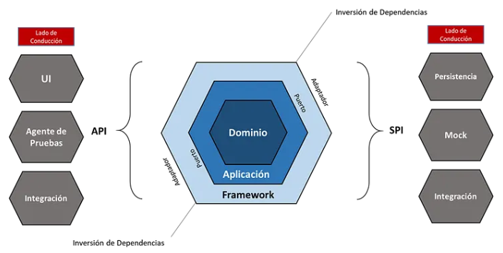
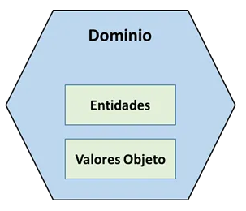
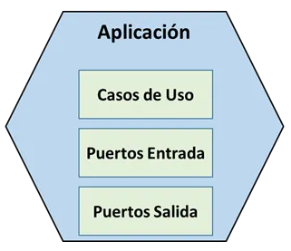
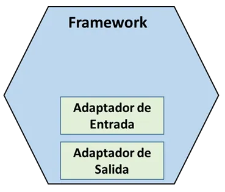
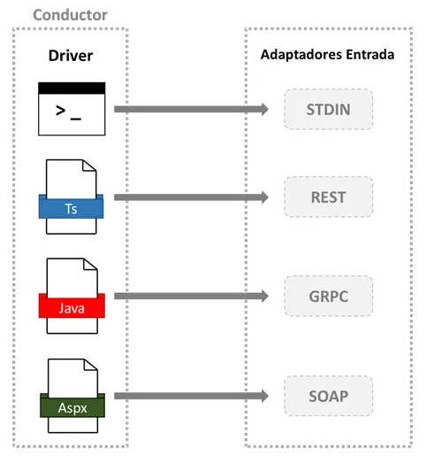
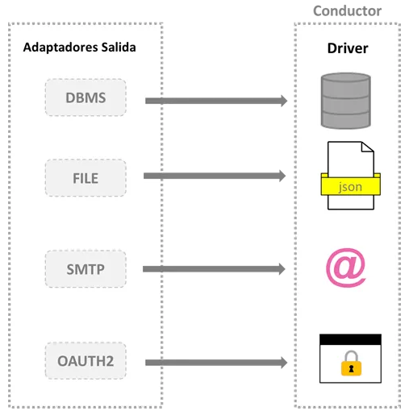
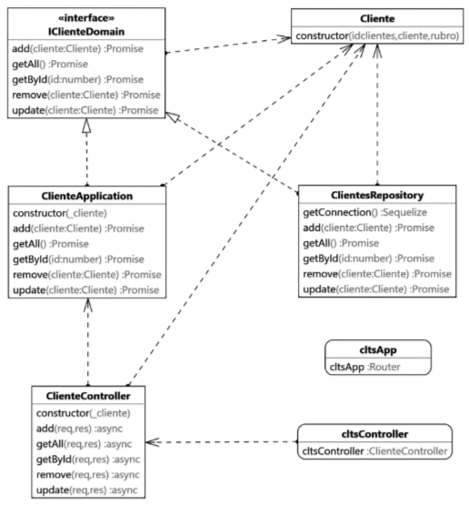
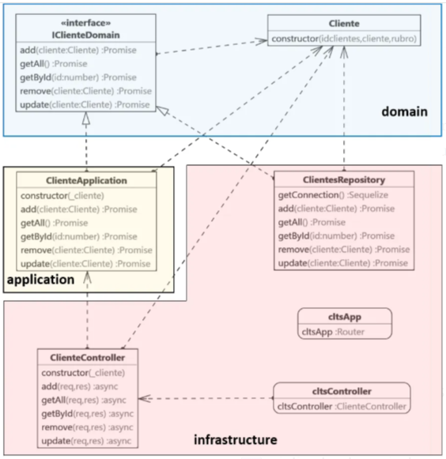
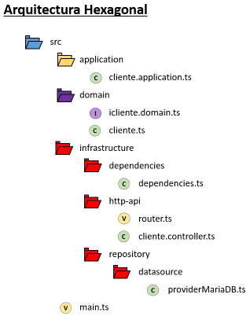

# Arquitectura Hexagonal 

## Introducción
¿Cuál es la intención que persigue la arquitectura hexagonal? La arquitectura hexagonal permite a una aplicación igualar la conducción de usuarios, programas, automatización de test o lotes de scripts, para ser desarrollada y probada de forma aislada, eventualmente desde los dispósitivos y las bases de datos en tiempo de ejecución. 

## Utilidad de la Arquitectura Hexagonal
Lo primero que tenemos que decir es que una arquitectura hexagonal es autoexplicativa. Ello significa que define perfectamente la separación de la lógica del negocio de la implementación tecnológica. Por lo tanto, gracias a esta característica particular, el producto de software podrá escalar correctamente y libre de todo tipo de engorrosidades, que son encontradas a menudo en las típicas arquitecturas más antiguas y clásicas. Además, el factor de mantenimiento también se verá beneficiado dado que facilita las tareas de mantenimiento muy significativamente. En breve, mantener este tipo de normalizaciones nos alejará de crear productos de software que resulten altamente complejos de escalar y mantener a futuro.

Por otro lado, el desarrollo de aplicaciones, servicios o productos de software completo, también requiere ir acompañado por el uso de patrones apropiados para el desarrollo. Por ejemplo, el uso del patrón SOLID. Puedes leer mi artículo acerca de los principios SOLID en Medium o en GitHub.

Este patrón ofrece muchas ventajas importantes para la construcción de software y que puedes aplicar en tus futuros proyectos. Si estas migrando una tecnología o arquitectura hacia otra, entonces será el mejor tiempo para poner en práctica estas técnicas. Haciéndolo lograrás una significativa mejora en tus soluciones.

<figure style="text-align:center;">
  
  <figcaption><b>Figura 1a:</b> Esquema de la Arquitectura Hexagonal.</figcaption>
</figure>

## Dominio Hexagonal
El Dominio Hexagonal representa un ezfuerzo para poder comprender y modelar los diversos problemas del mundo real. Considerando el siguiente ejemplo, supongamos que deseamos crear una red de telecomunicaciones y requerimos de un inventario de la topología de una compañía de telecomunicaciones.

El inventario proporciona un proceso visual para la comprensión de todos los recursos que reune la red de telecomunicaciones de la compañía. Dentro de estos recursos contamos con diversos equipos específicos. Por ejemplo, Routers, Switches, Paneles, Armarios, etc., además de otra clase de equipos especiales. Nuestro objetivo primordial es utilizar entonces nuestro hexágono de Dominio para modelar toda la base de conocimientos que se requiere para la identificación, categorización y organización visual del inventario deseado. Al saber todo esto, deberíamos entonces representarlo de forma aproximada lo máximo que sea posible, para poder representarla en un formulario bajo una tecnología agnóstica.

Ahora bien, todos los desarrolladores de la compañía debieran tener un conocimiento básico de las diversas actividades y funcionalidades que realiza la compañía de telecomunicaciones. Esto resulta prácticamente indispensable si pretendemos que los desarrolladores trabajen de forma más apropiada. Sin embargo, lo más probable de todo es que estos desarrolladores no sepan absolutamente nada de dicha compañía.

Por tanto, en este caso particular, ¿qué estrategia tendríamos que tomar en este caso tan particular? Bien, como algo inmediato podemos afirmar que el uso de una estrategia basada en DDD podría ser la más acertada y correcta posible de implementar. Estudiemos entonces esta estrategia implementativa.

Por empezar, resulta necesario consultar a los expertos de dominio u otros desarrolladores más experimentados quienes conocen plenamente los diversos problemas que plantea el dominio. Si por alguna razón, estos no conocen el contexto mencionado, se debería al menos obtener el conocimiento a través de otros medios alternativos, considerando los relevamientos primarios y sus requisitos más toda clase de análsis funcionales que aporten a la causa. Además, la adquisición de conocimientos que precisamente se alimenta mediante una base de conocimiento que pueden hallarse en diversos tipos de libros o temáticas del asunto. De todos modos, esta forma de adquirir conocimiento también tendrá una limitación. Esa limitación se ciñe simplemente a la falta de “experiencia”.

Ahora bien, dentro del hexágono de Dominio tendremos las entidades correspondientes a los datos empresariales críticos y todas sus reglas. La critica en efecto expresa los diversos problemas que suceden en el mundo real. El modelado tomará cierto tiempo para envolver consistentemente los problemas reflejados donde estaríamos tratando nuestro modelo. En efecto, este es el caso donde se planean nuevos proyectos donde son los desarrolladores que tienen una mejor visión del dominio que los propios expertos del dominio sobre los esecenarios donde confluyen los sistemas. En tales escenarios serán particularmente muy recurrentes el puntapié inicial de los ambientes. También, será normal y predecible quizá contar con un trabajo algo extraño del modelo del dominio inicial que involucra solamente las ideas del negocio, que serán validadas por los usuarios y los expertos del dominio. Es entonces muy probable que bajo esta situación un poco peculiar, se presente este concepto primordial, asumiéndolo como algo desconocido e incluso, ser llamado como expertos de dominios.

Por otro lado, se tiene que considerar que bajo los escenarios donde el dominio del problema es real, es probable que esté muy claro en la mente de los expertos en el dominio pero si no logramos comprender verdaderamente ese dominio del problema y cómo se traduce en entidades y otros objetos del Dominio, como objetos de valor, seguramente construiremos un software basado en suposiciones débiles o erróneas. Este proceso resulta crítico y debemos evitarlo a toda costa.

Este esecenario tan particular suele ser uno de los problemas más clásicos que siempre terminan complicándose más y más a medida que el software escala. Esta complejidad se ve traducida en una acumulación de deuda técnica y una dureza en las tareas de mantenimiento. En consecuencia, un proceso en este sentido puede terminar construyendo un software débil y frágil, que en un principio podría estar resolviendo las necesidades del negocio pero estaría exponiéndose muy críticamente del lado técnico, particularmente del desarrollo dado que podría causar toda clase de dificultades técnicas al momento de mantener o escalar el software.

Todas estas suposiciones débiles pueden conducir a un código frágil e inexpresivo que inicialmente puede resolver problemas comerciales pero que no está listo para adaptarse a los cambios de manera cohesiva. El hexágono de dominio se compone de cualquier tipo de categorías de objetos, las cuales pueden considerarse adecuadas para representación del dominio del problema. Veamos la figura 1b. 

<figure style="text-align:center;">
  
  <figcaption><b>Figura 1b:</b> Esquema del Dominio Hexágono.</figcaption>
</figure>

Entidades
Para empezar, diremos entonces que las entidades son en cierto modo una forma simple de expresar al código. Una entidad se carácteriza por mostrar continuidad e identificación, como bien se describe DDD (Domain-Driven Design) mediante Tackling Complexity in the Heart of Software, es decir, Abordando La Complejidad en el Corazón del Software.

La continuidad es relativa a los ciclos de vida y posee características mutables del objeto. Por ejemplo, cuando mencionamos la compañía de telecomunicaciones, aquel inventario del escenario de nuestra red y su topología, al enumerar la existencia de algunos dispositivos tales como Routers, Switchs, etc. Para el caso de un Router, podemos definirle a este al menos dos estados posibles; habilitado o deshabilitado.

Por otra parte, resulta posible añadirle otras propiedades que describan la relación que tiene un Router con los diferentes otros Routers y también, otros equipos de la red de telecomunicaciones. Todas estas propiedades quizá cambien en algún momento, por tanto podremos ver que el Router no se trata de una cosa de tipo estática y que todas estas características internas también pueden cambiar. Pues bien, todos estos tipos de cambios que pueden cambiar podrían reflejar su ciclo de vida. Además, el Router debería ser único en un inventario y por ende, debiera poseer una identidad propia. Por lo tanto, el sentido de continuidad e identificación son elementos que determinan una entidad.

```typescript
// Objeto de Valor.
enum Itipo {
  EDGE = 1, 
  CORE = 2
}

// Entidad.
class Router {
  public _routerId: number;
  public _routerTipo: ITipo; 

  constructor(routerId: number, routerTipo: ITipo) {
    this._routerId = routerId;
    this._routerTipo = routerTipo; 
  }
}

// Figura 1.c. – Código de una Típica Entidad más Tipo de Valor.
```

### Objeto de Valor
Los objetos de valores nos ayudan a completar nuestro código de modo expresivo cuando no existe la necesidad de indentifcar como único, así como cuando estamos más preocupados por los atributos que por su propia identidad.

Podemos utilizar los objetos de valor con el objeto de poder componer un objeto de entidad. Eso implica que los objetos de valor deberán ser inmutables de modo de evitar todo tipo de inconsistencia en los valores almacenados en la memoria de dicho objeto, particularmente en el dominio. En el ejemplo de la figura 1.c se aprecia la enumeración Itipo que es utilizada para expresar dos descripciones constantes que permiten distinguir un tipo del otro y que es utilizado para establecer un tipo de valor al objeto de entidad Router.

Aplicación Hexagonal
Ya hemos visto recientemente todo acerca del Dominio Hexagonal y toda su encapsulación que incluye las reglas de negocio con sus entidades y objeto de valores. Sin embargo, existen algunas situaciones donde el software no requiere ser operado directamente como un nivel de Dominio.

La aplicación hexagonal se trata de un modelo abstracto que aplica ciertas tareas específicas para la aplicación. Es entonces señalada como abstracta porque hace énfasis particularmente sobre el tipo de tecnología que la compone. El hexágono expresa al usuario del software una intención y características basadas sobre las reglas del negocio del Dominio hexagonal.

Regresando al ejemplo de la compañía de telecomunicaciones, la misma topología y el inventario del escenario de la red descriptos recientemente, supone una necesidad para consultar a los Routers del mismo tipo. Esto podría requerir la manipulación de algunos datos para producir finalmente tales resultados. El software podría entonces requerir la captura de alguna entrada de usuario para consultar los tipos de Routers. Podrías utilizar una capa de reglas de negocio específica para validar las entradas de usuario y otras reglas de negocio para verificar los datos que son enlistados desde orígenes externos.

Si no se produce algún tipo de violación a las reglas establecidas, el software podría proveer algunos datos de muestra en forma de una lista de Routers del mismo tipo. En este escenario, de algún modo posible, podremos agrupar diferentes tipos de tareas en un caso de uso. La siguiente figura trata de plasmar todo lo que hemos venido estudiando hasta el momento. Ver figura 1d. 

<figure style="text-align:center;">
  
  <figcaption><b>Figura 1d:</b> Aplicación Hexagonal.</figcaption>
</figure> 

### Casos de Uso
Los casos de uso representan una serie de características específicas sobre el comportamiento esperado de la aplicación y que básicamente, se tratan de conjunto de diversas operaciones, funcionalidades e interacciones que existen de cara a la aplicación del usuario. Los casos de uso podría interactuar directamente con entidades y otros tipos de casos de usos, haciendo más flexible todos sus componentes. Ahora bien, para los lenguajes de programación como lo es TypeScript o también, como lo son otros tipos de lenguajes como Java, Visual C#, etc., los casos de usos actúan como elementos abstractos que son definidos y expresados como interfaces con el que el software puede usar y acceder.

El siguiente ejemplo de la figura 1.e es un sencillo modo de representar a un caso de uso bajo el código de TypeScript que representa un comportamiento particular.

```typescript
interface IListadoRouter {
  getAll(): Array<Router>;
}

// Figura 1.e – Interface Representando un Simple Caso de Uso.
```

### Puertos de Entrada y Salida
Como ya hemos señalado recientemente, los casos de uso son justamente las interfaces que el software realiza, aún requerimos de un elemento más para complementarlos. Aquí precisamente ingresa el rol de los llamados “Puertos de Entrada“ que complementan el contexto general en los casos de usos. El componente se encuentra totalmente adjunto al caso de uso, a nivel de la Aplicación, para los puertos de entrada permitiéndonos implementar las intenciones sobre los términos del dominio del software.

Por otro lado también contamos con los llamados “Puertos de Salida” y, tal cual sucede con los de entrada, su función es similar porque también se trata de un componente pero a diferencia del otro es que es de salida. En la siguiente figura vemos un sencillo ejemplo de implementación de puertos de entrada y salida. Las clases IRouterInput e IRouterOutput son representadas como los puertos de entrada y salida respectivamente. 

```typescript
interface IRouterInput {
  add(router: Router): void; 
  delete(routerId: number): void;
}

interface IRouterOutput {
  getAll(): Array<Router>;
}

class RouterView implements IRouterInput, IRouterOutput {
  private _arreglo: Array<Router> = new Array<Router>();

  getAll(): Router[] {
    return this._arreglo;
  }
  add(router: Router): void {
    this._arreglo.push(router);
  }
  delete(routerId: number): void {
    this._arreglo.splice(
      this._arreglo.findIndex((r) => { r._routerId === routerId }), 1
    );
  }
}

// Figura 1.f – Puertos de Entrada y de Salida.
```

Framework Hexagonal
Todo lo que hemos visto se encuentra muy bien organizado bajo nuestra buena crítica que hemos descripto en recientes apartados sobre las reglas del negocio, restringidas como un Dominio Hexagonal, seguidas por la Aplicación Hexagonal que estará marcando algunas operaciones específicas de la aplicación, a través de lo que son los casos de usos más los puertos de entrada y salida.

A partir de estos instantes es necesario establecer qué decisión tomaremos respecto al aspecto tecnológico que debería adopar nuestro software. Dicho de otro modo, es decir, qué tecnologías debieramos utilizar para permitir todas las comunicaciones que atraviesan por completo nuestro software. Esas comunicaciones pueden ocurrir de dos formas distintas. Una es conociendo lo conducido y la otra es conociendo lo que se conduce. Para el lado de la conducción entrante, usaremos los Adaptadores de Entrada y para la conducción saliente, usaremos los Adaptadores de Salida. Precisamente, este esquema es representado en la figura 1g. 

<figure style="text-align:center;">
  
  <figcaption><b>Figura 1g:</b> Esquema de Framework Hexagonal.</figcaption>
</figure> 

Operaciones de Conducción y los Adaptadores de Entrada y Salida
Las Operaciones de Conducción son las que solicitan las acciones para el software. Por ejemplo, podría tratarse de un usuario que con la línea de comandos del cliente o desde una interface gráfica tipo Frontend, que mediante su acción induce por sobre el comportamiento directo del área. Algunos especialistas de pruebas verificaran el software y procederán a informarte como desarrollador de las correcciones más tempranas o evidentes que deben hacerse y que estos han detectado en prima fase. O también, podría tratarse de de otro tipo de aplicaciones dentro de un gran ecosistema, muy necesario para interactuar con algunas otras características expuestas del software. Esta comunicación ocurre a través de una API (Application Programming Interface) o en español, Interface de Programación de Aplicaciones, construida precisamente a la cabeza de los adaptadores entrantes.

Por lo tanto, las API se definen cómo las entidades externas que deberían interactuar con tu sistema y luego, traducir cada solicitud para tu dominio de la aplicación. El término conduciendo utilizado aquí, dado que estas entidades extrernas, son conducidas por el comportamiento del sistema. Los adaptadores entrantes pueden definir el soporte de las aplicaciones de los protocolos de comunicación como se muestra en la siguiente figura 1h.

<figure style="text-align:center;">
  
  <figcaption><b>Figura 1h:</b> Adaptadores Entrantes.</figcaption>
</figure>

Supongamos que necesitamos exponer algunas características del software para aplicaciones heredadas que trabajan con la vieja y tradicional arquitectura de SOAP sobre el protocolo de HTTP/1.1 y, al mismo tiempo, también necesitas contar con las mismas características disponibles para un nuevo cliente que posee algunas ventadas liberadas utilizando GRPC bajo el protocolo HTTP/2. Con la HA la arquitectura hexagonal podrías crear un puerto entrante que podría traducir la solitud de descarga para trabajar bajo los términos del dominio.

Respecto a los adaptadores de salida sucede algo similar a lo anterior. Sin embargo, existen algunas diferenicas que son necesarias remarcar aquí. Como bien podríamos decir análogamente, la otra cara de la moneda donde también se conducen las operaciones es la parate saliente de los adaptadores. En efecto, estas operaciones son disparadas desde tu aplicación e estando internamente de cara hacia el exterior del mundo para obtener los datos de las necesidades que requieren los softwares. Una operación conducida generalmente ocurre en respuesta de algún proceso en conducción. Como podrás imaginar, la forma en que nosotros definimos el lado de lo conducido, es a través de los adaptadores de salidas. Los adaptadores deberán implenarse luego para los puertos de salidas.

Recordemos entonces que un puerto de salida nos dice qué clase de datos es necesaria para trabajar con alguna aplicación para diversas tareas específicas. Veamos la siguiente figura ilustrativa figura 1i. 

<figure style="text-align:center;">
  
  <figcaption><b>Figura 1i:</b> Adaptadores Salientes.</figcaption>
</figure>

En el caso de una base de datos, podríamos tener varios escenarios interesantes con qué trabajar. La filosofía que existe detrás de una HA arquitectura hexagonal es la adaptar de la mejor forma posible la tecnología proveedora de bases de datos con nuestro software.

Supongamos entonces que estamos trabajando normalmente con una base de datos de tipo relacional de la firma Oracle Corporation. Un día recibes una notificación de la jefatura del departamento de desarrollo de la empresa y en donde se te notifica que es necesario realizar una planificación de migración hacia otra plataforma de base de datos. La urgente decisión administrativa te pide migrar la base de datos por razones de costos y licenciamientos.

La tecnología que optemos a futuro debiera adaptarse a nuestro software sin ningún problema, siempre y cuando hayamos construido nuestro proyecto correctamente y bajo el lineamiento de la HA arquitectura hexagonal. Por tanto, se nos sugiere el uso de una tecnología NoSQL usando el proveedor de base de datos MongoDB. La adaptación no nos debiera de algún modo afectar porque la misma HA arquitectura hexagonal, debiera tener la capacidad de amoldarse a los nuevos requisitos sugeridos. Por tanto y en teoría, esto se debiera llevar acabo sin ningún problema.

> ***Importante**: En este proceso adaptativo o migratorio del ejemplo citado desde una base de datos Oracle a MongoDB, es probable que bajo algunos tipos de escenarios y compljidades de desarrollo de una base de datos, esa migración pueda resultar a veces imposible. Ello es debido por las diferencias tecnológicas que son aplicadas en la resolución de los requisitos de la propia funcionalidad de base de datos destinada a una solución particular. Por ejemplo, el uso de determinados tipos de funciones para las consultas especiales, la creación de objetos específicos vinculados a tipos de cálculos o geometrías complejas, el uso de liberías complejas y sofisticadas, etc.*
> 
> *En este caso ejemplar citado, asumimos que la migración es factible. Es obvio que una migración de un tipo de base de datos hacia otro no resulta ser una tarea sencilla. Por lo tanto, se supone de antemano debemos estudiar cada caso en particular muy cuidadosamente para evitar caer en un bloqueo mayor que implique mayores costos de implementación, rediseño y recomposición de toda la lógica del negocio. Esto último resulta ser totalmente prohibitivo y no deseado.*

Ahora bien, suponiendo que nuestra migración desde una tecnología hacia otra resultar ser posible, tendremos que preparar el trabajo. Por empezar, tendrías un adaptador de salida que permita la persistencia con la base de datos de Oracle. Para habilitar la comunicación con MongoDB, tendrías que crear un adaptador de salida sobre el Framework hexagonal, dejando la aplicación y lo más importante, sin tocar al Dominio hexagonal. Ambos adaptadores de entrada y salida son puntos internos del hexágono. Luego, nosotros estaríamos luego dependiendo de ambas estructuras hexagonales de aplicación y dominio, por tanto invirtiendo la dependencia.

Precisamente el término Driven o conducido es utilizado dado que estas operaciones son conducidas y controladas por la aplicación hexagonal propia, disparando las acciones en cada uno de los sistemas externos. 

### Caso de Estudio
El siguiente caso de estudio se fundamenta básicamente en una típica aplicación basada en operaciones CRUD (*Create, Read, Update & Delete*). El proyecto ha sido desarrollado bajo la plataforma de Node.js y el framework Express mediante el lenguaje TypeScript. Por lo tanto, aquí te presento dos diagramas de clases para poder analizarlo mejor.

<figure style="text-align:center;">
  
  <figcaption><b>Figura 1j:</b> Mapeo de una solución basada en la Arquitectura Hexagonal con TypeScript sobre el Framework Express de la plataforma de Node.js.</figcaption>
</figure>

Como podemos observar, en la figura 1–1, este diagrama de Clases representa toda la parte principal del proyecto. Podemos observar cada una de sus dependencias y herencias en el contexto. 

<figure style="text-align:center;">
  
  <figcaption><b>Figura 1k:</b> Ubicación y Distribución en las Carpetas.</figcaption>
</figure>

Ahora bien, cada una de estas clases es ubicada en una serie de carpetas específicas que permite organizar el modelo de dicha arquitectura. Esto mismo lo podemos observar en la figura 1k. 

<figure style="text-align:center;">
  
  <figcaption><b>Figura 1l:</b> Distribución Real de las Carpetas dentro del Contexto del Proyecto.</figcaption>
</figure>

Finalmente, en la figura 1l podemos observar la distribución real de las carpetas en el contexto del proyecto. Es decir, cómo y dónde se ubica cada uno de los archivos que se componen generalmente de clases, interfaces y de archivos basados en variables.

### Código Fuente del Proyecto
En las siguiente secciones de nuestro estudio, voy a presentarte el código de cada una de las partes para que luego podamos ir analizando paso a paso todas sus funcionalidades. 

```typescript
export class Cliente {
    constructor(
        public idclientes: number, 
        public cliente: string, 
        public rubro: string
    ) {}
}
// --> Archivo clientes.ts

import { Cliente } from './cliente'; 

export interface IClienteDomain {
    getAll(): Promise<Cliente | any>;
    getById(id: number): Promise<Cliente | any>;
    add(cliente: Cliente): Promise<Cliente | any>;
    update(cliente: Cliente): Promise<Cliente | any>;
    remove(cliente: Cliente): Promise<Cliente | any>;
}
// --> Archivo icliente.domain.ts

// Código - 1
```

En los dos códigos presentados en la sección código-1, podemos observar que contamos con un archivo que es una clase llamada Cliente, que sirve de clase de entidad de datos sencilla y finalmente, una interface llamada IClienteDomain. Ambos se encuentran alojados dentro de la carpeta domain y como seguramente podrás ver en la figura 1l.

El dominio domain nos ofrece de cara al desarrollo una interface que permite ser implementada más tarde en otras áreas del proyecto y una clase de entidad de datos para dar formato a los objetos.

La interface IClienteDomain alberga cinco funciones especiales. Todas conforman el patrón CRUD (*Create, Read, Update & Delete*). Las dos funciones de lectura “*Read*” son *getAll()* y *getById()* respectivamente. Por otro lado, las tres funciones restante son las que permiten realizar las operaciones de añadir, modificar y eliminar datos. Estas funciones son *add()* “*añadir nuevos datos*”, *update()* “*actualizar datos vigentes*” y *remove()* “*eliminar datos vigentes*”. 

```typescript
import { Cliente } from "../domain/cliente";
import { IClienteDomain } from "../domain/icliente.domain";

export class ClienteApplication implements IClienteDomain {
    constructor(private readonly _cliente: IClienteDomain) {}
    
    getAll(): Promise<any> {
        return this._cliente.getAll();
    }
    
    getById(id: number): Promise<any> {
        return this._cliente.getById(id);
    }
    
    add(cliente: Cliente): Promise<any> {
        return this._cliente.add(cliente);
    }
    
    update(cliente: Cliente): Promise<any> {
        return this._cliente.update(cliente);
    }
    
    remove(cliente: Cliente): Promise<any> {
        return this._cliente.remove(cliente);
    }
}
// --> Archivo cliente.application.ts

// Código - 2
```

En el código 2 podemos obersar el “caso de uso”. En efecto, esta clase llamada ClienteApplication implementa los casos de uso para nuestra aplicación. Este archivo se ubica dentro de la carpeta application.

Esta clase ClienteApplication implementa la interface IClienteDomain con el objeto de poder añadirle a la misma las cinco funciones necesarias para nuestro proyecto. A través del archivo de la aplicación podremos instrumentar cada uno de los procesos de las operaciones de CRUD. Además, a través del constructor() se implementa la interface, con el objeto de utilizarla dentro de cada una de las funciones de la aplicación. En este tipo de códigos hacemos uso de la DIP (*Dependency Inversion Principle*) o en español, Inversión de Dependencias y que también se la conoce como Inyección de Dependencias y, que como ya sabemos, este principio forma parte del patrón SOLID. 

```typescript
import { Request, Response } from "express"; 
import { ClienteApplication } from "../../application/cliente.application"; 
import { Cliente } from "../../domain/cliente";

export class ClienteController {
    constructor(private readonly _cliente: ClienteApplication) {}

    public async getAll(req: Request, res: Response) {
        res.status(200).send(await this._cliente.getAll());
    }

    public async getById(req: Request, res: Response) { 
        let { id } = req.params;
        res.status(200).send(await this._cliente.getById(parseInt(id)));
    }

    public async add(req: Request, res: Response) {
        let { idclientes, cliente, rubro } = req.body; 
        res.status(201).send(await this._cliente.add(new Cliente(parseInt(idclientes), cliente, rubro)));
    }

    public async update(req: Request, res: Response) {
        let { idclientes, cliente, rubro } = req.body; 
        res.status(201).send(await this._cliente.update(new Cliente(parseInt(idclientes), cliente, rubro)));
    }

    public async remove(req: Request, res: Response) {
        let { idclientes, cliente, rubro } = req.body; 
        res.status(201).send(await this._cliente.remove(new Cliente(parseInt(idclientes), cliente, rubro)));
    }
}
// --> Archivo clientes.controller.ts 

import express from "express"; 
import { cltsController } from "../dependencies/dependencies";
import bodyParser from "body-parser";

const cltsApp = express.Router(); 

cltsApp.get(
   '/getall', cltsController.getAll.bind(cltsController)); 
cltsApp.get(
   '/getbyid/:id', cltsController.getById.bind(cltsController)); 
cltsApp.post(
   '/add', bodyParser.json(), cltsController.add.bind(cltsController)); 
cltsApp.put(
   '/update', bodyParser.json(), 
   cltsController.update.bind(cltsController)); 

cltsApp.delete(
   '/remove', bodyParser.json(),    
   cltsController.remove.bind(cltsController));

export { cltsApp }; 
// --> Archivo router.ts 

// Código - 3
```

En el código 3 nos encontramos con dos partes fundamentales. Un archivo se trata sencillamente del controlador llamado ClienteController y finalmente, el archivo de variables que permite configurar las rutas de acceso a los recursos cuyo archive es router.ts. Ambos archivos se ubican en la capa de infrastructure. El controlador a través del constructor() implementa las características proporcionadas por la clase ClienteApplication que se ubica en la capa application. Luego, mediante la configuración de cada una de las funciones del controlador, son consumidos por los clientes de forma externa mediante los endpoints.

```typescript
import { QueryTypes, Sequelize } from "sequelize";
import { Cliente } from "../../../domain/cliente";
import { IClienteDomain } from "../../../domain/icliente.domain";

export class ClientesRepository implements IClienteDomain {  
    private getConnection(): Sequelize {
        return new Sequelize(
            'empresa', 
            'root', 
            'root', {
                host: 'localhost',
                dialect: 'mariadb', 
                logging: false, 
                timezone: "America/Argentina/Buenos_Aires",
            }
        );
    }

    public async getAll(): Promise<any> { 
        let qry = this.getConnection().query('SELECT * FROM clientes;', {
            type: QueryTypes.SELECT
        }); 
        let outReturn = qry.then((results) => { 
            return results;
        }).catch(() => {
            return { "status": "Failure", "operation": "aborted" };
        });        
        return outReturn;
    }

    public async getById(id: number): Promise<any> {
        let qry = this.getConnection().query('SELECT * FROM clientes WHERE idclientes = :idcliente', { 
            replacements: { idcliente: id },
            type: QueryTypes.SELECT
        }); 
        let outReturn = qry.then((results) => { 
            return results;
        }).catch(() => {
            return { "status": "Failure", "operation": "aborted" };
        });
        return outReturn;
    }

    public async add(cliente: Cliente): Promise<any> {
        let qry = this.getConnection().query(
            "INSERT INTO clientes (idclientes, cliente, rubro) VALUES (:idclientes, :cliente, :rubro)", 
            {
                replacements: {
                    idclientes: cliente.idclientes, 
                    cliente: cliente.cliente, 
                    rubro: cliente.rubro
                }, 
                type: QueryTypes.INSERT
            }
        ); 
        let outReturn = qry.then((results) => {
            return results;
        }).catch(() => {
            return { "status": "Failure", "operation": "aborted" };
        });
        return outReturn;
    }

    public async update(cliente: Cliente): Promise<any> { 
        let qry = this.getConnection().query(
            "UPDATE clientes SET cliente = :cliente, rubro = :rubro WHERE idclientes = :idclientes", {
                replacements: {
                    idclientes: cliente.idclientes, 
                    cliente: cliente.cliente, 
                    rubro: cliente.rubro                    
                }, 
                type: QueryTypes.UPDATE
            }
        );
        let outReturn = qry.then((results) => {
            return results;
        }).catch(() => {
            return { "status": "Failure", "operation": "aborted" };
        });
        return outReturn;
    }

    public async remove(cliente: Cliente): Promise<any> {
        let qry = this.getConnection().query(
            "DELETE FROM clientes WHERE idclientes = :idclientes", {
                replacements: {
                    idclientes: cliente.idclientes
                }, 
                type: QueryTypes.DELETE
            }
        );
        let outReturn = qry.then((results) => {
            return { "status": "Ok", "operation": "delete" };
        }).catch(() => {
            return { "status": "Failure", "operation": "aborted" };
        });
        return outReturn;
    }
}
// --> Archivo providerMariaDB.ts 

// Código 4
```

En el código 4 vemos nuestro proveedor de la base de datos y las cinco operaciones implementadas. Esta clase llamada ClientesRepository también se ubica en el sector de la capa de infrasctructure.

El proceso de desarrollo de este código se basa en el uso del motor ORM Sequelize. Además, he utilizado el tipo de consultas Raw “crudo” para construir todas las interacciones y acciones para este programa. Esta sección resultante, es en breve, nada más y nada menos que el repositorio de persistencia de datos que proviene de la base de datos. La base de datos utilizada aquí es MariaDB. 

```typescript
import { ClientesRepository } from "../repository/datasource/providerMariaDB";
import { ClienteApplication } from "../../application/cliente.application";
import { ClienteController } from "../http-api/cliente.controller"; 

const cltsRepo = new ClientesRepository(); 
const cltsApplication = new ClienteApplication(
    cltsRepo
);
export const cltsController = new ClienteController(
    cltsApplication
); 
// --> Archivo dependencies.ts 

// Código 5
```

En el código 5 podemos ver un archivo especial llamado dependencies.ts y que se encarga precisamente de crear el marco de cada una de las dependencias del proyecto. Vemos aquí en un sentido muy práctico cómo se implementa DIP para este caso particular. Gracias a esta clase de configuración, nuestro programa puede funcionar correctamente. Por último, esta sección también se ubica en la capa de infrastructure.

## Fuente

### Autor: 
- (Arq. e Ing.) Ariel Alejandro Wagner

### Medios Relacionados:
- (Publicación 1) - https://medium.com/@arielwagnermovil/arquitectura-hexagonal-parte-1-dcda312a68b6
- (Publicación 2) https://medium.com/@arielwagnermovil/arquitectura-hexagonal-parte-2-7cb1703c83cf