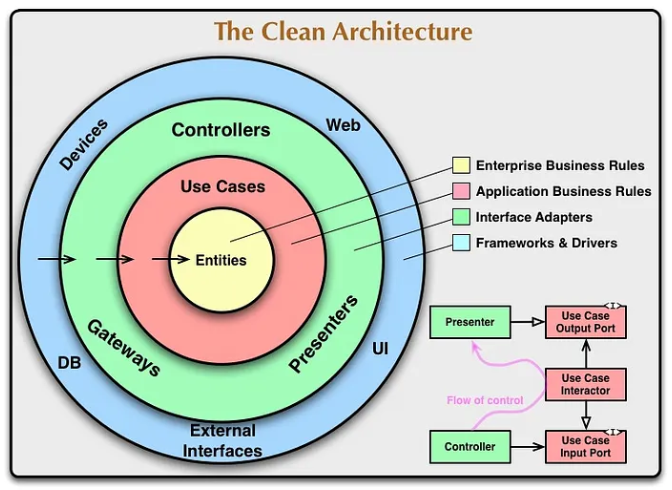
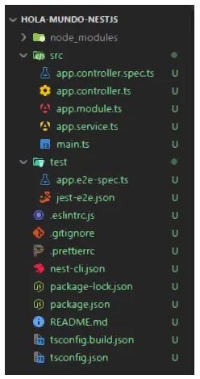
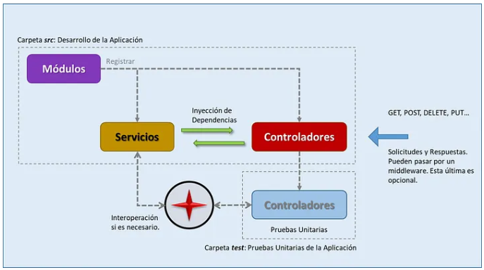
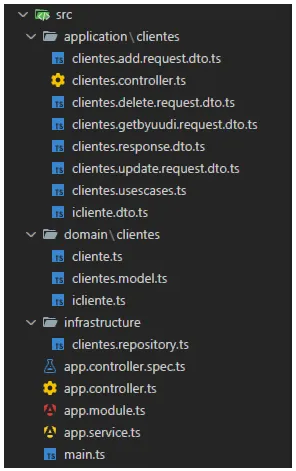
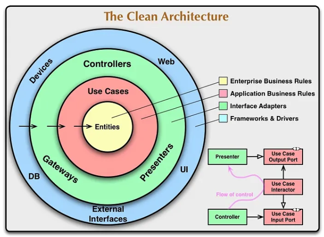
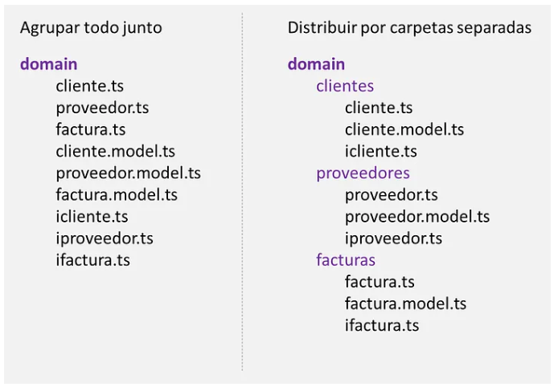

# Arquitectura Limpia Aplicada en NestJS 

## Intrudcción 
La propuesta como Clean Architecture o Arquitectura Limpia ha sido desarrollada por el Ing. Robert Cecil Martin (<a href="https://blog.cleancoder.com/" target="_blank">blog personal</a>), también conocido con el pseudónimo de Uncle Bob o el Tío Bob. El ingeniero y arquitecto Robert Cecil Martin para desarrollar esta arquitectura tomó ideas de otras propuestas o arquitecturas para pasar a desarrollar la propia.

La arquitectura limpia busca estructurar aplicaciones de manera que sean altamente mantenibles, flexibles y robustas frente a cambios. Este estilo arquitectónico organiza el código en capas concéntricas, con la regla principal de que las dependencias siempre deben fluir hacia adentro, es decir, desde las capas externas hacia las internas. Cada capa tiene una responsabilidad claramente definida, lo que facilita la separación de preocupaciones y permite un desarrollo más ágil y modular. Ver figura 1.

<figure style="text-align:center;">
  
  <figcaption><b>Figura 1:</b> Descripción de las Capas de la Arquitectura Limpia.</figcaption>
</figure>

En el centro de la Arquitectura Limpia se encuentra la capa de (**Entities**) Entidades, que contiene las reglas de negocio más fundamentales de la aplicación. Por ejemplo, es la capa suele ubicarse en nuestro proyecto como **Domain**. Estas entidades son independientes de cualquier implementación tecnológica, como bases de datos o frameworks, y representan el núcleo de la lógica del dominio. Esta capa no depende de nada más en el sistema.

La siguiente capa es la de **Casos de Uso**, donde se implementan las reglas específicas de la aplicación. Aquí se define cómo las entidades deben interactuar entre sí para cumplir con los objetivos del sistema. Los casos de uso orquestan el flujo de datos entre las capas internas y externas, manteniéndose igualmente independientes de tecnologías externas. Esta suele ubicarse en la capa Application o aplicación de nuestro proyecto.

En las capas más externas se encuentran los Adaptadores y las Interfaces, que son responsables de interactuar con el mundo exterior, como bases de datos, interfaces de usuario, servicios web y dispositivos externos. Estas capas dependen de las capas internas, pero no al revés. Por ejemplo, un controlador o una vista en la capa de interfaz de usuario puede depender de un caso de uso, pero el caso de uso nunca debe depender directamente de la interfaz de usuario. Parte de los adaptadores e interfaces sumados a los repositorios pertenecen a la capa Infrastructure de nuestro proyecto. Sin embargo, el controlador se suele ubicar en la capa de Application para una mejor distribución dado que otros lo ubican en una capa externa a esta. Esto resulta opcional.

Finalmente, la capa más externa contiene los mecanismos y los frameworks utilizados para construir la aplicación. Aquí se integran bibliotecas externas, tecnologías específicas, y otros detalles de implementación que pueden cambiar con el tiempo sin afectar al núcleo de la aplicación. En esta también se encuentran en la capa Infrastructure.

Una característica clave de la Arquitectura Limpia es su énfasis en la independencia tecnológica. Esto significa que la lógica central de la aplicación no está atada a frameworks, herramientas o bases de datos específicos, lo que facilita la migración entre tecnologías, la reutilización del código y la realización de pruebas unitarias. Este diseño asegura que las decisiones técnicas externas, como el tipo de base de datos o el framework de interface de usuario, sean reemplazables sin alterar las capas internas.

En resumen, la Arquitectura Limpia organiza el sistema en capas con responsabilidades bien definidas, con flujos de dependencia unidireccionales hacia el núcleo. Esto permite un diseño flexible, modular y mantenible, que puede evolucionar con facilidad frente a cambios tecnológicos o de requisitos, al tiempo que mantiene la lógica de negocio protegida y aislada de las preocupaciones externas.

## ¿Qué es NestJS?
NestJS se trata de un framework progresivo de desarrollo backend para aplicaciones Node.js. Construido con TypeScript, aunque también es compatible con JavaScript, está diseñado para ser altamente escalable, modular y mantenible. El producto de NestJS se encuentra inspirado bajo el prinicpio SOLID y también, basado en la OOP (*Programación Orientada a Objetos*), la FP (*Programación Funcional*) y los principios de Arquitectura Reactiva. Por otro lado, NestJS proporciona una estructura robusta para desarrollar aplicaciones del lado del servidor.

La plataforma NestJS se basa en el popular framework Express, pero también permite integrar otros frameworks HTTP como Fastify para optimizar el rendimiento. Su enfoque modular y su soporte nativo para herramientas modernas hacen que sea una excelente opción para desarrollar aplicaciones de cualquier tamaño, desde APIs pequeñas hasta sistemas empresariales complejos. 

## Arquitectura de NestJS
NestJS posee un tipo de arquitectura específica que permite que la plataforma pueda brindarnos un conjunto de recursos muy importantes que permiten con facilidad la construcción y la escala de las aplicaciones de software. Por lo tanto, podemos describir a esta arquitectura en los siguientes recursos importantes:

* *Módulos*
* *Controladores*
* *Servicios*
* *Proveedores*
* *Decoradores*
* *Middleware*
* *Guards*
* *Pipes*
* *Interceptors*
* *Filtros*
* *Microservicios*

## Resumen General
En consecuencia, la arquitectura de NestJS sigue un enfoque modular, basado en patrones de diseño tales como los que se enumeran a continuación:

* *Controlador — Servicio — Repositorio para desacoplar la lógica.*
* *Uso de inyección de dependencias para gestionar componentes.*
* *Decoradores y herramientas avanzadas para simplificar tareas comunes como validación, autorización, y manejo de errores.*

Esta estructura modular y escalable permite que NestJS sea una excelente opción para proyectos de cualquier tamaño, asegurando calidad y mantenibilidad en el desarrollo. 

## Ejemplo de la Plantilla Hello World!
La plantilla que crea NestJS al crear un nuevo proyecto nos sirve para comprender básicamente la forma arquitectócnica en la que NestJS suele distribuir sus recursos. Veamos la siguiente figura 2.

<figure style="text-align:center;">
  
  <figcaption><b>Figura 2:</b> Distribución de los Recursos de la Arquitectura de NestJS.</figcaption>
</figure>

El proyecto lo tenemos que dividir en dos secciones importantes. Tenemos la sección del desarrollo y construcción del software dentro de la carpeta src y la sección contenida dentro de la carpeta test destinada para las pruebas de la aplicación que se basan en los Unit Tests o “pruebas unitarias”.

Dentro de la carpeta src tenemos algunos archivos importantes para esta aplicación de prueba. Por empezar tenemos el archivo main.ts. Este archivo es el más importante de todos porque es quien se encarga de hacer el proceso Bootstrap, es decir, el inicio de nuestra aplicación. Veamos el siguiente código 1.

```typescript
import { NestFactory } from '@nestjs/core';
import { AppModule } from './app.module';

async function bootstrap() {
  const app = await NestFactory.create(AppModule);
  await app.listen(process.env.PORT ?? 3000);
}
bootstrap(); 

// Código 1
```

Luego tenemos los siguientes archivos que forman parte de nuestra aplicación, empezando con los Servicios hacia el Controlador a través del Módulo. Ver figura 3. 

<figure style="text-align:center;">
  
  <figcaption><b>Figura 3:</b> Arquitectura básica de NestJS.</figcaption>
</figure>

Ahora bien, como podemos observar en la figura 3, NestJS hace uso de un módulo para registrar tanto los servicios como los controladores. Los servicios y los controladores se conectan mediante el uso del servicio de inyección de dependencias. Esto último es muy importante porque es cómo NestJS funciona. A continuación, muestro el código para los archivos de la clase controladora, del servicio y el módulo los muestro a continuación. 

```typescript
// Módulo - Registrar los recursos de la aplicación. compuesto por una 
// clase llamada AppModule.
import { Module } from '@nestjs/common';
import { AppController } from './app.controller';
import { AppService } from './app.service';

@Module({
  imports: [],
  controllers: [AppController],
  providers: [AppService],
})
export class AppModule {}

// Servicio compuesto por una clase llamada AppService
import { Injectable } from '@nestjs/common';

@Injectable()
export class AppService {
  getHello(): string {
    return 'Hello World!';
  }
}

// Controlador compuesto por una clase AppController
import { Controller, Get } from '@nestjs/common';
import { AppService } from './app.service';

@Controller()
export class AppController {
  constructor(private readonly appService: AppService) {}

  @Get()
  getHello(): string {
    return this.appService.getHello();
  }
}

// Código 2
```

En el contexto del código 2 del controlador construimos las funciones que terminarán siendo luego los endpoint, es decir los contratos de cara al cliente. Los servicios proporcionan la lógica del negocio que podrían incluso venir desde otros servicios hasta de una base de datos. En este ejemplo tan sencillo los servicios solo proporcionan un mensaje de texto muy simple que es pasado hacia el controlador cuando se procede a procesar una solicitud desde el navegador cuando la aplicación esté corriendo en el servidor.

El proyecto contiene más archivos que son utilizados para diversos tipos de funcionalidades tanto propias de la aplicación como del entorno de desarrollo mismo.

## Antes de Aplicar una Arquitectura Limpia en NestJS
En el siguiente artículo vamos hacer uso de la Arquitectura Limpia sobre NestJS y para ello he construido una pequeña aplicación de API Rest basado en un CRUD como ejemplo. 

En esta sección de este artículo voy a describir cómo he adaptado la arquitectura limpia para un proyecto construido de NestJS. Este proyecto se trata de una sencilla API Rest, una solución Backend, que dispone de un sencillo CRUD (*Create Read Update Delete*) para demostrar algunas operaciones de lectura y escritura más el uso como base de datos PostgreSQL. Voy a empezar a describir el proyecto mostrándote un mapa de cómo he distribuido las carpetas principales y sus archivos a continuación en la figura 4.

<figure style="text-align:center;">
  
  <figcaption><b>Figura 4:</b> Distribución de las Carpetas y Archivos.</figcaption>
</figure>

En la carpeta src tenemos todo el código del proyecto. Alrededor de la carpeta src existen otras más como node_modules que son las dependencias del proyecto, test que es la sección para las pruebas unitarias y otras carpetas adicionales. Por ejemplo, las carpetas adicionales podrían ser un para tu documentación, tus scripts de la base de datos, etc. 

> **Muy importante**: “*Este tipo de recursos siempre debe estar fuera de la carpeta **src**.*”

Como puedes observar en la figura 5, dentro de la carpeta **src** nos encontramos con tres carpetas fundamentales; **application**, **domain** y **infrastructure**. Ahora bien, dentro de cada una de estas carpetas principales, que forman en breve la estructura de nuestra arquitectura limpia de nuestro proyecto, pasaremos a ir detallando cada una de sus partes.

<figure style="text-align:center;">
  
  <figcaption><b>Figura 5:</b> Descripción de las Capas de la Arquitectura Limpia.</figcaption>
</figure>

## Domain
El diseño de una aplicación de software puede partir del patrón DDD (*Domain-Drive Design*) o Diseño Basado en el Dominio, que es un modelo para el desarrollo y construcción del software. Puedes obtener más información acerca de este patrón en dos de mis artículos de mi blog o en este repositorio en los siguientes links para los Principios Fundamentales para el diseño DDD (*Domain-Driven Design*) y en Diseño y Desarrollo de un Dominio. 

Enlaces: 
- Blog (Publicación 1) - https://medium.com/@arielwagnermovil/principios-fundamentales-para-el-dise%C3%B1o-en-ddd-domain-driven-design-parte-1-deed59a0546a
- Blog (Publicación 2) - https://medium.com/@arielwagnermovil/principios-fundamentales-para-el-dise%C3%B1o-en-ddd-domain-driven-design-parte-2-71c5d9c42a6f
- Repositorio https://github.com/Ariel-A-W/documentation/blob/main/Principios%20Fundamentales%20DDD/Principios%20Fundamentales%20DDD.md

En el dominio tendremos las reglas del negocio eso incluye las entidades de datos, los modelos y las interfaces que pueden tratarse de diversos tipos de operaciones que posteriormente serán implementadas en otras capas más externas del proyecto. Eso lo iremos viendo a través del código.

Resulta importante señalar que muchos desarrolladores optan por distribuir sus recursos o archivos de determinada forma. Es decir, algunos desarrolladores aglutinan cada una de los recursos vinculados a una entidad dentro de una carpeta separadamente, como hago yo en este caso y, mientras que otros, agrupan todo en una sola carpeta como contenedor. Esto podría resultar ser indistinto. Sin embargo, por una cuestión de orden, mayor claridad y legibilidad, estaríamos haciendo un buen uso de la regla de Responsabilidad Simple. Te dejo un ejemplo gráfico para que comprendas mucho mejor a qué me refiero. Ver figura 6.

<figure style="text-align:center;">
  
  <figcaption><b>Figura 6:</b> Modos en cómo distribuir los recursos de tu proyecto.</figcaption>
</figure> 

Observa que en la figura 6 vemos cómo en la izquierda se aglutina todo y en la derecha se separa por cada entidad de datos. Este último resulta más legible y claro.

Bien, una vez aclarado este asunto, continuamos con nuestra descripción de nuestro proyecto. En la carpeta domain se encuentra otra carpeta llamada **clientes** donde alojo todos los recursos concernientes a la entidad **clientes**, que dicho de paso, en la base de datos, simplemente se trata de la tabla *clientes*. Dentro de la carpeta *domain/clientes* nos encontramos con tres archivos. El archivo *cliente.ts* contiene la clase **Cliente** que se encarga de estructurar la entidad de datos para el proyecto. Luego *clientes.model.ts* que es el modelo de la tabla de la base de datos, basada en una clase llamada **ClientesModel** y por último, tenemos *icliente.ts* que es una interface llamada **ICliente** que nos permite implementar todas las operaciones vinculadas un CRUD clásico. Veamos el código para estos tres archivos.

```typescript
// Archivo cliente.ts
import { UUID } from "crypto";

export class Cliente {
    constructor(
        public cliente_id: Number,
        public cliente_uuid: UUID,
        public cliente: String,
        public direccion: String, 
        public ciudad: String,
        public movil: String, 
        public email: String,
        public atcreated: Date, 
        public atmodified: Date
    ) {}
}

// Archivo clientes.model.ts 
import { UUID } from 'crypto';
import { Column, Model, Table, CreatedAt, UpdatedAt, DataType, Sequelize, AutoIncrement } from 'sequelize-typescript'; 

@Table({
    freezeTableName: true, 
    timestamps: true, 
    tableName: 'clientes'
}) 
export class ClientesModel extends Model {
    @Column({type: DataType.INTEGER, primaryKey: true, autoIncrement: true})
    cliente_id: number; 

    @Column({type: DataType.UUID})
    cliente_uuid: UUID;

    @Column({type: DataType.STRING(150)})
    @Column 
    cliente: string;

    @Column({type: DataType.STRING(150)})
    @Column
    direccion: string; 

    @Column({type: DataType.STRING(100)})
    @Column
    ciudad: string; 

    @Column({type: DataType.STRING(255)})
    @Column
    movil: string; 

    @Column({type: DataType.STRING(255)})
    @Column
    email: string;

    @CreatedAt
    @Column({type: 'TIMESTAMP'})
    atcreated: Date;

    @UpdatedAt
    @Column({type: 'TIMESTAMP'})
    atupdated: Date;
}

// Archivo icliente.ts
import { UUID } from 'crypto';
import { Cliente } from './cliente';

export interface ICliente {
    getList(): Promise<Array<Cliente>>;
    getById(id: number): Promise<Cliente>;
    getByUUID(uuid: UUID): Promise<Cliente>;
    add(entity: Cliente): Promise<number>;
    delete(id: number): Promise<number>;
    update(id: number, entity: Cliente): Promise<number>;
}

// Código 3
```
Antes de explicar someramente el código 3, resulta importante señalar un detalle más acerca de la organización en la sección de la carpeta **domain** (en el dominio). Además de estos resursos, también se tienen que establecer reglas de negocio que pueden ser más o menos restrictivas. Por ejemplo, en el caso de un proceso de facturación, el porcentaje de comisiones se establece en un rango determinado entre 10% hasta un máximo de 50%. Valores por debajo de 10% y por encima de 50% no estarían permitidos en el sistema. Las reglas del negocio nos permiten dar seguridad y operación a nuestro sistema.

Luego, tenemos algunas reglas de negocio que bien podrían aplicarse a más de una entidad. En este caso hablaríamos de un recurso abstracto dado que no pertenece a ninguna de las entidades pero si se puede aplicar a varias de ellas. En este caso estaríamos hablando de reglas abstractas. Por ejemplo, podría tratarse de algún tipo de fórmula o valores constantes. En el caso de una fórmula, podría ser aquella que nos permite calcular porcentajes o cualquier otro valor que será necesario reutilizar en varios tipos de entidades.

En nuestro caso, dado que se trata de un ejemplo muy sencillo para nuestra API Rest, no es necesario añadir una carpeta abstracts para este tipo de recursos.

La clase **Cliente** del archivo *cliente.ts* es utilizada para establecer los recursos del dominio. Aquí he declarado una clase de entidad basada en propiedades públicas. Es en esta clase donde se establecerían las reglas del negocio o las restricciones si resultasen necesarias. En nuestro caso no son necesarias y por eso no se han declarado. Sencillamente, esta clase describe los campos o propiedades que se encuentran en la base de datos en la tabla **clientes** para ser utilizados como estructura de datos en otras partes de nuestro proyecto como veremos más adelante.

La clase **ClientesModel** del archivo *clientes.model.ts* es utilizada como modelo para poder mapear directamente los datos desde la base de datos. También podría ser utilizada para el proceso de migración o conocido como migration. El mapeo nos permite el acceso hacia los datos almacenados en la tabla de la base de datos de modo de poder manipularlos como lectura y escritura respectivamente. Es decir, para que luego podamos hacer uso de las operaciones de CRUD.

Observa que el modelo se vale de una serie de etiquetas, inicializadas con la letra @, que nos permiten declarar anotaciones específicas para el código. Por ejemplo, el tipo de datos del campo de la base de datos, si es clave primaria o foránea, si es autonumérico, si se encuentra vinculada con otra entidad o tabla para la base de datos, si es un campo de tipo literal, numérico, booleano, etc. Las etiquetas permiten añadir un comportamiento particular para cada parte del código. Esta es parte de las directivas de NestJS.

Finalmente, la interface **ICliente** en el archivo *icliente.ts* es utilizado para que se pueda implementar en el código las diversas operaciones para el CRUD.

## Infrastructure
La sección de infraestructura básicamente estaríamos dentro de un área externa al dominio y que es donde generalmente se suelen añadir reglas y lógica del negocio vinculado a los tipos de proveedores, en nuestro caso de base de datos. En esta área también podrían haber otros tipos de recursos externos.

En lo que atañe a nuestro proyecto, contamos con lo que generalmente se suele llamar repositorio. En enfecto, el repositorio es donde se establecen las reglas de negocio formales de cara a la base de datos, sea esta relacional o no relacional.

La clase **ClientesRepository** se encuentra dentro del archivo clientes.repository.ts. El código siguiente muestra cómo se compone.

```typescript
// Archivo clientes.repository.ts 
import { Cliente } from 'src/domain/clientes/cliente';
import { ICliente } from '../domain/clientes/icliente';
import { Injectable } from '@nestjs/common';
import { ClientesModel } from '../domain/clientes/clientes.model';
import { InjectModel } from '@nestjs/sequelize';
import { UUID } from 'crypto';

@Injectable()
export class ClientesRepository implements ICliente {  
    constructor(
        @InjectModel(ClientesModel) 
        private cliente: typeof ClientesModel
    ) {}

    async getList(): Promise<Array<Cliente>> {
        const lstclientes: Array<Cliente> = [];
        try {
            const data = await this.cliente.findAll({
                attributes: [
                    'cliente_id', 'cliente_uuid', 'cliente', 'direccion', 'ciudad',
                    'movil', 'email', 'atcreated', 'atupdated'
                ]
            });    
            data.forEach((element) => {
                lstclientes.push(
                    new Cliente(
                        element.cliente_id,
                        element.cliente_uuid,
                        element.cliente,
                        element.direccion,
                        element.ciudad,
                        element.movil,
                        element.email,
                        new Date(element.atcreated), 
                        new Date(element.atupdated)  
                    )
                );
            });
        } catch (error) {
            console.error('Error de datos:', error);
        }
        return lstclientes;
    }
   
    async getById(id: number): Promise<Cliente> {
        const clie = await this.cliente.findOne({
            where: {
                cliente_id: id
            }, 
            attributes: [
                'cliente_id', 'cliente_uuid', 'cliente', 'direccion', 'ciudad',
                'movil', 'email', 'atcreated', 'atupdated'                
            ]
        });

        if (!clie) {
          return null;
        }        

        var oneCliente = new Cliente(
            clie.cliente_id, 
            clie.cliente_uuid, 
            clie.cliente, 
            clie.direccion, 
            clie.ciudad, 
            clie.movil, 
            clie.email, 
            clie.atcreated, 
            clie.atupdated
        );
        
        return oneCliente;              
    }

    async getByUUID(uuid: UUID): Promise<Cliente> { 
        const clie = await this.cliente.findOne({
            where: {
                cliente_uuid: uuid
            }, 
            attributes: [
                'cliente_id', 'cliente_uuid', 'cliente', 'direccion', 'ciudad',
                'movil', 'email', 'atcreated', 'atupdated'                
            ]
        });

        if (!clie) {
          return null;
        }        

        var oneCliente = new Cliente(
            clie.cliente_id, 
            clie.cliente_uuid, 
            clie.cliente, 
            clie.direccion, 
            clie.ciudad, 
            clie.movil, 
            clie.email, 
            clie.atcreated, 
            clie.atupdated
        );
        
        return oneCliente;                       
    }

    async add(entity: Cliente): Promise<number> {       
        try 
        {
            var result = await this.cliente.create({
                'cliente_uuid': entity.cliente_uuid,
                'cliente': entity.cliente,
                'direccion': entity.direccion,
                'ciudad': entity.ciudad,
                'movil': entity.movil,
                'email': entity.email, 
                'atcreated': new Date(), 
                'atmodified': new Date()
            });
            await result.save();
            return 1;
        }
        catch 
        {
            return 0;
        } 
    }

    async delete(id: number): Promise<number> {     
        try 
        {
            const clie = await this.cliente.findOne({
                where: {
                    cliente_id: id
                }
            });
            clie.destroy();
            return 1;
        }
        catch 
        {
            return 0;
        }
    }

    async update(id: number, entity: Cliente): Promise<number> {
        try 
        {
            await this.cliente.update(
                {
                    'cliente': entity.cliente,
                    'direccion': entity.direccion,
                    'ciudad': entity.ciudad,
                    'movil': entity.movil,
                    'email': entity.email, 
                    'atcreated': new Date(), 
                    'atmodified': new Date()
                }, 
                { 
                    where: { cliente_id: id}
                }
            );
            return 1;
        }
        catch 
        {
            return 0;
        }
    }
}

// Código 4
```

Como puedes apreciar, nuestro repositorio alberga todas las operaciones CRUD que necesita nuestro sistrema. Hay algunos detalles que necesito explicarte antes de continuar. Por empezar, este repositorio para NestJS se trata de un servicio. El servicio es implementado en el sistema a través de la técnica de inyección de dependencias. En efecto, observa que la clase es declarada como **@Injectable()**. Esto hará que el recurso se cargue en la memoria cuando el sistema se encuentre corriendo y de esta manera se pueda utilizar dentro del mismo.

Como motor ORM he utilizado Sequelize que nos permite interoperar con la base de datos. Ahora bien, como ya vimos recientemente en la sección de dominio que contamos con una clase para el modelo **ClientesModel**. En efecto, esta clase es inyectada dentro del contexto del repositorio a través del constructor. Gracias a este proceso podremos acceder y manipular los datos que se encuentran contenidos en la base de datos.

Si prestas atención al código de la clase **ClientesRepository** podrás ver que he implementado la interface **ICliente** que se encuentra dentro del dominio. La implementación de la interface permite añadir a esta clase de repositorio todas las operaciones de CRUD que son formalizadas en el dominio. Además, también como tipo de datos para cada una de las operaciones de CRUD en el repositorio he utilizado la clase Cliente para dar formato a los tipos de datos en cada operación. Dicho de otro modo, desde el dominio establecemos las reglas del negocio sobre el repositorio. 

## Application
En esta sección vamos a encontrarnos con un conjunto de recursos que iré describiendolos poco a poco. Antes de continuar, necesito hacer una puntualización. La forma en cómo se distribuyen los recursos en este sector depende de varios factores.

El primero es que de modo general, si estamos utilizando un CQRS (*Command and Query Responsability Segregation*), en la distribución podría resultar necesario separar las diversas carpetas apropiadamente para este patrón. En cambio, si no utilizamos este patrón, que es nuestro caso, la distribución de los recursos se harán de otro modo. En otro artículo futuro te haré un ejemplo para el uso de CQRS en NestJS.

En el ejemplo que te estoy explicándo, dentro de la sección de la carpeta application, he aglutinado varios recursos dentro de la carpeta *application/clientes*. Entonces, dentro de la carpeta clientes tenemos todos los recursos. Sin embargo, bien podría haber separado todos esos recursos en algunos recursos más diversificados como DTO, Abstracts, etc. He decido no hacerlo para no complejizar más la jerarquía de las carpetas. Sin embargo, sería una muy buena práctica que lo hagas. Aquí te lo dejo como consigna. No te preocupes que te iré explicando cada uno de los recursos. Luego, verás que fácilmente podrás separar y distribuir tus recursos de manera adecuada. ¡Vamos al grano entonces!

Empecemos describiendo los archivos que conforman las clases DTO.

```typescript
// Clases DTO  
// Archivo clientes.add.request.dto.ts  
import { IsString, IsNotEmpty, IsOptional } from "class-validator";

export class ClientesAddRequestDTO
{
    @IsString()
    @IsNotEmpty()
    cliente: string;

    @IsString()
    @IsOptional()
    direccion?: string; 

    @IsString()
    @IsOptional()
    ciudad?: string; 

    @IsString() 
    @IsOptional()
    movil?: string;

    @IsString() 
    @IsOptional()
    email?: string;    
}

// Archivo clientes.delete.request.dto.ts 
import { IsUUID } from "class-validator";
import { UUID } from "crypto";

export class ClientesDeleteRequestDTO 
{
    @IsUUID()
    public cliente_uuid: UUID;
}

// Archivo clientes.update.request.dto.ts 
import { IsString, IsNotEmpty, IsOptional } from "class-validator";
import { UUID } from "crypto";
import { IsUUID } from "class-validator";

export class ClientesUpdateRequestDTO
{
    @IsUUID()
    cliente_uuid: UUID;

    @IsString()
    @IsNotEmpty()
    cliente: string;

    @IsString()
    @IsOptional()
    direccion?: string; 

    @IsString()
    @IsOptional()
    ciudad?: string; 

    @IsString() 
    @IsOptional()
    movil?: string;

    @IsString() 
    @IsOptional()
    email?: string;    
}

// Archivo clientes.getbyuuid.request.dto.ts
import { UUID } from "crypto";
import { IsUUID } from "class-validator";

export class ClientesGetByUUIDRequestDTO {
    @IsUUID()
    cliente_uuid: UUID;
}

// Archivo clientes.response.dto.ts
import { UUID } from "crypto";

export class ClientesResponseDTO {
    constructor(
        public cliente_uuid: UUID,
        public cliente: String,
        public direccion: String, 
        public ciudad: String,
        public movil: String, 
        public email: String,
        public atcreated: Date, 
        public atmodified: Date
    ) {}
}

// Archivo icliente.dto.ts 
import { UUID } from "crypto";
import { ClientesResponseDTO } from "./clientes.response.dto";
import { ClientesAddRequestDTO } from "./clientes.add.request.dto";
import { ClientesUpdateRequestDTO } from "./clientes.update.request.dto";

export interface IClienteDTO 
{
    getList(): Promise<Array<ClientesResponseDTO>>;
    getById(id: number): Promise<ClientesResponseDTO>;
    getByUUID(uuid: UUID): Promise<ClientesResponseDTO>;
    add(entity: ClientesAddRequestDTO): Promise<number>;
    delete(uuid: UUID): Promise<number>;
    update(entity: ClientesUpdateRequestDTO): Promise<number>;
} 

// Código 5
```

Por empezar, quizá te estes preguntando ¿qué es un DTO? Bien, vamos por esto primero. El término de DTO (*Data Transfer Object*) o en español Transferencia de Objeto de Datos se trata de estructuras de datos independientes del modelo de datos. Esto permite controlar el formato, nombre y tipos de datos que se transmiten. Ahora bien, en NestJS existe un recurso llamado Pipe. Los Pipes se los puede utilizar para validar los datos que son ingresados para una solicitud dada. Para hacer más sofisticados tus Pipes te recomiendo que leas la página oficial de NestJS en este link.

Si prestas atención a cada uno de las clases DTO, particularmente las declaradas como Request, podrás observar la presencia de una serie de campos o propiedades con una serie de etiquetas en cada uno de sus respectivos encabezados. En efecto, estas etiquetas tienen como objeto establecer una serie de reglas de restricciones que permiten validar si los datos ingresados son correctos o no lo son. Estas validaciones resultan de suma utilidad porque evitan que los datos ingresados no sean adecuados y los que podrían crear diversos tipos de problemas. Además, estas validaciones garantizan en cierto modo la normalización de los datos.

La clase **ClientesResponseDTO** se encarga de datos formato a los datos de salida. Ese formato nos permite especificar qué información le llegará al cliente. Ahora bien, si los datos tienen que ser modificados a voluntad del cliente, lo mejor quizá sería implementar GraphQL que permite personalizar los datos obtendidos desde una consulta de la API Rest. En ese caso tendríamos que incorporar GraphQL y requiere de otras configuraciones particulares que escapan de este artículo.

Por tanto, cada una de las operaciones del CRUD desde el controlador tienen sus propias clases DTO correspondientes. Esto es debido a que cada operación trata distintos tipos de datos para validar. 

```typescript
// Casos de usos 
// Archivo clientes.usescases.ts 
import { Injectable } from "@nestjs/common";
import { UUID } from "crypto";
import { ClientesRepository } from "src/infrastructure/clientes.repository";
import { IClienteDTO } from "./icliente.dto";
import { ClientesAddRequestDTO } from "./clientes.add.request.dto";
import { ClientesResponseDTO } from "./clientes.response.dto";
import { ClientesUpdateRequestDTO } from "./clientes.update.request.dto";
import { Cliente } from "src/domain/clientes/cliente";
import { v4 as uuidv4 } from 'uuid';

@Injectable()
export class ClientesUsesCases implements IClienteDTO {
    constructor(
        private readonly cliente: ClientesRepository
    ) {}
    
    async getList(): Promise<Array<ClientesResponseDTO>> {
        try 
        {
            var lstclientes = new Array<ClientesResponseDTO>();
            var datas = await this.cliente.getList(); 
            datas.forEach((element) =>{
                lstclientes.push(
                    new ClientesResponseDTO(
                        element.cliente_uuid,
                        element.cliente,
                        element.direccion,
                        element.ciudad,
                        element.movil,
                        element.email,
                        element.atcreated, 
                        element.atmodified  
                    )
                ); 
            });
            return lstclientes;
        }
        catch 
        {
            return null; 
        }  
    }
    
    async getById(id: number): Promise<ClientesResponseDTO> {
        throw new Error("Method not implemented.");
    }
    
    async getByUUID(uuid: UUID): Promise<ClientesResponseDTO> {
        try 
        {
            const data = await this.cliente.getByUUID(uuid);

            if(data == null || data.cliente_uuid == null) 
            {
                return null;
            }

            var oneCliente = new ClientesResponseDTO(
                data.cliente_uuid,
                data.cliente,
                data.direccion,
                data.ciudad,
                data.movil,
                data.email,
                data.atcreated, 
                data.atmodified 
            );

            return oneCliente;
        }
        catch 
        {
            return null;
        }        
    }
    
    async add(entity: ClientesAddRequestDTO): Promise<number> {
        var cliente = new Cliente(
            0,
            uuidv4(),
            entity.cliente,
            entity.direccion,
            entity.ciudad,
            entity.movil,
            entity.email, 
            new Date(), 
            new Date()
        );
        return await this.cliente.add(cliente);
    }
    
    async delete(uuid: UUID): Promise<number> {   
        const data = await this.cliente.getByUUID(uuid);
       
        if(data == null || data.cliente_uuid == null) 
        {
            return null;
        }        
        
        return await this.cliente.delete(Number(data.cliente_id));
    }
    
    async update(entity: ClientesUpdateRequestDTO): Promise<number> {

        const data = await this.cliente.getByUUID(entity.cliente_uuid);

        if(data == null || data.cliente_uuid == null) 
        {
            return null;
        }

        var cliente = new Cliente(
            data.cliente_id,
            data.cliente_uuid,
            entity.cliente,
            entity.direccion,
            entity.ciudad,
            entity.movil,
            entity.email, 
            new Date(), 
            new Date()
        );

        return await this.cliente.update(Number(data.cliente_id), cliente);        
    }
}

// Código 6
```

La clase **ClientesUsesCases** se trata de la clase para el Caso de Uso. En este caso particular la clase de uso se encarga de adaptar cada una de las operaciones CRUD para los datos ingresados y los que admite internamente nuestra aplicación. Algunas operaciones son de consulta de solo lectura como lo son las funciones *getList()* para obtener el listado general de los clientes y luego la función *getByUUID()* que obtiene un dato particular de un cliente. Las operaciones *add()*, *delete()* y *update()* se tratan de consultas de cambio y, como imaginarás, son las que nos permiten insertar datos, eliminarlos o actualizarlos.

Los Casos de Usos tienen como rol fundamental la de establecer las reglas de negocio de los datos, tanto para la salida de datos, la forma en cómo se pretende mostrar o el ingreso de los datos. Además, en cada una de las operaciones se adaptan o modifican las operaciones internas a las necesidades del caso de uso. En ocasiones, en los procesos de adaptación se requiere del uso de una serie de procesos específicos como pordía ser algunos cláculos especiales, ajustes de formato, del tipo de datos, etc. La finalidad dependerá de los requisitos de nuestra aplicación.

Para cerrar me falta explicar la interface **IClienteDTO**. Esta interface tiene como objeto poder implementar las operaciones exclusivas para este case de uso y para el controlador. Esto lo explico un poco más adelante.

```typescript
// Controlador de la aplicación. 
import { Controller, Get, Post, Put, Delete, NotFoundException, Param, Body, BadRequestException } from "@nestjs/common";
import { ClientesUsesCases } from "./clientes.usescases";
import { ClientesAddRequestDTO } from "./clientes.add.request.dto";
import { ClientesUpdateRequestDTO } from "./clientes.update.request.dto";
import { ClientesDeleteRequestDTO } from "./clientes.delete.request.dto";
import { ClientesGetByUUIDRequestDTO } from "./clientes.getbyuudi.request.dto";

@Controller("api/clientes")
export class ClientesController {
    constructor(
        private readonly cliente: ClientesUsesCases
    ) {}

    @Get()
    public async getList() {        
        const data = await this.cliente.getList();

        if (data == null || data.length == 0) 
        {
            return new NotFoundException("No existen registros.");
        }

        return await data;
    }

    @Get('getcliente/:cliente_uuid')
    public async getCliente(@Param() entity: ClientesGetByUUIDRequestDTO)
    {
        const data = await this.cliente.getByUUID(entity.cliente_uuid);

        if(data == null || data.cliente_uuid == null) 
            return new NotFoundException("El cliente no existe.");
        
        return data;
    }    

    @Post('add')
    public async add(@Body() entity: ClientesAddRequestDTO)
    {
        const result = await this.cliente.add(entity);

        if(result == 0) 
            return new BadRequestException("El cliente no fue añadido.");

        return result;
    }

    @Delete('delete')
    public async delete(@Body() entity: ClientesDeleteRequestDTO)
    {
        const result = await this.cliente.delete(entity.cliente_uuid); 

        if (result == 0) 
            return new BadRequestException("El cliente no ha sido eliminado."); 

        return result;
    }

    @Put('update')
    public async update(@Body() entity: ClientesUpdateRequestDTO)
    {
        const result = await this.cliente.update(entity);

        if(result == 0) 
            return new BadRequestException("El cliente no fue actualizado.");
        
        return result;
    }
}

// Código 7
```

Para ir cerrando este artículo nos encontramos con el controlador. El controlador se trata de una clase llamada **ClientesController** que se encarga de manipular los endpoints para el juego de solicitudes y respuestas. El controlador inyecta la clase **ClientesUsesCases**. Por tanto, cada uno de los endpoints que son utilizados por medio del contrato de la API Rest, hacen uso de las funciones implementadas en la clase del caso de uso. Además, el controlador hace uso de los DTO para poder mediante los Pipes validar los datos ingresados en cada solicitud.

Si prestas atención, cada una de las funciones poseen una etiqueta e incluso, la misma clase controladora. La declaración de etiquetas nos permite especificar diversos tipos de comportamientos que asumirá ese recurso etiquetado. Por ejemplo, vemos cada una de las etiquetas son utilizadas para especificar cada uno de los verbos o los métodos de HTML, tales como GET, POST, PUT y DELETE. Además, la etiqueta que es utilizada para especificar el controlador.

## Fuente

### Autor: 
- (Arq. e Ing.) Ariel Alejandro Wagner

### Medios Relacionados: 
- (Publicación 1) - https://medium.com/@arielwagnermovil/arquitectura-limpia-aplicada-en-nestjs-parte-i-d3ffc67f5219 
- (Publicación 2) - 