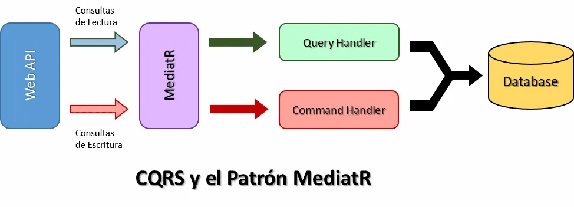
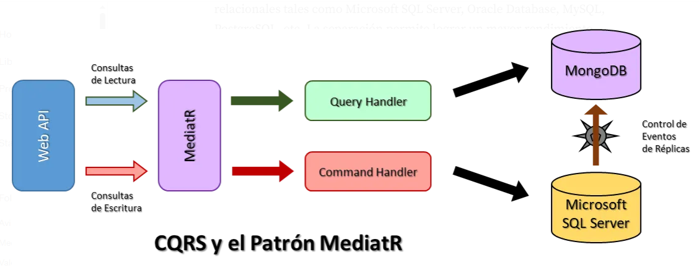
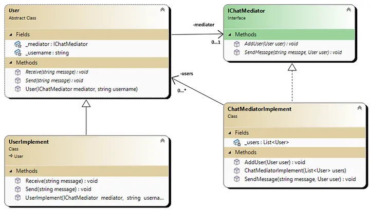
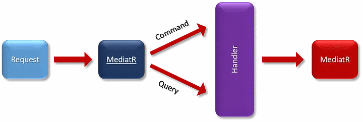
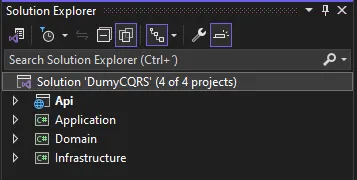
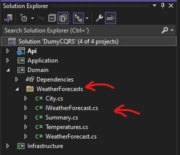
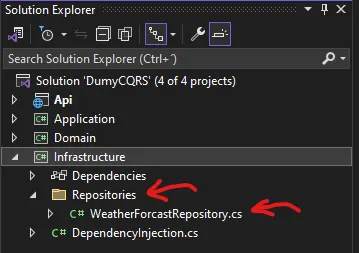
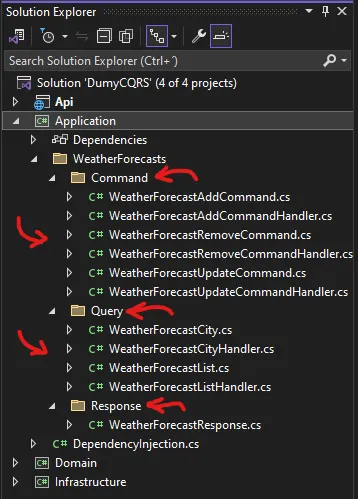
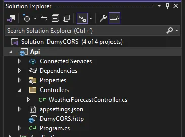
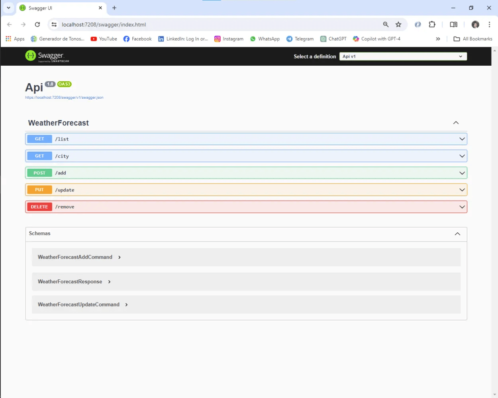

# CQRS (Command Query Responsability Segregation)

## Introducción
CQRS (*Command and Query Responsability Segregation*) o Segregación de Responsabilidades de Comandos y Consultas se trata de un patrón que permite separar las operaciones de lectura y escritura durante la gestión de persistencia de datos. Una de sus principales ventajas es que permite obtener un excelente rendimiento, escalabilidad y seguridad. Esta arquitectura tan particular tiene la gran ventaja de separar los procesos de escritura y lectura, minimizando de esta forma potenciales tipos de conflictos de fusión a nivel de dominio.

## Propuesta Tradicional
Las arquitecturas tradicionales suelen utilizar el mismo modelo de datos para realizar tanto operaciones de consultas de cambio como de lectura. Este grado de operatividad resulta bastante aceptable en aplicaciones o servicios relativamente pequeños. Sin embargo, cuando las aplicaciones o servicios van escalando, se produce un mayor impacto de complejidad en el proceso general.

Esta complejidad se puede traducir en varios tipos de problemas que podrían surgir. Lo más evidente es el mantenimiento dado que el incremento de escala imprime mayor complejidad cíclica y también, diversos tipos de acoplamientos entre las distintas partes del dominio y el modelo.

Por otro lado tenemos el factor de rendimiento. Este es el más crítico de todos. A medida que se incrementa la actividad de uso en las diversas operaciones que realizan las consultas, tiende a producir una merma progresiva de su rendimiento muy significativamente. La cantidad de consultas ejecutadas más las diversas operaciones que se deben realizar dentro del contexto del sistema, pueden ser proclives a generar todo tipo de conflictos y fallos generales.

Por ejemplo, tomando los procesos de consultas de lectura, estas podrían estar haciendo muchos tipos de operaciones que requieren retornar diversos tipos objetos de transferencias, DTO (*Data Transfer Objects*), que requieren diversos tipos de formas. Por lo tanto, el mapeo de estos objetos tienden a complicarse muy significativamente.

Por otro lado, la escritura también tiene sus afecciones directas. La implementación de un tipo de lógica compleja como lo es la empresarial que requiere de un conjunto de procesos específicos podrían verse afectados muy significativamente. Las aplicaciones o servicios empresariales requieren que los sistemas sean seguros, robustos y eficaces.

Todas estas cuotas de exigencia imprimen en los modelos tradicionales una mayor complejidad en su diseño general. Esta tendencia incrementativa tiende a conducir al desarrollador, de forma indirecta, a realizar malas prácticas. Por otro lado, el factor de validaciones que forman parte de la política general de seguridad operativa y funcional, le imprimirá sin duda alguna una mayor complejidad a los procesos en las validaciones generales. La suma de todas estas causales crearán modelos demasiados complejos, rompiendo de algún modo los patrones recomendados, desnaturalizando el espíritu de buenas prácticas y de los patrones recomendados.

## Propuesta de CQRS
Para poder resolver todas estas cuestiones en los sistemas tradicionales, el patrón CQRS nos permite superar muchos de estos problemas y, a su vez, nos permite establecer una mayor confiabilidad durante el diseño e implementación para los procesos de escala, mantenimiento, rendimiento, etc.

Como CQRS separa los universos de las consultas de lectura y escritua, este patrón plantea una nueva arquitectura interesante. Lo más destacado es la gestión que podría darse en las fuentes de persistencia de datos. Es decir, CQRS podría trabajar con dos tipos de fuentes de datos distintas para mejorar su rendimiento. Una fuente de datos podría ser la encargada de gestionar las lecturas y la otra las escrituras. Ambas fuentes de datos deberían encontrarse bajo un esquema de replicación para mantener consistente los datos. Este CQRS junto a otras aplicaciones adicionales de terceros, pueden gestionar muy eficazmente todos estos procesos.

<figure style="text-align:center;">
  
  <figcaption><b>Figura 1:</b> CQRS y el Patrón MediatR</figcaption>
</figure>

Además la tecnología que proporciona CQRS admite el uso de colas para gestionar todas las consultas. Las colas permiten administrar cada uno de los procesos ejecutados en el contexto. Esto imprime directamente una mejor performance operativa.

## Comandos
Los comandos se basan en tareas. Esto lo podemos entender con la siguiente analogía; “Reservar una mesa en el restaurant” no es similar a “Establecer un lugar reservado en dicho restaurant”. Este proceso considera directamente algunos cambios en el tipo o estilo de interacción con el usuario. Modificar la lógica del negocio que procesa dichos comandos tiene el objeto de que se logre la mayor cantidad de operaciones con mayor frecuencia y de manera exitosa. Esto se logra mediante la ejecución de diversas reglas desde el cliente incluso antes del envío de los comandos. Esto permite atajar todo tipo de excepciones o retardo en los procesos operativos. Dicho de otro modo, volviendo a nuestra analogía inicial del restaurant, esto explicaría el estado de la interface del usuario con una acción de “no quedan mesas”. Todo este tipo de validaciones y reglas permiten controlar potenciales conflictos y errores en el servidor, evitando que este colapse por los conflictos y errores producidos en las operaciones del ambiente del sistema. 

Por otro lado, los comandos pueden hacer uso de las colas mediante la modalidad asincrónica para mejorar cada una de las operaciones pertinentes. La modalidad asincrónica permite una mejor gestión de los recursos y eso se traduce en respuestas más rápidas y ágiles. Esto se ve reflejado tanto en las solicitudes como en las respuestas aunque es en las respuestas donde podremos observar mejor sus resultados. 

## Consultas
Las consultas no modifican las bases de datos y por lo tanto, los datos se mantienen consistentes todo el tiempo. El rendimiento más óptimo es mantener en menoria las consultas mediante el uso de una caché. La agilidad de las respuestas de las consultas tienen su cede de rendimiento en este punto. Generalmente, las consultas de lectura suelen ser más lentas y consumir más recursos que la de escritura. Por este motivo se suelen destinar las consultas para que sean operativas en una base de datos a parte de la base de datos de persistencia. Bajo este escenario, se establecen dos tipos de fuentes de datos. Una utilizada para la lectura, la que hará uso de tecnologías que impriman mejor rendimiento como las bases de datos NoSQL o las orientadas a objetos como MongoDB. Mientras que las de escritura normalmente serán tipo de base de datos basadas en SQL relacionales tales como Microsoft SQL Server, Oracle Database, MySQL, PostgreSQL, etc. La separación permite lograr un mayor rendimiento general del sistema. Ver figura 2. 

<figure style="text-align:center;">
  
  <figcaption><b>Figura 2:</b> CQRS y el Patrón MediatR — Haciendo uso de dos Bases de Datos</figcaption>
</figure>

## Generalidades
Quizá la gran desventaja de CQRS por ahora es la de no poder generarse automáticamente a partir del esquema de la base de datos mediante el andamiaje de las herramientas de O/RM. No obstante, esto mismo se puede construir a mano. Además, también resulta posible personalizarlo muy convenientemente.

Por lo tanto y regresando a la figura 2, la aislación entre ambos gestores de bases de datos y de las propias bases de datos es total. Las consultas podrán disponer del esquema de la base de datos destinada a las lecturas, tal es el caso del ejemplo del gestor MongoDB mientras que la de escritura lo hace Microsoft SQL Server.

Mediante este esquema se puede obtener una materialización de datos haciendo uso de las clásicas “vistas” de las bases de datos. Este tipo de almacenamiento puede evitar diversos problemas de uniones y asignaciones por sobre el mapa O/RM complejas. En efecto, el uso de dos tipos de fuentes de datos separadas facilita enormente esta práctica.

## El Patrón MediatR
El patrón MediatR permite implementar el uso de CQRS en los sistemas de la arquitectura limpia o Clean Architecture. Este patrón se trata de uno de los patrones de GoF (*Gang of Four*).

El patrón MediatR o también podríamos llamarlo como Mediador, permite reducir las dependencias caóticas que podrían encontrarse entre los objetos. En breve, minimiza el impacto de acoplamiento en general. Además, el patrón restringe las comunicaciones directamente entre los objetos y las fuerzas para luego colaborar solamente a través del objeto mediador.

La librería MediatR contiene una serie de interfaces especiales que permiten implementar el código. El uso de las interfaces son IRequest, **ICommand** y **IQuery**. Estas interfaces permiten definir los comandos y las consultas en el sistema de forma explícita.

La implementación de estas interfaces de la librería MediatR hacen uso de otra interface muy importante llamada **ISender**. Esta interface más tarde hace uso en el código la función *Send()*. La función *Send()* es utilizada tanto en las consultas como en los comandos para controlar todos los procesos mediante el uso de los Handlers, es decir, los manejadores.

Cuando usamos la interface **ISender** esta interface implementa la función *Handler()* dentro del contexto del manejador de procesos. Esta función se encarga de manipular los procesos implementados dentro del cuerpo de la función cuando esta es ejecutada. Allí mismo podremos configurar nuestras consultas o comandos según sea.

```csharp
using Domain.WeatherForecasts;
using MediatR;

namespace Application.WeatherForecasts.Command;

public sealed class WeatherForecastAddCommandHandler
    : IRequestHandler<WeatherForecastAddCommand, Guid>
{
    private readonly IWeatherForecast _weatherForecast;

    public WeatherForecastAddCommandHandler(IWeatherForecast weatherForecast)
    {
        _weatherForecast = weatherForecast;
    }

    Task<Guid> IRequestHandler<WeatherForecastAddCommand, Guid>.Handle(
        WeatherForecastAddCommand request, 
        CancellationToken cancellationToken
    )
    {
        var temp = new WeatherForecast(
            Guid.NewGuid(),
            request!.Date!.Value,
            new Temperatures(request.Temperatures!.Value),
            new Summary(request!.Summary!),
            new City(request!.City!)
        );
        var reg = _weatherForecast.AddTemperature(temp);
        return Task.Run(() => reg);
    }
}
// Código 1
```
En el siguiente código 1 se puede apreciar la implementación de un comando. Este se encarga de añadir nuevos datos en la fuente de persistencia de datos. Las operaciones de persistencia se realizan desde el repositorio. En este caso es . Este repositorio es inyectado en esta clase para poder ser consumido por los procesos internos de la función *Handler()*. En este caso es a través de la interface **IWeatherForecast** que también está vinculada a la clase del repositorio.

# El Patrón Mediator  

## Profundizando
El patrón Mediator pertenece al conjunto de patrones de comportamiento de Diseño de GoF (*Gang of Four*). El patrón de diseño Mediator es utilizado para proveer una comunicación centralizada a través de diferentes objetos del sistema.

Este patrón Mediator permite un proceso de acomplamiento perdido para encapsular de manera interactiva un conjunto de objetos dispares y luego comunicarlos entre si. Esto permite que las acciones de cada conjunto de objeto varien independientemente unas de otras.

El patrón de diseño Mediator es muy útil en aplicaciones de tipo empresariales donde múltiples objetos estarán interactuando entre si. Si con cada uno de los objetos interactúan directamente entre sí, el sistema de componentes estará estrechamente acoplado entre sí, lo cual en definitiva, facilitará el costo de mantenebilidad y también, el factor de extensibilidad.

El patrón Mediator se enfoca para proveer una mediación entre los objetos con el objeto de establecer una comunicación, y por el otro lado, ayudar al proceso de implementación que estará basado en el efecto de acomplamiento perdido entre los objetos.

Un buen ejemplo análogo para este tipo de patrón es la mediación que se realiza en los aeropuertos a través del control de vuelo de los aviones. La mediación opera como una ruta entre los objetos y este puede tener su propia lógica para proveer la comunicación. Los objetos del sistema se pueden comunicar entre si con cada uno de sus colegas. Usualmente tenemos una interface y una clase abstracta que provee el contrato para las comunicaciones y luego, más tarde, tenemos la implementación de los mediadores.

Supongamos que deseamos implementar una aplicación de chat donde los usuarios puedan charlar en grupo. Cada usuario deberá ser identificado mediante su nombre de modo tal que luego estos puedan enviar o recibir mensajes entre si. El mensaje enviado por un usuario deberá ser recibido por todos los usuarios del grupo.

A continuación, vamos a estudiar un ejemplo como caso de uso para comprender mejor su funcionamiento. 

<figure style="text-align:center;">
  
  <figcaption><b>Figura 3:</b> Partes del conjunto de patrones de Diseño de GoF,</figcaption>
</figure>

El siguiente diagrama de la figura 3 describe un ejemplo que aplica el patrón Mediator. En el esquema podemos apreciar el uso de tres clases y una interface. Una de las clases es abstracta, la clase User, mientras las otras dos clases son comunes.

Ahora bien, la clase UserImplement hereda como clase base la clase User y también hace uso de la interface **IChatMediator**. Por otro lado, la clase ChatMediatorImplement implementa a la interface IChatMediator y luego hace uso de la clase abstracta User.

Si observamos bien los vínculos entre las clases e interfaces, podremos notar varios puntos importantes. El vínculo que se establece entre la clase abstracta User y la interface IChatMediator permite que en la clase User se pueda cargar hasta un usuario como máximo. Observa que la cardinalidad es de 0 a 1. Por otro lado, el vínculo entre la clase User y la clase ChatMediatorImplement, establece una cardinalidad de 0 a (*) muchos. En efecto, en un chat la cantidad de usuarios es múltiple. Por tanto, la cardinalidad nos indica que podrían ser varios los usuarios que participen en el chat.

## La Librería MediatR
Ahora que tenemos un conocimiento más claro del patrón Mediator, estamos listos para analizar y comprender mejor el funcionamiento de la librería MediatR. Ver figura 4.

<figure style="text-align:center;">
  
  <figcaption><b>Figura 4:</b> Esquema Simplificado Representativo de MediatR.</figcaption>
</figure>

## Descripción General de MediatR
MediatR se trata de una librería de .NET cuyo nucleo opera como un mediador que actúa como arbitraje entre los componentes en la aplicación. Estos reciben las solicitudes desde los clientes para poder hallar el manejador apropiado para cada solicitud y luego, delegar la solicitud hacia otro mecanismo de manipulación de procesamiento.

Las solictudes en MediatR se tratan de simples transferencias de datos de objetos DTO (*Data Transfer Object*) que tienen la funcionalidad de encapsular comandos o consultas. Estos comandos y consultas son, en esencia, en lo que se basa el patrón CQRS (*Command Query Responsability Segregation*).

Por otro lado contamos con los manipuladores Handler. Los manipuladores son los responsables de procesar las solicitudes. Cuando una solicitud es recibida por el mediador, este la resuelve mediante el uso de un manipulador apropiado para esa solitud y luego, procede a invocarla para poder manipular la lógica requerida.

MediatR soporta el uso de comportamientos en los Pipelines. Los Pipelines anctúan en el área del Middleware. En breve, los Pipelines se tratan de componentes que interceptan las solitudes y las respuestas, antes y después, cuando son alcanzadas por los manipuladores. El comportamiento del Pipeline habilita a los desarrolladores poder implementar los CCC (*Cross-Cutting Concerns*), tales como los logging, validaciones, captura de excepciones y las autorizaciones como un componente modular y confiable.

## Características Clave
Las características más importantes de la librería MediatR son varias. Vamos a describir cada una de ellas.

El acomplamiento perdido que ofrece MediatR le otorga muchas ventajas significativas a esta arquitectura. Por empezar, MediatR promueve el uso del acomplamiento perdido entre los componentes para eliminar directamente las dependencias entre los envios y las recepciones de las solicitudes. Este proceso convierte a la aplicación en un esquema más modular, flexible y fácil de mantener.

La separación de responsabilidad permite establecer una abstracción en la lógica de los mensajes dentro de las solicitudes, los manipuladores y el mediador. En consecuencia y de esta forma, MediatR facilita entonces la separación de responsabilidades. La lógica del negocio es encapsulada dentro de los manipuladores mientras el mediador manipula la orquestación de las solicitudes y respuestas.

MediatR es altamente extensible y permite a los desarrolladores añadir comportamientos personalizados haciendo uso de Pipelines, decoradores y punto de extensión. Esto habilita la personalización y argumentación del comportamiento por defecto de MediatR, con el objeto de acomodarse a las necesidades específicas de una aplicación.

Los tipos de pruebas en MediatR permiten de manera fácil y flexible la incorporación y uso de los test de unitarios Unit Test mediante un proceso de manipulación aislada. En principio, los manipuladores son desacoplados desde cada una de sus llamadas, pudiendo de esta forma ser inyectadas todas sus dependencias y el paso directo de prueba para las pruebas unitarias, lo que les permite a los desarrolladores escribir tipos de pruebas más robustas y confiables.

## Arquitectura
El patrón de solicitudes y respuestas RRP (*Request-Response Pattern*) es seguido por MediatR donde las solicitudes son enviadas hacia el mediador para ser procesadas por el manipulador más apropiado y luego, más tarde, retornado como respuesta desde dicho invocador. Este patrón ayuda a constituir un esfuerzo para establecer una clara separación de responsabilidades y facilidades para la comunicación entre los diferentes tipos de componentes de la aplicación.

El mecanismo de publicación y subscripción PSM (*Pub-Sub Mechanism*) permite la gestión de los tipos de notificaciones. Las notificaciones permiten a los componentes establecer una difusión múltiple de subsritores de eventos, sin necesidad de esperar la recepción de respuestas. Esto puede resultar ser muy útil en la implementación de tipos de arquitecturas conducidas por eventos Event-Driven Architectures y el desacoplamiento de productores de eventos desde los consumidores. 

## Aspectos de Usabilidad de MediatR
La librería MediatR es propuesta para varios escenarios y productos que son desarrollados por la firma Micorosoft Corporation. La integración de ASP.NET Core es una de ellas. Por lo tanto, MediatR puede ser muy fácilmente integrado a tipos de soluciones ASP.NET Core. Los componentes pueden ser registrados y resueltos de modo automático por el contendor de ASP.NET Core, lo cual esto simplifica muy significativamente su instalación y configuración.

Los desarrolladores típicamente pueden configurar MediatR registrando los manipuladores y el comportamiento de los Pipeline durante la mediación del inicio de un aplicación. Esta configuración asegura los pasos que el mediador conoce como ruta de solicitudes para cada manipulador respectivo y aplicará algún tipo de comportamiento Pipeline que sea necesario.

Los patrones que estriban de la incorporación de MediatR son el CQRS (*Command Query Responsibility Segregation*) y DDD (*Domain-Driven Design*). MediatR puede ser utilizado para implementar estos patrones y mejorar la organización, mantenibilidad y la escalabidlidad de una aplicación o servicio. 

# Clean Architecture (Arquitectura Limpia)
La Arquitectura Limpia o Clean Architecture en inglés, se trata de una propuesta de diseño de software que hace énfasis en el uso de DDD (*Driven-Domain Design*) como patrón de diseño. Puedes leer más de mis artículos en estos dos enlaces “*Principios Fundamentales para el Diseño DDD*” y “*Diseño y Desarrollo de un Dominio*”. A través del patrón de diseño DDD se construye el software.

La Arquitectura Limpia es muy parecida a la Arquitectura Hexagonal. Si bien, comparando a la Arquitectura Limpia con la Arquitectura Hexagonal, ambos tipos de arquitecturas tienen un fin en común. Este fin es el de apuntar a mejorar la mantenebilidad y la pruebas de los sistemas de software. Sin embargo, ambas tienen enfoques distintos. Por un lado, la Arquitectura Limpia se enfoca sobre la organización del código dentro de capas y la aislación de la lógica del dominio mientras que la Arquitectura Hexagonal, se enfoca en la separación del núcleo de la lógca desde las dependencias, haciendo uso de puertos Ports y adaptadores Adapters.

En nuestro caso particular, vamos a describir en caso de estudio que hace uso de la Arquitectura Limpia. Por lo tanto, vamos por ello. Let’s go!


## Aplicación — Caso de Uso
La aplicación **Application** se trata de la “*clásica plantilla*” que ofrece Visual Studio como ASP.NET Core API RESTfull básica de prueba llamada WeatherForescast. Sin embargo, esta plantilla la he refactorizado para que adquiera el patrón de Arquitectura Limpia y también, utilice el patrón CQRS (*Command Query Responsability Segregation*) entre otros patrones más, como iremos viendo a lo largo de este artículo.

<figure style="text-align:center;">
  
  <figcaption><b>Figura 5:</b> Arquitectura de la Solución.</figcaption>
</figure>

Como puedes apreciar en la figura 5, la solución contiene cuatro proyectos importantes. El proyecto llamado Api es el consumidor o cliente de la aplicación mientras que Application, Domain e Infrastructure forman parte de la arquitectura fundamental de la solución llamada DumyCQRS de **WeatherForescast**.

Cada una de las capas de la arquitectura han sido creadas en proyectos de librerías individuales. Esto permite separar mejor los archivos de las librerías en la construcción de nuestra solución. Cada capa tendrá su respectiva librería y, en efecto, dentro de nuestro File System, podremos observar sus respectivos archivos DLL distribuidos dentro de la aplicación compilada.

## Domain
La capa Domain se encuentra en la parte más interna de la Arquitectura Limpia. Generalmente, es considerada como el core o núcleo de la arquitectura. Esta capa es independiendte de cualquier otra capa externa, tal es el caso de base de datos, los Frameworks o la interface del usuario. Básicamente, esta capa contiene entidades, valores de objeto, toda la lógica del negocio que representa los conceptos fundamentales y las reglas generales de la aplicación del **Domain**.

<figure style="text-align:center;">
  
  <figcaption><b>Figura 6:</b> Capa Domain (El dominio.)</figcaption>
</figure>

En la figura 6 podemos apreciar el Domain donde se ubican varias clases, registros y una interface. La carpeta WeatherForcasts contiene todos los recursos. Presta atención que el nombre de la carpeta está en plural mientras que la clase principal del dominio ubicado dentro del archivo WeatherForescast.cs está en singular. En efecto, esta es una regla de convención. Esta convención permite mejorar la organización de los namespace y también, de los distintos tipos de clases, registros, interfaces, enumeraciones, etc.

```csharp
namespace Domain.WeatherForecasts;

public interface IWeatherForecast  
{
    IEnumerable<WeatherForecast> GetListTemperatures();
    IEnumerable<WeatherForecast> GetTemperatures(string city);
    public Guid AddTemperature(WeatherForecast value);
    IEnumerable<WeatherForecast> UpdateTemperature(WeatherForecast value);
    int RemoveTemperature(Guid id);
}
// Código 2
```
Como podemos apreciar en el código 2, la interface **IWeatherForecast** es creada para poder implementar las diversas operaciones que hará nuestra aplicación. Las operaciones se tratan de un clásico CRUD (*Create Read Update Delete*). Precisamente, esta interface será implementada en la clase que administra el repositorio, ubicada en la sección **Infraestructure**, para luego poder controlar las operaciones que se harán de cara a una base de datos o fuente u origen de datos. 

> **Nota**: En nuestro caso trabajaremos todo en memoria mediante listas y enumeraciones de lista para simplificar el proyecto. Sin embargo, se podría implementar cualquier tipo de base de datos que desees. Este tema lo ampliaré más adelante.

Además, la interface **IWeatherForecast** también se implementará en la capa Application para manipular las consultas y comandos que serán quienes se encarguen de procesar las operaciones. Es en este sector donde se ubica el patrón CQRS (*Command Query Responsability Segregation*) que gobernará gran parte del proceso de las operaciones CRUD (*Create Read Update Delete*). 

```csharp
namespace Domain.WeatherForecasts;

public class WeatherForecast
{
    public WeatherForecast(
        Guid id,
        DateTime date,
        Temperatures temperatures, 
        Summary summary, 
        City city
    )
    {
        Id = id;
        Date = date;
        Temperatures = temperatures;
        Summary = summary;
        City = city;
    }
    public Guid Id { get; set; }
    public DateTime Date { get; set; }
    public Temperatures? Temperatures { get; set; }
    public Summary? Summary { get; set; }
    public City? City { get; set; }
}
// Código 3
```

En el código 3 la clase **WeatherForecast** se trata en breve de la entidad del dominio. La entidad describe todas las propiedades más importantes que requiere el dominio. En la clase podemos apreciar el uso de varios campos. Empezando por Id que es utilizado para colocarle un valor único para cada entidad de datos. Este campo hace uso de la clase **Guid**. 

Luego el resto de los campos hacen uso de varios tipos de registros que permiten otorgarle a las propiedades y campos, algunos comportamientos específicos o algún tipo de dato en particular. Debemos recordar que un dominio debe abstrarse en lo posible de depender de tipos de datos primitivos o de obejtos. Lo recomendable que utilice tipos llamados Objetos de Valores para poder moldear algunos comportamientos o tipos de datos más adecuados para el modelo. En efecto, esto mismo hacen los registros. 

```csharp
namespace Domain.WeatherForecasts;

public record City(string value);


namespace Domain.WeatherForecasts;

public record Summary(string value);


namespace Domain.WeatherForecasts;

public record Temperatures(decimal value)
{
    private const decimal CONST_CELSIUS = (Decimal)0.5556;
    private const decimal CONST_KEVIN = (Decimal)273.15;

    public decimal GetScaleCelsius() => value;
    public decimal GetScaleFaranheit() => (32 + (value / CONST_CELSIUS));
    public decimal GetScaleKelvin() => value + CONST_KEVIN;
}
// Código 4
```

En este último conjunto de códigos, cada uno de los registros **record** son ubicados en sus respectivos archivos. Aquí los he colocado todos juntos para facilitar nuestro estudio.

Ahora bien, podrás apreciar que cada registro tiene una estrecha relación con un tipo de dato primitivo o tipo de datos objeto, tal es el caso de string. Bien dije objeto que no es igual a objeto de valores como veremos más adelante. En breve, son representaciones muy sencillas. Sin embargo, el registro Temperatures es algo distinto. Podemos observar en su interior el uso de atributos y operaciones. En efecto, vamos a estudiarlos en más detalles.

Las temperaturas se pueden representar en varios tipos de formatos. Es decir, en grados Celsius, Faranheit y Kelvin. Cada representación requiere del uso de una fórmula particular para obtener la lectura apropiada de temperatura para esa escala de medida. El registro hace uso de tres operaciones, o sea funciones, que permiten adaptar el tipo de temperatura al tipo de grado utilizado. Observa que los grados Celsius son pasados directamente como dato. Sin embargo, tanto los grados Faranheit como los Kelvin requieren de una conversión. En efecto, cada una de estas funciones ejecutan este proceso de cálculo para adaptarla a la escala pertinente.

Cuando la clase de entidad de dato **WeatherForecast** es consumida desde las capas externas, por ejemplo **Application** o **Infrastructure**, la regla de negocio del dominio permiten directamente pasar las escalas de grados calculadas. Recordemos que el dominio es quien dirige las reglas del negocio y no el resto de las capas externas. El experto del dominio ha diseñado al modelo para que funcione de esa forma. Nosotros, los desarrolladores, debemos respetar estas reglas de negocio.

La arquitectura en este caso propone que todas las reglas de las operaciones deben centrarse e instrumentarse dentro de la capa **Domain** y no fuera de esta. La capa **Domain** debe mantenerse inalterable ante el desarrollo o extensión de las otras capas externas y/o colindantes.

## Infrastructure
La capa **Infrastructure** es una capa externa alrededor de la capa de Domain. La capa Infrastructure contiene las implementaciones de interfaces definidas en la capa de **Domain** para poder acceder a los recursos y servicios externos. Esta área incluye la gestión de la base de datos o cualquier otro tipo de origen de fuentes de datos. La gestión prevee tanto la persistencia de los datos como el acceso concurrente de los datos desde las fuentes de datos. Además puede incluir otros tipos de servicios tales como los Web Services, componentes de interfaces especiales o cualquier otra dependencia necesaria para el sistema.

La clave principal de la Arquitectura Limpia para la capa Infrastructure es depender de la capa **Domain** aunque resulta necesario señalar que la capa **Domain** siempre permanecerá totalmente independiente de la capa de **Infrastructure** incluso, cualquier otro tipo de implementación especial que se practique en esta.

<figure style="text-align:center;">
  
  <figcaption><b>Figura 7:</b> Capa Infrastructure (La infraestructura.)</figcaption>
</figure>

En la figura 7 podemos apreciar una carpeta llamada **Repositories** que es utilizada para albergar las clases encargadas de gestionar, en este caso en particular, todos los repositorios de la aplicación. El uso de la carpeta nos permite organizar mejor los namespace y los recursos del proyecto. Por último, por convención, las clases se nombran como "**<<entidad_repositorio>>**" por ejemplo y es nuestro caso **WeatherForecastRepository**.

A continuación, podemos apreciar todo el contenido de la clase para el repositorio de nuestra aplicación. Te recuerdo que este repositorio tiene partes hardcodeadas para poder hacer uso en la memoria como prueba general. No obstante, la inclusión de algún tipo de origen de fuente de datos o una base de datos podría añadirse sin problema alguno. Tan solo se tendría que realizar una serie de cambios y adaptaciones.

```csharp
using Domain.WeatherForecasts;

namespace Infrastructure
{
    public sealed class WeatherForcastRepository : IWeatherForecast
    {
        private static List<WeatherForecast>? _temps;

        public WeatherForcastRepository()
        {
            _temps = new List<WeatherForecast>();
            _temps.AddRange(
                [
                    new WeatherForecast
                    (
                        Guid.Parse("313877cc-a63b-4242-88dc-759eb323f5a0"),
                        DateTime.UtcNow,
                        new Temperatures((decimal)45.31),
                        new Summary(GetSummary("Chilly")),
                        new City(GetCity("Texas"))
                    ),
                    new WeatherForecast
                    (
                        Guid.Parse("313877cc-a63b-4242-88dc-759eb323f5a1"),
                        DateTime.UtcNow,
                        new Temperatures((decimal)12.16),
                        new Summary(GetSummary("Cool")),
                        new City(GetCity("New York"))
                    ),
                    new WeatherForecast
                    (
                        Guid.Parse("313877cc-a63b-4242-88dc-759eb323f5a2"),
                        DateTime.UtcNow,
                        new Temperatures((decimal)10.62),
                        new Summary(GetSummary("Bracing")),
                        new City(GetCity("Washington DC"))
                    ),
                    new WeatherForecast
                    (
                        Guid.Parse("313877cc-a63b-4242-88dc-759eb323f5a3"),
                        DateTime.UtcNow,
                        new Temperatures((decimal)4.55),
                        new Summary(GetSummary("Chilly")),
                        new City(GetCity("Massachusetts"))
                    ),
                ]
            );
        }

        public static IEnumerable<string> GetCities()
        {
            var cities = new List<string>();
            cities.AddRange([
                "New York",
                "Washington DC",
                "Virginia",
                "Massachusetts",
                "Florida"
            ]);
            return cities;
        }

        public static string GetCity(string value)
        {
            var city = GetCities().First(x => x == value);
            return city;
        }

        public static IEnumerable<string> GetListSummaries()
        {
            var summaries = new List<string>();
            summaries.AddRange([
                "Freezing",
                "Bracing",
                "Chilly",
                "Cool",
                "Mild",
                "Warm",
                "Balmy",
                "Hot",
                "Sweltering",
                "Scorching"
            ]);
            return summaries;
        }

        public static string GetSummary(string value)
        {
            var result = GetListSummaries().First(x => x == value);
            return result;
        }

        public static List<WeatherForecast> GetList()
        {
            return _temps!.OrderBy(x => x.Id).ToList();
        }

        public IEnumerable<WeatherForecast> GetListTemperatures()
        {
            return GetList();
        }

        public IEnumerable<WeatherForecast> GetTemperatures(string city)
        {
            var registros = GetList()
                .Where<WeatherForecast>(
                    x => x.City!.value.ToUpper().Equals(city.ToUpper())
                ).AsEnumerable<WeatherForecast>().ToList();

            if (registros is null)
                return Enumerable.Empty<WeatherForecast>();

            var temp = new List<WeatherForecast>();

            foreach (var item in registros)
            {
                temp.Add(
                    new WeatherForecast
                    (
                        item.Id!,
                        item.Date!,
                        item.Temperatures!,
                        item.Summary!,
                        item.City!
                    )
                );
            }

            return temp;
        }

        public Guid AddTemperature(WeatherForecast value)
        {
            _temps!.Add(
                new WeatherForecast
                (
                    value.Id!,
                    value.Date!,
                    value.Temperatures!,
                    value.Summary!,
                    value.City!
                )
            );
            return value!.Id;
        }

        public IEnumerable<WeatherForecast> UpdateTemperature(
            WeatherForecast value
        )
        {
            var registro = GetList()
                .FirstOrDefault<WeatherForecast>(
                    x => x.Id == value.Id
                );

            if (registro is null)
            { 
                var nulo = new List<WeatherForecast>();
                return nulo;
            }

            _temps!.Remove(registro);

            var newRegistro = new WeatherForecast(
                value.Id!,
                value.Date!,
                value.Temperatures!,
                value.Summary!,
                value.City!
            );
            _temps!.Add(newRegistro);

            List<WeatherForecast>? result = [
                new WeatherForecast
                (
                    value.Id!,
                    value.Date!,
                    value.Temperatures!,
                    value.Summary!,
                    value.City!
                )
            ];
            return result;
        }

        public int RemoveTemperature(
            Guid id    
        )
        {
            var registro = GetList()
                .FirstOrDefault<WeatherForecast>(
                    x => x.Id == id
                );

            if (registro is null)
                return 0;

            _temps!.Remove(registro);
            return 1;
        }
    }
}
// Código 5
```

Como puedes apreciar en el código 5, la clase **WeatherForcastRepository** implementa a la interface IWeatherForecast. La implementación de la interface nos permite luego crear y codificar todas las operaciones para la gestión de los datos, a través de un clásico CRUD (*Create Read Update Delete*). Podremos ver las distintas clases de operaciones para añadir, actualizar, eliminar y ejecutar búsquedas o listados de los datos de información dentro del contexto del repositorio. 

```csharp
using Domain.WeatherForecasts;
using Microsoft.Extensions.Configuration;
using Microsoft.Extensions.DependencyInjection;

namespace Infrastructure;

public static class DependencyInjection
{
    public static IServiceCollection AddInfrastructure(
        this IServiceCollection services,
        IConfiguration configuration
    )
    {
        services.AddSingleton<IWeatherForecast, WeatherForcastRepository>();

        return services;
    }
}
// Código 6
```

Por último, contamos con una clase fundamental llamada **DependencyInjection**. En la Arquitectura Limpia como otro tipo de arquitectura similares, también hacen uso del patrón de “*Inyección de Dependencias*” o **Dependency Injection** en inglés. El patrón de inyección de dependencias es utilizado para proporcionar un mecanismo de acomplamiento perdido entre los componentes en una aplicación o servicio. Estos se ven involucrados entre las clases y las interfaces. Gracias a este tipo de patrón podremos crear software más modular, con importantes características de facilidad de tipos de pruebas y por sobretodo, una mejor característica para las prácticas de mantenebilidad del proyecto.

La inyección de dependencias nos permite “*inyectar*” código en las partes y áreas del código fuente para extender las diversas operaciones en nuestro código de nuestra aplicación o servicio. Como podemos apreciar en la clase **DependencyInjection**, la función llamada *AddInfrastructure()* permite configurar los diversos aspectos para el comportamiento de la inyección de dependencias. Podemos apreciar el uso dentro de su cuerpo de la función *AddSingleton<>()* que retorna un tipo específico de implementación para la interface IWeatherForecast sobre la clase **WeatherForecast**. Podemos apreciar como *AddSingleton<IWeatherForecast, WeatherForecast>()* permite unir ambos recursos para crear la inyección. Gracias a este proceso, más tarde, podremos disponer de inyecciones en las clases externas consumidoras y de esta forma poder extenderlas a lo largo de todo nuestro proyecto, como iremos viéndolo a medida que avanzamos en la lectura de estos artículos.

El uso de *AddSinglenton()* es para permitir que el modelo de inyección se cargue solamente una vez en el contexto de la aplicación y que, en cada invocación producida, tan solo se cargue una sola vez en la memoria del sistema. El resto de las invocaciones serán omitidas. En nuestro caso en particular, este proceso evita que lo que tengamos cargado en memoria de nuestro sistema, se elimine cada vez que se ejecute alguna de las operaciones de CRUD.

En el caso de una base de datos, evitaría excesivas conexiones que se crean en el contexto de la aplicación que podrían afectar negativamente al rendimiento de la aplicación o servicio e incluso, podrían crear errores o colapsos generales si el número de invocaciones es elevado. Una creación excesiva de conexiones puede ser un problema muy serio y hay que evitarlo a toda costa.

La función *AddSinglenton()* estriba del patrón Singleton, se trata de un patrón muy importante que forma parte la arquitectura SOLID. El patrón Singleton permite controlar las instancias de clases, limitándola solamente a una creación de instancia por cada proceso de instanciación. El patrón tan solo permitirá crear una sola instancia al comienzo e ignorar el resto de la creación de otras futuras instancias como producto de otras invocaciones dadas. 

# Características Clave de MediatR para CQRS
Para poder utilizar el patrón CQRS nos valemos de una librería llamada MediatR que es la encargada de gestionar los procesos de CQRS. Esta modalidad hace uso, al menos en este proyecto de prueba, de dos interfaces importantes IRequest e IRequestHandler.

La interface **IRequest<TResponse>** se trata de un tipo de marcador que denota un objeto de solicitud. Básicamente, su utilidad es la de indicar que una clase está destinada a representar a una solicitud que puede ser procesada por el mediador. El tipo **TResponse** tiene como objetivo pasar la clase o conjunto de clases que serán utilizadas para el proceso de respuesta. El proceso de respuesta es representado por algún tipo de clase de entidad de modo de brindar un formato de dato saliente. Las clases salientes pueden tratarse de tipos DTO (*Data Transfer Object*).

La interface **IRequestHandler<TRequest, TResponse>** es utilizada para definir las clases que serán manipuladas por los tipos de solicitudes. Para el caso de **TRequest** y luego, lo que producirá mediante **TResponse** o también **TResult**. TRequest se trata del tipo de solicitud que el manipulador podrá procesar. Este representa entonces el ingreso o entrada para el manipulador y podría tratarse de cualquier clase que implementa la interface **IRequest<TResponse>**, donde la T es el tipo de resultado esperado desde la manipulación de la solicitud. Por otro lado, **TResponse** o **TResult** son tipos que son producidos desde el manipulador. En consecuenia, ambos representan la salida de los datos desde el manipulador siendo cualquier tipo de datos. La representación **TResult** es utilizada para la personalización de tipos de resultados de salidas para las respuesta de los procesos de solicitudes iniciales. En breve, nos permite el uso de la clase **Result**.

A menudo, la clase **Result** se la utiliza como una clase personalizada para representar el resultado de una operación, generalmente utilizada en escenarios de manejo de errores o para devolver información adicional junto con el resultado de una operación.

## Application
La capa **Application** se ubica sobre la capa **Domain**. La capa **Application** orquesta el flujo de datos y la lógica entre la capa **Domain** y las interfaces que están vinculadas con UI (*User Interface*), las bases de datos, los servicios externos, etc. Basicamente, esta capa consiste en una serie de clases o componentes que manipulan la lógica del negocio, representan escenarios de casos de usos y especifica el flujo de trabajo. Todas estas clases actúan como intermediarios entre la interface de usuario, la capa **Domain** y los sistemas externos. Existe una estricta separación de las responsabilidades y los componentes comunmente encontrados en la capa **Application** de la Arquitectura Limpia. En resumen, en esta capa podremos hallar recursos tales como los Casos de Usos y sus Interacciones, Aplicación de Servicios, los DTO (*Data Transfer Object*), las Políticas de Autorización de la Aplicación, la Gestión de Transacciones y la Manipulación de Errorres, Logging, etc.

En la capa de **Application** vamos a encontrarnos con la implementación del patrón CQRS (*Command Query Responsability Segregation*). Este lo estudiaremos en detalle a continuación. 

<figure style="text-align:center;">
  
  <figcaption><b>Figura 8:</b> Capa Application (La aplicación.)</figcaption>
</figure>

Como podemos apreciar en la figura 8, vemos cómo se encuentra distribuido cada una de las clases que nos permiten construir las distintas funcionalidades de nuestra aplicación. La capa Application tiene implementado CQRS (*Command Query Responsability Segregation*) para gestionar todos los procesos. Antes de describir por completo la capa **Application**, vamos a conocer algunos detalles particulares de CQRS (*Command Query Responsability Segregation*).

La carpeta **Response** de la figura 8 es utilizada para ubicar todas las clases de salida como respuesta a las peticiones dadas. En esta sección suelo colocar todos los tipos de datos, también los DTO de salida, destinados a la saliente de datos. En esta ocasión, contamos con el registro de tipo de datos **WeatherForecastResponse**. Este lo podemos ver a continuación.

```csharp
namespace Application.WeatherForecasts.Response;

public record WeatherForecastResponse
{
    public Guid Id { get; set; }
    public DateTime Date { get; set; } 
    public decimal GetScaleCelsius { get; set; }
    public decimal GetScaleFaranheit { get; set; }
    public decimal GetScaleKelvin { get; set; }
    public string? Summary { get; set; }
    public string? City { get; set; }
}
// Código 7
```

Como puedes apreciar, este registro no tiene demasiada complejidad. En este caso vemos cómo son representados los datos salientes y en particular, aquellos datos vinculados para las distintas escalas de temperatura.

Podrías planearte si alguien necesita dar formato numérico y simbólico a los valores arrojados por la consulta, para logar tal acometido, hacer una implementación para tal caso en este registro sería válido. En verdad, si se puede hacer. Sin embargo, sería mejor hacerlo en la capa Domain antes de tener que hacerlo aquí. No obstante, si la representación son simplemente la muestra de formatos, podría ser la regla que justifica la excepción. Eso quedaría a tu criterio. En mi caso particular, yo evaluaría muy bien la situación para determinar si es o no conveniente hacerlo en este sector. Lo ideal es que se debiera hacerse en la capa Domain.

Luego, contamos con dos carpetas más Command y Query. En esta sección es donde se implementa verdaderamente todas las funcionalidades de CQRS (*Command Query Responsability Segregation*).

## Query
Vamos a empezar a describir lo que sucede en la sección de **Query**. En esta parte se ubican las consultas de solo lectura para nuestra aplicación.

```csharp
using Application.WeatherForecasts.Response;
using MediatR;

namespace Application.WeatherForecasts.Query;

public record WeatherForecastList() 
    : IRequest<IEnumerable<WeatherForecastResponse>> { }
// Código 8
```

El siguiente registro **WeatherForecastList** es utilizado para otorgar las configuraciones para el **IRequest**. El uso de **IRequest** nos permite pasar la clase que será utilizada durante la respuesta a través de la clase **WeatherForecastResponse** que hemos visto recientemente como salida y, a su vez, esta está encapsulada mediante una interface IEnumerable. La interface IEnumerable nos permite manipular listas o una colección de datos. Recordemos que para mostrar en pantalla un listado de datos requerimos de una especie de colección para poder gestionarlo. 
```csharp
using Application.WeatherForecasts.Response;
using Domain.WeatherForecasts;
using MediatR;

namespace Application.WeatherForecasts.Query;

public sealed class WeatherForecastListHandler
    : IRequestHandler<WeatherForecastList, IEnumerable<WeatherForecastResponse>>
{
    private readonly IWeatherForecast _weatherForecast;

    public WeatherForecastListHandler(IWeatherForecast weatherForecast)
    {
        _weatherForecast = weatherForecast;
    }

    public async Task<IEnumerable<WeatherForecastResponse>> Handle(
        WeatherForecastList request,
        CancellationToken cancellationToken
    )
    {
        var temps = _weatherForecast.GetListTemperatures();
        var list = new List<WeatherForecastResponse>();
        foreach (var temp in temps)
        {
            list.Add(new WeatherForecastResponse
            {
                Id = temp.Id,
                Date = temp.Date,
                GetScaleCelsius = temp.Temperatures!.GetScaleCelsius(),
                GetScaleFaranheit = temp.Temperatures!.GetScaleFaranheit(),
                GetScaleKelvin = temp.Temperatures!.GetScaleKelvin(),
                Summary = temp.Summary!.value,
                City = temp.City!.value
            });
        }
        return list; 
    }
}
// Código 9
```

La clase **WeatherForecastListHandler** como lo sugiere su nombre es la clas para la manipulación de las consultas. Podemos observar la implementación de la interface **IRequestHandler**. Esta interface nos permite pasar el registro **WeatherForecastList** que implementa a su vez la interface **IRequest** y también, implementa la clase o registro saliente **WeatherForecastResponse**. Toda esta encapsulación nos permite finalmente implementar la función *Handler()* que será utilizada para la manipulación general.

La clase **WeatherForecastListHandler** hace uso de un constructor para poder inyectar la interface IWeatherForecast. Recordemos que la interface IWeatherForecast está vinculada con la clase del repositorio WeatherForecastRepository y que fue configurada desde para la inyección desde la clase DependencyInjection en la sección Infrastructure.

Gracias a la inyección de IWeatherForecast podremos hacer uso de la función *GetTemperaturesList()* y que nos ayuda a traer el listado total de las temperaturas por cada ciudad de los EEUU. El algoritmo sencillamente lo que hace es obtener el listado desde esta función y luego, la adapta para añadirla en una colección de datos saliente, con el objeto más tarde de ser consumida por los clientes externos y, que en nuestro caso, es nuestra Api de nuestro propio proyecto y de la que hablaremos al final de todo.

Algo parecido sucede para la siguiente consulta. La única diferencia es que en esta ocasión, obtendremos datos desde un filtro y que es aplicado por ciudad de los EEUU. 

```csharp
using Application.WeatherForecasts.Response;
using MediatR;

namespace Application.WeatherForecasts.Query;

public record WeatherForecastCity(string city) 
    : IRequest<IEnumerable<WeatherForecastResponse>> { }
// Código 10
```

Como puedes apreciar, el registro no difiere demasiado del otro registro creado para los listados. Quizá te preguntes, si son iguales, ¿porqué crear otro y no reutilizar el ya creado anterioremente? Obviamente que podría reutilizarse. Sin embargo, siempre es mejor separar las responsabilidades. La idea es trabajar bajo las recomendaciones que los patrones proponen. 

```csharp
using Application.WeatherForecasts.Response;
using Domain.WeatherForecasts;
using MediatR;

namespace Application.WeatherForecasts.Query;

public sealed class WeatherForecastCityHandler
    : IRequestHandler<WeatherForecastCity, IEnumerable<WeatherForecastResponse>>
{
    private readonly IWeatherForecast _weatherForecast;

    public WeatherForecastCityHandler(IWeatherForecast weatherForecast)
    {
        _weatherForecast = weatherForecast;
    }

    public async Task<IEnumerable<WeatherForecastResponse>> Handle(
        WeatherForecastCity request, 
        CancellationToken cancellationToken
    )
    {
        var temps = _weatherForecast.GetTemperatures(request.city);
        var list = new List<WeatherForecastResponse>();
        foreach (var temp in temps)
        {
            list.Add(new WeatherForecastResponse
            {
                Id = temp.Id,
                Date = temp.Date,
                GetScaleCelsius = temp.Temperatures!.GetScaleCelsius(),
                GetScaleFaranheit = temp.Temperatures!.GetScaleFaranheit(),
                GetScaleKelvin = temp.Temperatures!.GetScaleKelvin(),
                Summary = temp.Summary!.value,
                City = temp.City!.value
            });
        }
        return list;
    }
}
// Código 11
```

Nuevamente, ahora podemos observar la similitud que posee la clase manipuladora **WeatherForecastCityHandler** respecto a WeatherForecastListHandler. En esencia, ambas clases son similares excepto que esta última hace uso de la función *GetTemperatures(ciudad)*. La siguiente función retornará los datos de una ciudad dada. El resto de las operaciones en el algoritmo de la función *Handler()* son similares como el anterior caso. 

## Command
En esta área se hallan las consultas que permiten escribir en nuestra aplicación. La carpeta **Command** alberga cada una de las tres operaciones de escritura posible; es decir, crear o agregar, modificar y eliminar registros de la base de datos. Recordemos. La persistimos la estoy haciendo en la memoria del sistema para hacer las pruebas.

```csharp
using MediatR;

namespace Application.WeatherForecasts.Command;

public record WeatherForecastAddCommand() : IRequest<Guid> 
{
    public DateTime? Date { set; get; }
    public decimal? Temperatures { set; get; }
    public string? Summary { get; set;  }
    public string? City { get; set; }
}
// Código 12
```

Comenzamos con la operación que permite añadir nuevos registros a nuestra lista en la memoria del sistema. El siguiente registro **WeatherForecastAddCommand** es utilizado para la entrante de datos que necesitamos para la insersión de un nuevo registro. Podrás notar que estoy utilzando solamente una propiedad de campo para la temperatura llamado **Temperatures**. 

Ahora bien. recuerda que para poder representar cada una de las escalas de temperatura necesito aplicar la formula apropiada para adaptar dichas escalas de grados. Esto mismo se hace en la sección Domain dado que posee sus reglas de operaciones para dichos cálculos. Por lo tanto, en esta área de **Application**, tan solo necesito pasar el valor de la temperatura en grados Celsius.

```csharp
using Domain.WeatherForecasts;
using MediatR;

namespace Application.WeatherForecasts.Command;

public sealed class WeatherForecastAddCommandHandler
    : IRequestHandler<WeatherForecastAddCommand, Guid>
{
    private readonly IWeatherForecast _weatherForecast;

    public WeatherForecastAddCommandHandler(IWeatherForecast weatherForecast)
    {
        _weatherForecast = weatherForecast;
    }

    Task<Guid> IRequestHandler<WeatherForecastAddCommand, Guid>.Handle(
        WeatherForecastAddCommand request, 
        CancellationToken cancellationToken
    )
    {
        var temp = new WeatherForecast(
            Guid.NewGuid(),
            request!.Date!.Value,
            new Temperatures(request.Temperatures!.Value),
            new Summary(request!.Summary!),
            new City(request!.City!)
        );
        var reg = _weatherForecast.AddTemperature(temp);
        return Task.Run(() => reg);
    }
}
// Código 13
```

La clase de manipulación **WeatherForecastAddCommandHandler** es utilizada para ejecutar la operación de insersión de datos. Como puedes apreciar, no difiere de las consultas de lectura. Sin embargo, resulta importante señalar la necesidad de separar las responsabilidades para respetar los patrones de responsabilidad simple. Para cerrar, la función *AddTemperature()* se encarga de insertar el nuevo registro en la colección de datos de la memoria.

A continuación, paso a mostrar el código para el resto de las operaciones y que prácticamente no demandan diferencia excepto las operaciones que realizan cada uno de estos. Me refiero entonces a las operaciones modificar y eliminar. 

```csharp
using MediatR;

namespace Application.WeatherForecasts.Command;

public record WeatherForecastRemoveCommand() : IRequest<int>
{
    public Guid Id { get; set; }
}
// Código 14
```

Y su manipulador... 

```csharp
using Domain.WeatherForecasts;
using MediatR;

namespace Application.WeatherForecasts.Command;

public sealed class WeatherForecastRemoveCommandHandler
    : IRequestHandler<WeatherForecastRemoveCommand, int>
{
    private readonly IWeatherForecast _weatherForecast;

    public WeatherForecastRemoveCommandHandler(IWeatherForecast weatherForecast)
    {
        _weatherForecast = weatherForecast;
    }

    public Task<int> Handle(WeatherForecastRemoveCommand request, CancellationToken cancellationToken)
    {
        var regRemove = _weatherForecast.RemoveTemperature(request.Id);
        return Task.Run(() => regRemove);
    }
}
// Código 15
```

Finalmente la operación para las actualizaciones. 

```csharp
using Application.WeatherForecasts.Response;
using MediatR;

namespace Application.WeatherForecasts.Command;

public record WeatherForecastUpdateCommand() 
    : IRequest<IEnumerable<WeatherForecastResponse>>
{
    public Guid Id { get; set; }
    public DateTime? Date { set; get; }
    public decimal? Temperatures { set; get; }
    public string? Summary { get; set; }
    public string? City { get; set; }
} 

using Application.WeatherForecasts.Response;
using Domain.WeatherForecasts;
using MediatR;

namespace Application.WeatherForecasts.Command;

public sealed class WeatherForecastUpdateCommandHandler
    : IRequestHandler<WeatherForecastUpdateCommand, IEnumerable<WeatherForecastResponse>>
{
    private readonly IWeatherForecast _weatherForecast;

    public WeatherForecastUpdateCommandHandler(IWeatherForecast weatherForecast)
    {
        _weatherForecast = weatherForecast;
    }

    public async Task<IEnumerable<WeatherForecastResponse>> Handle(
        WeatherForecastUpdateCommand request, 
        CancellationToken cancellationToken
    )
    {
        var upRegistro = new WeatherForecast(
            request.Id,
            request.Date!.Value,
            new Temperatures(request.Temperatures!.Value),
            new Summary(request!.Summary!),
            new City(request!.City!)
        );

        var registro = _weatherForecast.UpdateTemperature(
            upRegistro
        );

        if (registro is null || registro.Count() == 0)
        {
            var nulo = new List<WeatherForecastResponse>();
            return nulo;
        }

        var outRegistro = new List<WeatherForecastResponse>();
        outRegistro.Add(new WeatherForecastResponse
        {
            Id = upRegistro.Id,
            Date = upRegistro.Date,
            GetScaleCelsius = upRegistro.Temperatures!.GetScaleCelsius(),
            GetScaleFaranheit = upRegistro.Temperatures!.GetScaleFaranheit(),
            GetScaleKelvin = upRegistro.Temperatures!.GetScaleKelvin(),
            Summary = upRegistro.Summary!.value,
            City = upRegistro.City!.value
        });

        return outRegistro;
    }
}
// Código 16
```

Finalmente, la clase de manipulación para proceder con la actualizaciones o modificaciones de los datos existentes en la colección de datos.

Resulta necesario puntualizar que la capa **Application** también dispone de una clase utilizada para las injecciones y otros procesos más que permiten acoplar las capas de **Domain** y **Application**.

```csharp
using FluentValidation;
using Microsoft.Extensions.DependencyInjection;

namespace Application;

public static class DependencyInjection
{
    public static IServiceCollection AddApplication(
        this IServiceCollection services
    )
    {
        var assembly = typeof(DependencyInjection).Assembly;

        services.AddMediatR(configuration =>
            configuration.RegisterServicesFromAssembly(assembly));

        services.AddValidatorsFromAssembly(assembly);

        return services;
    }
}
// Código 17
```

Como podemos ver, la clase para las inyecciones hacen uso de la configuración para habilitar el uso de MediatR para nuestro CQRS (*Command Query Responsability Segregatio*n).

## Api
Por último, pasamos a describir la aplicación que consume el resto de los recursos de la arquitectura descripta hasta el momento. Sencillamente, Api es una aplicación API RESTful utilizada para consumir los contratos que ofrece nuestro servicio interno de la aplicación para el clima.

<figure style="text-align:center;">
  
  <figcaption><b>Figura 9:</b> La capa API o interface para el Cliente.</figcaption>
</figure>

El controlador de la clase de la aplicación API es utilizado para exponer cada uno de los contratos de las API a través de las distintas operaciones del CRUD. 

```csharp
using Application.WeatherForecasts.Response;
using Domain.WeatherForecasts;
using MediatR;

namespace Application.WeatherForecasts.Command;

public sealed class WeatherForecastUpdateCommandHandler
    : IRequestHandler<WeatherForecastUpdateCommand, IEnumerable<WeatherForecastResponse>>
{
    private readonly IWeatherForecast _weatherForecast;

    public WeatherForecastUpdateCommandHandler(IWeatherForecast weatherForecast)
    {
        _weatherForecast = weatherForecast;
    }

    public async Task<IEnumerable<WeatherForecastResponse>> Handle(
        WeatherForecastUpdateCommand request, 
        CancellationToken cancellationToken
    )
    {
        var upRegistro = new WeatherForecast(
            request.Id,
            request.Date!.Value,
            new Temperatures(request.Temperatures!.Value),
            new Summary(request!.Summary!),
            new City(request!.City!)
        );

        var registro = _weatherForecast.UpdateTemperature(
            upRegistro
        );

        if (registro is null || registro.Count() == 0)
        {
            var nulo = new List<WeatherForecastResponse>();
            return nulo;
        }

        var outRegistro = new List<WeatherForecastResponse>();
        outRegistro.Add(new WeatherForecastResponse
        {
            Id = upRegistro.Id,
            Date = upRegistro.Date,
            GetScaleCelsius = upRegistro.Temperatures!.GetScaleCelsius(),
            GetScaleFaranheit = upRegistro.Temperatures!.GetScaleFaranheit(),
            GetScaleKelvin = upRegistro.Temperatures!.GetScaleKelvin(),
            Summary = upRegistro.Summary!.value,
            City = upRegistro.City!.value
        });

        return outRegistro;
    }
}
// Código 18
```

Las operaciones las podremos probar con Swagger que se incorpora en este proyecto. Tu puedes utilizar cualquier otro tipo de programas para probar API como por ejemplo Postman. 

<figure style="text-align:center;">
  
  <figcaption><b>Figura 10:</b> Usando Swagger para probar las operaciones de CRUD de la aplicación.</figcaption>
</figure>

Con Swagger resulta posible probar cada una de las interacciones que requiere nuestra aplicación. Por lo tanto, podrás acoplar otras aplicaciones o programa para probar esta API e incluso, hasta crear una aplicación Frontend de cliente y luego consumir cada uno de estos endpoint de operación para la manipulación de los datos desde una interface gráfica e interactiva para el cliente de manera que la puedan utilizar los usuarios. 

---

# Repositorio
Repositorio en GitLab de toda la solución la encuentras en el siguiente enlace. https://github.com/Ariel-A-W/documentation/tree/main/repo/dumycqrs

## Fuente

### Autor: 
- (Arq. e Ing.) Ariel Alejandro Wagner

### Medios Relacionados: 

Publicación: 17-07-2024 Blog Medium (Mi autoría)
- (Parte 1) https://medium.com/@arielwagnermovil/cqrs-command-and-query-responsibility-segregation-parte-1-ece3d468152d
- (Parte 2) https://medium.com/@arielwagnermovil/cqrs-command-and-query-responsability-segregation-parte-2-561b5370d501
- (Parte 3) https://medium.com/@arielwagnermovil/cqrs-command-and-query-responsability-segregation-parte-3-0e3d2dc25749
- (Parte 4) https://medium.com/@arielwagnermovil/cqrs-command-and-query-responsability-segregation-parte-4-9ea259cd1bb5