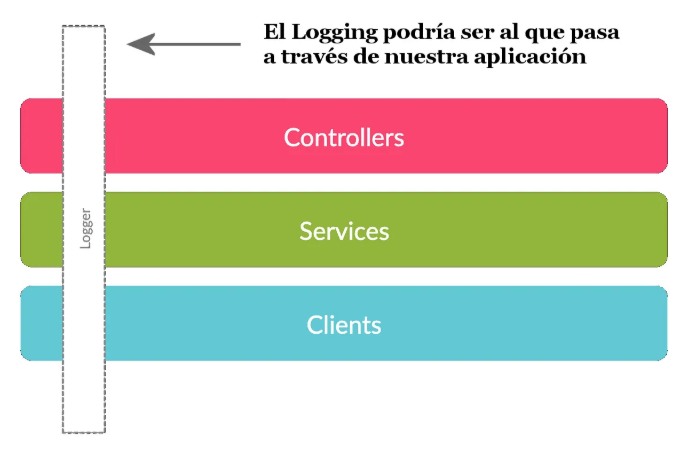

# Cross-Cutting Concerns en Clean Architecture

## Introducción 
Cross-Cutting Concerns (*Aspectos de las Responsabilidades Transversales*) se tratan de diversos tipos o aspectos de un sistema de software, donde varias capas que describen la arquitectura de un sistema se ven afectadas, debido por las diversas transversalidades de un componente o, de varios de ellos, sobre toda la arquitectura de capas y módulos, a lo largo de todo el sistema de aplicación o servicio determinado.

Ello quiere decir que un módulo que utilizamos, como por ejemplo, para registrar logs que supervisan todas las actividades de nuestro sistema, se ven afectados por encontrarse ubicados en cada una de las capas o módulos funcionales de nuestro sistema. Por ejemplo, los logs que utilizamos para auditar las autenticaciones y autorizaciones en nuestro sistema, los manejos de errores generales o específicos, el almacenamiento de caché, el comportamiento o monitoreo de desempeño del software, el registro de actividades operativas y funcionales del sistema, etc.

Para poder comprender mejor el efecto CCC (*Cross-Cutting Concerns*), supongamos que tenemos un Logger en el sistema de software que se distribuye sobre varias capas, como se muestra a continuación en la figura 1.

<figure style="text-align:center;">
  
  <figcaption><b>Figura 1:</b> La Distribución de Logger sobre todas las capas.</figcaption>
</figure>

El módulo Logger supervisa cada una de las capas. Cada una de estas requiere que se implemente el código de modo de ajustar la supervisión de cada una de las operaciones que se den dentro de cada una de las capas. Esto se hace para poder registrar cada una de las actividades que se dan en las capas y determinar su comportamiento operativo.

El problema surge cuando es necesario hacer algún cambio del código en alguna de las capas y peor aún, si ese cambio requiere que se modifique la implementación que Logger ha realizado en cada área competente.

Este aspecto de cambio podría resultar bastante crítico, caótico y proclive a generar todo tipo de fallas o anomalías inesperadas. Por lo tanto, resulta que será necesario adaptar cada una de las áreas afectadas complicando así el código y haciéndolo cada vez más en proclive a producir toda clase de fallos y excepciones.

En el lenguaje .NET C#, CCC (*Cross-Cutting Concerns*) son abordadas mediante el uso de una serie de técnicas. Estas técnicas podrían basarse en AOP (*Programación Orientada a los Aspéctos*) o bien, mediante el uso de algunos patrones decoradores, proxy o interceptores.

Los aspectos apliables a estas técnicas los podemos descomponer al menos en seis tipos. Ellos son descriptos a continuación.

**Logging** — Se trata de un CCC (*Cross-Cutting Concerns*) de orden clásico entre los sistemas con el objeto de capturar información sobre la ejecución de una aplicación que puede perseguir o bien, análisis, depuración, monitoreo, auditoría, etc. En .NET, existen diversas alternativas para su uso e implementación, como por ejemplo los productos PostSharp, Castle DynamicProxy o Serilog, tan solo por citar algunos ejemplos. Estos permiten inyectar el código de registro usando una serie de métodos, sin alterar el código de fuente original.

**Autenticación y Autorización** — Resulta muy frecuente la necesidad de supervisar el comportamiento de ambos mecanismos de validaciones de credenciales, a los efectos de garantizar la seguridad de los sistemas. La verificación de los usuarios y sus acciones permitidas o denegadas, en un sistema, son cruciales. Estas en breve encierra niveles de CCC (*Cross-Cutting Concerns*) que podrían encontrarse muy vinculados a este efecto. Por otro lado, AOP (*Programación Orientada a los Aspéctos*) se puede utilizar para hacer cumplir las comprobaciones de autorización mediante varios métodos alternativos. Por lo tanto, el registro de las actividades de la seguridad pueden ser muy fácilmente instrumentadas con una debida implementación que evite el efecto CCC (*Programación Orientada a los Aspéctos*) para obtener los mejores resultados.

**Manejo de Errores** — Otro gran aspecto importante es el concerniente al tipo de manejo de errores y excepciones. Una buena práctica para garantizar un mejor desarrollo de los registros de log es evitar el desperdigado de bloques de tipo try…catch a través de todo el código base. En su lugar, todo ello se puede simplemente centralizar utilizando las técnicas de AOP (*Programación Orientada a los Aspéctos*). Las notificaciones se puede clasificar según sea mediante diversos tipos de niveles de errores y/o excepciones.

**Almacenamiento en Caché** — El uso de caché en los sistemas pueden mejorar el rendimiento del software muy significativamente. Por lo tanto, es ideal que este sistema funcione apropiadamente. Para ello se requiere de una supervisión eficaz de su comportamiento y uso de los recursos en el sistema en general. En efecto, el uso de Logger puede ser de gran utilidad para su monitoreo. Sin embargo, es necesario recalcar que la implementación que evita el efecto CCC (*Cross-Cutting Concerns*) será en breve la mejor opción a elegir. Para ello mediante AOP (*Programación Orientada a los Aspéctos*) podremos disponer del uso de patrones que utilizan decoradores para añadir de forma transparente el comportamiento del almacenamiento de caché a métodos o clases.

**Monitereo del Rendimiento** — La versatilidad de un programa de aplicación o servicio de software radica en su capacidad de rendimiento. La identificación temprana de potenciales problemas que ejercen una funcionalidad pobre o negativa, permiten allanar el camino para sanaer el sistema, mediante la incorporación de mejoras, correcciones, inclusión de otras funcionalidades, etc. A través de la técnica que evita una implementación discresional que rompe la sugerencia CCC (*Cross-Cutting Concerns*), se puede contribuir muy positivamente mejorar el rendimiento pero en particular, a la recabación de información como peritaje en el sistema de forma eficaz.

**Gestión de Transacciones** — Las transacciones son muy importantes entre los sistemas porque permiten la comunicación y el intercambio de valores. Por ejemplo, un banco que realiza diversas operaciones bursátiles a través de la transferencia de dinero electrónico de un punto a otro. Resulta de suma importancia poder supervisar todos los movimientos que se realizan mediante las transacciones comerciales de la entidad. En efecto, un Logger nos puede ayudar a supervisar si las transacciones se han realizado de forma satisfactoria. Por lo tanto, la implementación de un sistema que requiere este monitoreo, necesariamente hará uso de un sistema eficaz y muy fácil de implementar, y lo más importante de todo, que no requiere que su incorporación altere la naturaleza del código fuente de origen. Siguiendo las buenas prácticas que nos sugiere el efecto CCC (*Cross-Cutting Concerns*) podremos garantizar el proceso satisfactoriamente.

En resumen, para abordar con precisión el abordaje de CCC (*Cross-Cutting Concerns*) de manera efectiva, es la de mejorar la capacidad de mantenimiento, la modularidad y la escalabilidad de su software mientras mantiene su base de código limpia y enfocada en la lógica empresarial.

## Ejemplo para Logging
El siguiente ejemplo hace uso de la implementación de Castle DynamicProxy a través de la clase **ProxyGenerator**.

```csharp
public class Logging : IInterceptor
{
    public void Intercept(IInvocation invocar)
    {
        // Antes de que se ejecute el método.
        Console.WriteLine($"Entering {invocar.Method.Name}");

        try
        {
            // Procede con el método de ejecución. 
            invocar.Proceed();

            // Después de la ejecución del método. 
            Console.WriteLine(
                $"Exiting {invocar.Method.Name}");
        }
        catch (Exception ex)
        {
            // Anotar las excecpiones.
            Console.WriteLine(
                $"Exception in {invocar.Method.Name}: {ex.Message}");
            throw;
        }
    }
}

// Uso:
var generator = new ProxyGenerator();
var myClass = generator.CreateClassProxy<MyClass>(new Logging());
myClass.MethodToIntercept();
// Código 1
```

El siguiente código es un ejemplo muy sencillo de cómo instrumentar una implementación de Logging para un sistrema de aplicación o servicio. Resulta interesante observar que la salida hacia la consola, es en esencia, la raíz del registrado del comportamiento de las clase Logging de sus métodos y funciones. Dentro del mensaje que se emite hacia la consola se embebe las variable que permite pasar la información del regitrado del logging en cada uno de los mensajes de la salida de consola mediante la propiedad invocar.Method.Name respectivamente. En este caso habalmos del método *Intercept()*.

Ahora bien, dentro del bloque try podemos apreciar el uso del método *invocar.Proceed()* encargado de activar la supervisión del proceso. Luego la siguiente línea enviará, tanto a la Consola como al monitoreo de Logging el mensaje de operación instrumentada hasta el momento. Eso si, esto lo hará siempre y cuando el bloque try no encuentre algún error o excepción. Si ese fuese el caso, el mensaje contenido dentro del bloque try no será ejecutado y en su lugar, pasará a ejecutarse el bloque catch. En este bloque se emite otro mensaje a través de la Consola como así al monitoreo Logging marcando el error o la excepción producida. Observa que en este mensaje se le añade ex.Message que es la propiedad de la clase Exception que pasa el bloque catch al proceso. Esta propiedad nos proporciona un detalle del error o excepción encontrada. Por tanto, ambas variables nos proporcionan un mayor detalle de los potenciales errores o excepciones encontradas.

## Fuente

### Autor: 
- (Arq. e Ing.) Ariel Alejandro Wagner