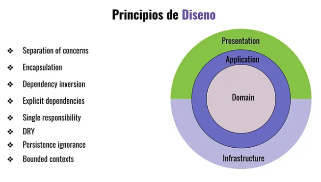

# Principios Fundamentales para el Diseño en DDD (Domain-Driven Design) 

## Introducción
El éxito del desarrollo de un software requiere de varios requisitos importantes. Estos requisitos se traducen en lo que podemos definir como “*Principios de Diseño*”. En pocas palabras, necesitamos conocer muy bien qué debemos hacer para obtener las mejores prácticas. 

<figure style="text-align:center;">
  
  <figcaption><b>Figura 1:</b> Principios de Diseño Clave para un buen desarrollo de un software.</figcaption>
</figure>

Como podemos apreciar en la figura 1, vemos una lista de items importantes que atañen a lo concerniente al uso de las buenas prácticas y cuyo objeto es lograr obtener un diseño exitoso. Vamos entonces a detallar cada uno de estos items.

## Separation of Concerns (Separación de Responsabilidades)
También se lo puede traducir en español como “*separación de responsabilidades*”. Su función básicamente es la de separar en partes cada una de las secciones que cumplen un determinado tipo de funcionalidad. Centrándonos en la figura 1, como una analogía a esta terminología, podemos decir que el “*Core Domain*” o núcleo del dominio se encuentra separado de las dependencias externas. Por ejemplo, una base de datos. En consecuencia, el Core Domain puede ser construido sin la necesidad de algún tipo de implementación específica de una base de datos.

### Encapsulation (Encapsulación)
El mecanismo de Encapsulación es muy conocido en el paradigma Orientado a Objetos. Su principal rol es la de producir dos efectos importantes; ocultar y aislar. Ocultar es una técnica que utilizamos para evitar que se exponga al ámbito público recursos que no lo deben ser. Por ejemplo, si desarrollamos una clase para cumplir una funcionalidad determinada, alguno de sus recursos podrán ser expuestos de manera pública para los clientes puedan consumir esta clase pero habrán otras cosas que no deseamos que sean públicas y, por lo tanto, las ocultamos. Aislación en efecto, en pocas palabras, es una manera de evitar que se haga un mal uso de nuestra clase. Las prácticas de encapsulación contribuyen a forzar al cliente hacer uso de los recursos asignados para su correcta utilización. Tanto la técnica de ocultación como de aislación, también contribuyen a promover una protección de derechos de autor, una suerte de copyright, que evita que de la misma se pueda extender o alterar sin el consabido permiso de su fabricante.

### Dependency Inversion (Inversión de Dependencia)
Inversión de dependencia basicamente se trata de una practica constructiva del código que nos permite crear diversos tipos de abstracciones. Por ejemplo, en tiempo de compilación y su respectivo tiempo de ejecución.

### Dependency Explicity (Dependencias Explícitas)
La dependencia explícita permite obligar a crear un proceso de dependencia entre diversas etapas bajo un direccionamiento o regla de facto. Por ejemplo, en la figura 1 vemos las capas de Presentation “**Presentación**” o de Infrastructure “**Infraestructura**”. Bien, cada clase, componente, etc., se encontrarán obligados a ser utilizados bajo un direccionamiento, un regla. Públicamente las depenencias que posee no deben ocultar la información al respecto de las dependencias de cada uno del resto de los componentes.

### Single Responsability (Resopnsabilidad Simple)
Se trata de uno de los cinco principio de SOLID. Básicamente, este principio indica por ejemplo que una clase debe solamente contener tan solo una responsabilidad para realizar algo en lugar de contar con varias otras. Por ejemplo, una clase que ejecuta un cálculo para obtener el monto de rentabilidad de un plazo fijo, no debiera contener otras funcionalidades adicionales a esta que no respondan a la funcionalidad principal. Es decir, que además de la fórmula para obtener el monto de rentabilidad, esta también cuente con otra fórmula para desglosar un tributo o impuesto. Si bien, ambas fórmulas en formato de funciones podrían tener un cierto vínculo uso mutuo, en la realidad de la implementación y desarrollo en una clase, ambas fucnionalidades no deberían estar juntas sino totalmente separadas. Una clase sería PlazoFijo y otra sería Impuestos.

### DRY (Don’t Repeat Yourself) (No Repitas)
Se trata de una técnica muy importante en el desarrollo del software y consiste en “no repetir código” en tus desarrollos e implementaciones. La repitencia de código en un desarrollo de software suele producir un impacto negativo. Uno de los puntos más negativos es el que se produce durante un proceso de mantenimiento de software. Una corrección de código dentro de una estructura de código repetida podría convertirse en un verdadero dolor de cabeza. Por otro lado, la repitencia hace redundante al código. Ello se debe a que esta práctica le añade más líneas de código al programa innecesariamente. Por otro lado, esta práctica incluso podría impactar muy significativamente de forma negativa en el rendimiento del software. Otro aspecto y no menos importante, es el efecto negativo que resulta el no respetar la regla DRY y es que impacta muy fuertemente en los procesos de escala en el desarrollo del software.

### Persistence Ignorance (Ignorar la Persistencia)
Una de las abstracciones más importantes que debe tener nuestro desarrollo de software, es la característica principal de que nuestro programa, no dependa exclusivamente de algún tipo de base de datos en concreto. En efecto, el nivel de abstracción que imprime Persistence Ignorance “Ignorar la Persistencia” es la de exlcuir dependencias específicas de facto y contar con la posibilidad de poder depender desde cualquier tipo de fuentes de datos, sin tener que acotarnos trivialmente a un proceso de adaptación forzada, especificamente para cada tipo de base de datos o de cualquier otro tipo de fuente de datos en particular.

### Bounded Context (Contexto Acotado)
Un Bounded Context o “*Contexto Acotado*” básícamente hace énfasis por sobre un punto específico de enfoque de trabajo. Por ejemplo, en el caso de la tecnología de Entity Framework de Microsoft, se trata en breve de todo el continente que se enfoca en una fuente de gestión de información y datos, mayoritariamente de una base de datos, donde se establece un contexto para especificar y delimitar los datos de gestión de dicha fuente de datos. Por ejemplo, dentro de dicho contexto nosotros establecemos cuáles son las entidades que van a trabajar dentro de nuestra aplicación. Estas se pueden tratar por ejemplo de tablas, vistas, funciones, procedimientos almacenados, etc.

## Diseño y Desarrollo de un Dominio
La clave fundamental de un buen diseño del software es la definición correcta del Dominio. Los llamados “*expertos del Dominio*”, son aquellas personas que conocen a la perfección todas las reglas importantes que hacen que un sistema funcione. Estos expertos no tienen que conocer, además de todo ello, la relevancia que conlleva la construcción de un software. En su lugar, suelen ser personas que conocen muy bien cómo funciona un negocio, como por ejemplo, el proceso de producción en una fábrica, la contabilidad de una empresa, etc. Básicamente, estos buscan plasmar esas funcionalidades en un sistema de aplicación o servicio. Por otra parte, los desarrolladores e ingenieros del software, son los que finalmente construirán dicho software. En consecuencia, la definición del Dominio es clave en el éxito del desarrollo de un software.

Una regla fundamental del diseño y construcción del Dominio implica que todas las reglas de negocio deben ser aplicadas dentro de este contexto. Además, estas reglas no deberían ser alteradas desde el exterior, desde otras capas colindantes a esta. Se puede afirmar categóricamente que el Dominio debiera permanecer en lo posible invariable a lo largo de los procesos de escalado de un software.

En efecto, DDD (*Domain-Driven Design*) se trata de un enfoque que permite el diseño y la construcción del Dominio para una aplicación dada y que específicamente, se centra en la programación de un modelo de Dominio. Todo ello requiere, como ya hemos señalado, una necesidad de cooperación entre expertos del Dominio y los desarrolladores. Los principales puntos para poder llevarlo a cabo son los siguientes.

* Se debe centrar en el dominio central
* Se debe utilizar un lenguaje ubicuo para garantizar una comprensión compartida.
* Se debe separar las preocupaciones utilizando contextos limitados.
* Se debe modelar los conceptos del negocio, a través de entidades, objetos de valor y agregados.

## Elementos del Dominio
El Dominio básicamente se compone de una serie de elementos que permiten su construcción. Estos elementos son los siguientes.

* Entidades
* Valores Objeto
* Eventos del Dominio
* Servicios del Dominio
* Interfaces
* Excepciones
* Enumeraciones
* Mediante todos estos elementos podremos construir nuestros dominios de forma apropiada.

## Ejemplo Práctico de Dominio
Como bien dice el refrán, “*vale más una imagen que mil palabras*”. Analicemos todos estos puntos citados de manera práctica para poder obtener una mejor comprensión. Este ejemplo se basa en el lenguaje de C#.

```csharp
using MediatR;

namespace CleanArchitecture.Domain.Abstractions;

public interface IDomainEvent : INotification { }

// Código 1
```

Además también, 

```csharp
namespace CleanArchitecture.Domain.Abstractions;

public abstract class Entity
{
    private readonly List<IDomainEvent> _domainEvents = new();
    protected Entity(Guid id)
    {
        Id = id;
    }
    public Guid Id { get; init; }
    public IReadOnlyList<IDomainEvent> GetDomainEvents() 
    { 
        return _domainEvents.ToList();
    }
    public void ClearDomainEvents()
    { 
        _domainEvents.Clear();
    }
    protected void RaiseDomainEvent(IDomainEvent domainEvents)
    { 
        _domainEvents.Add(domainEvents);
    }
}

// Código 2
```

La clase Entity es utilizada de forma abstracta para que las futuras clases de entidades de datos hereden su comportamiento. Podemos observar que la clase permite la administración de eventos de manera de poder declararlos en las clases de entidades de datos futuras. También se hace uso de una interface IDomainEvent que implementa sus métodos a través de la interface **INotification** que pertenece al paquete MediatR.

El paquete MediatR es utilizado para implementar mediadores de forma (*in-process*), ideal precisamente para crear sistemas basados en CQRS (*Command Query Responsibility Segregation*).

```csharp
namespace CleanArchitecture.Domain.Vehiculos;

public sealed class Vehiculo : Entity
{
    public Vehiculo(
        Guid id, 
        Modelo modelo, 
        Vin vin, 
        Moneda precio, 
        Moneda mantenimiento, 
        DateTime? fechaUltimaAlquiler, 
        List<Accesorios> accesorios, 
        Direccion? direccion
    ) : base(id) 
    { 
        Modelo = modelo;
        Vin = vin;
        Precio = precio;
        Mantenimiento = mantenimiento;
        FechaUltimaAlquiler = fechaUltimaAlquiler;
        Accesorios = accesorios;
        Direccion = direccion;
    }

    public Modelo? Modelo { get; private set; }
    public Vin? Vin { get; private set; }
    public Direccion? Direccion { get; private set; }
    public Moneda? Precio { get; private set; }
    public Moneda? Mantenimiento { get; private set; }
    public DateTime? FechaUltimaAlquiler { get; internal set; }
    public List<Accesorios> Accesorios { get; private set; } = new();
}

// Código 3
```

En el código podemos apreciar una típica clase llamada **Vehiculo** y, que en esta ocasión, es declarada como una clase de tipo Entidad de Datos. Vemos que la clase **Vehiculo** hereda de otra clase llamada Entity. La clase **Vehiculo** contiene un constructor y una serie de propiedades que la componen.

Como hemos descripto al comienzo de este artículo, una entidad de datos se compone de una serie de elementos importantes. Vamos entonces a describirlos uno por uno.

El constructor de la clase se encarga de construir y pasar cada uno de los campos importantes de información que requiere la entidad. Análogamente podemos comparar la entidad de datos con una típica tabla de base de datos relacionales. Sin embargo, entre ambas poseen significativas diferencias funcionales. Nosotros nos vamos a centrar en las que concierne a las reglas del negocio que proponen las entidades de datos.

El constructor de la clase **Vehiculo** además de pasar cada uno de los datos, también hace uso del campo id que además lo hereda desde la clase abstracta Entity. La función de este campo id es, por un lado, declarar una instancia única durante la construcción de un objeto tipo entidad de datos durante la instanciación y, por el otro lado, establecer como único, las futuras declaraciones de eventos en cada instancia desde la clase Vehiculo.

Luego, contamos con cada una de las propiedades o campos, que tienen el objeto de modelar los datos para la entidad de datos. Sin embargo, resulta muy importante conocer algunos de sus aspectos particulares.

Cada set aplicado en esta entidad de clase es privado “**private**” puesto que se encapsula para evitar que las propiedades puedan ser modificadas desde el exterior de la clase. Sin embargo, vemos que una de las propiedades hace uso de un modificador llamado internal. En efecto, este modificador tiene como objeto poder permitir la modificación de esta propiedad desde el exterior para algunos casos particulares. Normalmente, este tipo de prácticas no son habituales aunque, claro está, existen algunas excepciones.

## Valores Objetos
Lo que más nos llama la antención es que muchas de estas propiedades, tanto su tipo de dato como el nombre de las mismas son idénticas. Seguramente te estarás preguntando, ¿a qué se debe esto? Bien, cada una de estas propiedades se tratan de Valores de Objetos. Analicemos algunos de estos a continuación.

```csharp
namespace CleanArchitecture.Domain.Vehiculos;

public record Modelo(string Value);

// Código 4
```

Y también, 

```csharp
namespace CleanArchitecture.Domain.Vehiculos;

public record Direccion
(
    string Pais, 
    string Departamento, 
    string Provincia, 
    string Ciudad, 
    string Calle
);

// Código 5
```

En el ejemplo vemos cómo podemos agrupar para un registro una cantidad de otros datos que están relacionados con un tipo de registro principal. Por ejemplo, el registro Direccion reune un conjunto de otras variables de tipos de datos que lo componen y estos son el Pais, Departamento, Provincia, Ciudad, Calle, etc.

Además, la declaración de Valores de Objetos evita que en las entidades de datos, hagamos uso de tipos primitivos que adolescen de reglas de control para la validación o normalización de los datos.

Por otro lado, podríamos substituir un conjunto de métodos por sobre otros métodos para establecer reglas de validación o enumeraciones de datos en forma de listado simple o también, incluyendo reglas de validación para estas. Veamos el siguiente ejemplo. 

```csharp
namespace CleanArchitecture.Domain.Shared;

public record TipoMonedas
{
    public static readonly TipoMonedas Usd = new("USD");
    public static readonly TipoMonedas Euro = new("EUR");
    public static readonly TipoMonedas Peso = new("Peso");
    public static readonly TipoMonedas None = new("");

    private TipoMonedas(string codigo) => Codigo = codigo;

    public string? Codigo { get; init; }

    public static readonly IReadOnlyCollection<TipoMonedas> All = new[]
    {
        Usd, Euro, Peso, None
    };

    public static TipoMonedas FromCodigo(string codigo)
    {
        return All.FirstOrDefault(c => c.Codigo == codigo) ??
            throw new ApplicationException("Tipo de moneda inválido.");
    }
}

namespace CleanArchitecture.Domain.Shared;

public record Moneda(decimal Monto, TipoMonedas TipoMoneda)
{
    public static Moneda operator +(Moneda primero, Moneda segundo)
    {
        if (primero.TipoMoneda != segundo.TipoMoneda)
        {
            throw new InvalidOperationException(
                  "El tipo de moneda no es el mismo."
            );
        }
        return new Moneda(
               primero.Monto + segundo.Monto, primero.TipoMoneda
        );
    }

    public static Moneda Zero() => new(0, TipoMonedas.None);
    public static Moneda Zero(TipoMonedas tipoMoneda) 
                                => new(0, tipoMoneda);
    public bool IsZero() => this == Zero(TipoMoneda);
}

// Código 6
```

Como podemos apreciar el tipo de Valor de Objeto **Moneda** lo estamos utilizando en la entidad de datos **Vehiculo** en el campo **Precio** y **Mantenimiento**.

Ahora bien, si ambos campos fuesen primitivos, digamos de tipo decimal, si bien el tipo representaría correctamente un valor monetario, este no establecería ciertas reglas de validación, tal cual lo proporciona Moneda.

Por ejemplo, en el caso del registro **Moneda**, este nos proporciona una serie de reglas que fuerzan el uso de tres monedas válidas. En este caso sería el dólar, el euro y el peso. Si pretendieramos utilizar otro tipo de moneda que no figure en esta regla, el sistema nos arrojaría un error de excepción.

Además, la regla evita que se mezclen en las operaciones de cálculo los distintos tipos de monedas. Es decir, si estoy utilizando euros para calcular un costo, no puedo utilizar dólar o peso a la vez. Los cálculos requieren que se realicen utilizando una moneda seleccionada previamente y mantener ese tipo moneda a lo largo de todos los cálculos.

En breve, como puedes apreciar, los Objetos Valores nos permiten establecer excelentes reglas de validación para modelar correctamente nuestra entidad de datos y así también, modelar correctamente el **Dominio** de nuestra aplicación o servicio.

Los Objetos de Valores también admiten otra clases específicas de valores que pueden ser tanto clases para especificar errores particulares aplicados al **Dominio** y también, entre otras cosas, enumeraciones para especificar tipos de datos fijos variados. En breve, Enumeraciones y Excepciones.

## Ampliando los Conceptos para Valores de Objeto
Otro ejemplo que nos puede ayudar a comprender mejor el uso de registros es el siguiente caso. Se trata en breve de un ejemplo original de la documentación de la página de Microsoft.

```csharp
private static DailyTemperature[] data = [
    new DailyTemperature(HighTemp: 57, LowTemp: 30), 
    new DailyTemperature(60, 35),
    new DailyTemperature(63, 33),
    new DailyTemperature(68, 29),
    new DailyTemperature(72, 47),
    new DailyTemperature(75, 55),
    new DailyTemperature(77, 55),
    new DailyTemperature(72, 58),
    new DailyTemperature(70, 47),
    new DailyTemperature(77, 59),
    new DailyTemperature(85, 65),
    new DailyTemperature(87, 65),
    new DailyTemperature(85, 72),
    new DailyTemperature(83, 68),
    new DailyTemperature(77, 65),
    new DailyTemperature(72, 58),
    new DailyTemperature(77, 55),
    new DailyTemperature(76, 53),
    new DailyTemperature(80, 60),
    new DailyTemperature(85, 66) 
];

// Código 7
```

Como podemos apreciar en el código tenemos una colección de datos que enlistan las diversas temperaturas diariamente a través de un arreglo vector que tiene el tipo de datos **DailyTemperature**. Este tipo de datos hace uso de registros como se describe a continuación. 


```csharp
public readonly record struct DailyTemperature(
                              double HighTemp, double LowTemp); 
                              
// Código 8
```

Ahora bien, lo que necesitamos obtener es el valor de la temperatura Media que surja de las altas y bajas temperaturas diarias. Esto lo podríamos resolver de la siguientes manera. 

```csharp
public readonly record struct DailyTemperature(
     double HighTemp, double LowTemp
)
{
    public double Mean => (HighTemp + LowTemp) / 2.0;
}

// Código 9
```

Una vez que implementamos esta sección de código, inmediatamente podemos probarlos y ver sus resultados. 

```csharp
using Registros;

Console.WriteLine("Uso de Registros");

// Carga de temperaturas diarias.
DailyTemperature[] data = [
    new DailyTemperature(HighTemp: 57, LowTemp: 30),
    new DailyTemperature(60, 35),
    new DailyTemperature(63, 33),
    new DailyTemperature(68, 29),
    new DailyTemperature(72, 47),
    new DailyTemperature(75, 55),
    new DailyTemperature(77, 55),
    new DailyTemperature(72, 58),
    new DailyTemperature(70, 47),
    new DailyTemperature(77, 59),
    new DailyTemperature(85, 65),
    new DailyTemperature(87, 65),
    new DailyTemperature(85, 72),
    new DailyTemperature(83, 68),
    new DailyTemperature(77, 65),
    new DailyTemperature(72, 58),
    new DailyTemperature(77, 55),
    new DailyTemperature(76, 53),
    new DailyTemperature(80, 60),
    new DailyTemperature(85, 66)
];

// Retornar temperaturas cargadas más Media.
foreach (var registro in data)
{ 
    Console.WriteLine(
        "Alta: {0} F° Baja: {1} F° Media: {2} F°", 
        registro.HighTemp, registro.LowTemp, registro.Mean
    );
}

// Resultado:
// 
// Uso de Registros
// Alta: 57 F° Baja: 30 F° Media: 43,5 F°
// Alta: 60 F° Baja: 35 F° Media: 47,5 F°
// Alta: 63 F° Baja: 33 F° Media: 48 F°
// Alta: 68 F° Baja: 29 F° Media: 48,5 F°
// Alta: 72 F° Baja: 47 F° Media: 59,5 F°
// Alta: 75 F° Baja: 55 F° Media: 65 F°
// Alta: 77 F° Baja: 55 F° Media: 66 F°
// Alta: 72 F° Baja: 58 F° Media: 65 F°
// Alta: 70 F° Baja: 47 F° Media: 58,5 F°
// Alta: 77 F° Baja: 59 F° Media: 68 F°
// Alta: 85 F° Baja: 65 F° Media: 75 F°
// Alta: 87 F° Baja: 65 F° Media: 76 F°
// Alta: 85 F° Baja: 72 F° Media: 78,5 F°
// Alta: 83 F° Baja: 68 F° Media: 75,5 F°
// Alta: 77 F° Baja: 65 F° Media: 71 F°
// Alta: 72 F° Baja: 58 F° Media: 65 F°
// Alta: 77 F° Baja: 55 F° Media: 66 F°
// Alta: 76 F° Baja: 53 F° Media: 64,5 F°
// Alta: 80 F° Baja: 60 F° Media: 70 F°
// Alta: 85 F° Baja: 66 F° Media: 75,5 F° 

// Código 10
```

Podemos apreciar cómo los registros nos permiten muy fácilmente poder obtener valores extra que requieren ser calculados, tal cual sucede con la obtención de los valores Media de las temperaturas.

Supongamos que ahora nos piden añadir la representación en grados centígrados, ¿qué debiéramos hacer? Bien, eso es muy fácil. Simplemente debieramos implementar en el registro **DailyTemperature** la siguiente implementación.

```csharp
internal record DailyTemperature(double HighTemp, double LowTemp)
{
    internal double Mean => (HighTemp + LowTemp) / 2.0; 
    internal double HighTempCentigrade => ((HighTemp - 32) * 5/9);
    internal double LowTempCentigrade => ((LowTemp - 32) * 5 / 9);
    internal double MediaCentigrade => 
                    (HighTempCentigrade + LowTempCentigrade) / 2.0;
}

using Registros;

Console.WriteLine("Uso de Registros");

// Carga de temperaturas diarias.
DailyTemperature[] data = [
    new DailyTemperature(HighTemp: 57, LowTemp: 30),
    new DailyTemperature(60, 35),
    new DailyTemperature(63, 33),
    new DailyTemperature(68, 29),
    new DailyTemperature(72, 47),
    new DailyTemperature(75, 55),
    new DailyTemperature(77, 55),
    new DailyTemperature(72, 58),
    new DailyTemperature(70, 47),
    new DailyTemperature(77, 59),
    new DailyTemperature(85, 65),
    new DailyTemperature(87, 65),
    new DailyTemperature(85, 72),
    new DailyTemperature(83, 68),
    new DailyTemperature(77, 65),
    new DailyTemperature(72, 58),
    new DailyTemperature(77, 55),
    new DailyTemperature(76, 53),
    new DailyTemperature(80, 60),
    new DailyTemperature(85, 66)
];

// Retornar temperaturas cargadas más Media.
foreach (var registro in data)
{ 
    Console.WriteLine(
        "Alta: {0:F2} F° Baja: {1:F2} F° Media: {2:F2} F°", 
        registro.HighTemp, registro.LowTemp, registro.Mean
    );
    Console.WriteLine(
        "Alta: {0:F2} C° Baja: {1:F2} C° Media: {2:F2} C°",
        registro.HighTempCentigrade, 
        registro.LowTempCentigrade, 
        registro.MediaCentigrade
    );
}

// Resultado 
//
// Uso de Registros
//
// Alta: 57,00 F° Baja: 30,00 F° Media: 43,50 F°
// Alta: 13,89 C° Baja: -1,11 C° Media: 6,39 C°
// Alta: 60,00 F° Baja: 35,00 F° Media: 47,50 F°
// Alta: 15,56 C° Baja: 1,67 C° Media: 8,61 C°
// Alta: 63,00 F° Baja: 33,00 F° Media: 48,00 F°
// Alta: 17,22 C° Baja: 0,56 C° Media: 8,89 C°
// Alta: 68,00 F° Baja: 29,00 F° Media: 48,50 F°
// Alta: 20,00 C° Baja: -1,67 C° Media: 9,17 C°
// Alta: 72,00 F° Baja: 47,00 F° Media: 59,50 F°
// Alta: 22,22 C° Baja: 8,33 C° Media: 15,28 C°
// Alta: 75,00 F° Baja: 55,00 F° Media: 65,00 F°
// Alta: 23,89 C° Baja: 12,78 C° Media: 18,33 C°
// Alta: 77,00 F° Baja: 55,00 F° Media: 66,00 F°
// Alta: 25,00 C° Baja: 12,78 C° Media: 18,89 C°
// Alta: 72,00 F° Baja: 58,00 F° Media: 65,00 F°
// Alta: 22,22 C° Baja: 14,44 C° Media: 18,33 C°
// Alta: 70,00 F° Baja: 47,00 F° Media: 58,50 F°
// Alta: 21,11 C° Baja: 8,33 C° Media: 14,72 C°
// Alta: 77,00 F° Baja: 59,00 F° Media: 68,00 F°
// Alta: 25,00 C° Baja: 15,00 C° Media: 20,00 C°
// Alta: 85,00 F° Baja: 65,00 F° Media: 75,00 F°
// Alta: 29,44 C° Baja: 18,33 C° Media: 23,89 C°
// Alta: 87,00 F° Baja: 65,00 F° Media: 76,00 F°
// Alta: 30,56 C° Baja: 18,33 C° Media: 24,44 C°
// Alta: 85,00 F° Baja: 72,00 F° Media: 78,50 F°
// Alta: 29,44 C° Baja: 22,22 C° Media: 25,83 C°
// Alta: 83,00 F° Baja: 68,00 F° Media: 75,50 F°
// Alta: 28,33 C° Baja: 20,00 C° Media: 24,17 C°
// Alta: 77,00 F° Baja: 65,00 F° Media: 71,00 F°
// Alta: 25,00 C° Baja: 18,33 C° Media: 21,67 C°
// Alta: 72,00 F° Baja: 58,00 F° Media: 65,00 F°
// Alta: 22,22 C° Baja: 14,44 C° Media: 18,33 C°
// Alta: 77,00 F° Baja: 55,00 F° Media: 66,00 F°
// Alta: 25,00 C° Baja: 12,78 C° Media: 18,89 C°
// Alta: 76,00 F° Baja: 53,00 F° Media: 64,50 F°
// Alta: 24,44 C° Baja: 11,67 C° Media: 18,06 C°
// Alta: 80,00 F° Baja: 60,00 F° Media: 70,00 F°
// Alta: 26,67 C° Baja: 15,56 C° Media: 21,11 C°
// Alta: 85,00 F° Baja: 66,00 F° Media: 75,50 F°
// Alta: 29,44 C° Baja: 18,89 C° Media: 24,17 C°

// Código 11
```

Como podemos ver, la implementación es muy sencilla y los resultados son muy contundentes. La aplicación de reglas de inferencia dentro de los registros pueden resultar muy poderosos para nuestros propósitos y es una herramienta indispensable para la construcción de Dominios robustos. 

## Fuente

### Autor: 
- (Arq. e Ing.) Ariel Alejandro Wagner

### Medios Relacionados: 
- (Publicación 1) - https://medium.com/@arielwagnermovil/principios-fundamentales-para-el-dise%C3%B1o-en-ddd-domain-driven-design-parte-1-deed59a0546a
- (Publicación 2) - https://medium.com/@arielwagnermovil/principios-fundamentales-para-el-dise%C3%B1o-en-ddd-domain-driven-design-parte-2-71c5d9c42a6f
