# Principios SOLID 

## Introducción 
Muchos de los problemas vigentes en el desarrollo del software moderno, es la construcción hecha con demasiados factores de deliberación. A veces, una refactoría para implementar mejorías podrían crear verdaderos dolores de cabeza. Sin embargo, es mejor enfrentar estos hechos en lugar de continuar extendiendo un proceso que deviene de un diseño desordenado y fuera de toda norma o patrón conocido recomendado. El costo del mantenimiento del software, el factor de acoplamiento, la escala, etc., podrían ser elementos que sopesen a la hora de tener que acudir a su uso. Por tanto, evaluar todos estos preceptos siempre serán más que bienvenidos a pesar de ser complejos y duros.

<figure style="text-align:center;">
  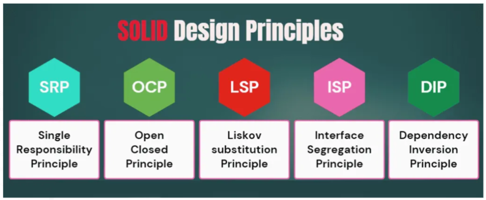
  <figcaption><b>Figura 1:</b> SOLID</figcaption>
</figure>

EL principio S.O.L.I.D. es una sugerencia que recomienda la arquitectura del software. Sin embargo, resulta importante señalar que no se trata de un dogma. Es de hecho aconsejable utilizar estos principios siempre porque nos permiten mejorar la calidad de nuestro software.

Básicamente esta arquitectura se basa en cinco principios fundamentales para el desarrollo y la construcción del software. De ahí sus siglas S.O.L.I.D. (*Single Responsibility — Open Closed — Liskov Sustitution — Interface Segregation — Dependency Inversion*) o en español, (*Responsabilidad Simple — Abierto Cerrado — Substitución Liskov — Segregación de Interface — Inversión de Dependencia*).

El propósito de estos principios es permitir un diseño del software más comprensible, escalable, flexible y por sobre todo, de muy fácil mantenimiento. Este modelo arquitectónico fue promovido por primera vez, allá por el año 2000, por Robert Cecil Martin. A continuación, se describe una breve descripción de estos principios.

* ✔️ **SRP — Single Responsability Principle — Principio de Responsabilidad Simple** — El principio apunta a que un objeto, por ejemplo una clase, tenga solo una única responsabilidad.
* ✔️ **OCP — Open Closed Principle — Principio Abierto Cerrado** — El principio establece dos reglas básicas. Por ejemplo, un objeto o clase, deben estar abiertas para su extensión y cerradas para su modificación.
* ✔️ **LSP — Liskov Substitution Principle — Principio de Substitución Liskov** — Este principio hace hincapié sobre las instancias de los objetos de un programa, que deben ser substituidas por instancias de subtipos de esos objetos, sin alterar el funcionamiento del programa.
* ✔️ **ISP — Interface Segregation Principle — Principio de Segregación de Interface** — Este principio hace hincapié en la recomendación del uso para varias tipos distintos de interfaces, para unas determinadas instancias, en lugar de tener que depender de una sola interface única para dichas instancias.
* ✔️ **DIP — Dependency Inversion Principle — Principio de Inversión de Dependencias** — Este principio hace hincapié en el uso de la dependencia de las abstracciones en lugar de las implementaciones. Como una derivación más de este principio, también contamos con la Dependency Injection o Inversión de Dependencias que hace uso de un mecanismo utilizado sobre métodos y funciones.

# Profundizando
A continuación, vamos a describir cada uno de estos cincos principios junto a su respectivo código de ejemplo utilizando el lenguaje de TypeScript para su demostración.

## SRP (Single Responsability Principle) — Principio de Responsabilidad Simple
Este principio persigue y/o intenta crear clases cuya responsabilidad es parte de una simple funcionalidad provista para el software y, a su vez, hacer que la responsabilidad sea completamente encapsulada. Dicho de otro modo, oculta dentro de una clase.

### Fundamento
El objetivo principal de este principio es reducir la complejidad. No necesitas inventar diseños sofisticados para una programación que solamente tiene doscientas líneas de código. Sin embargo, los problemas reales emergen cuando tu programa constantemente crece y cambia. A la vez, las clases se convierten en tan grandes que paulatinamente comienzas a perder los detalles de tu código y dejas de recordar bien sus funcionalidades. La navegación del código empieza a ser cada vez más lenta y aumenta tus movimientos dentro del código, de aquí para allá, con el fin de comprender las funcionalidades de este. En breve, el número de entidades en un programa desbordan tu mente y sientes que estás perdiendo el control sobre el código.

Lo peor de todo es que hay más. Si una clase hace demasiadas cosas, tendrás que cambiarla cada vez que se cambien algunas otras cosas más. Mientras haces esto, el riesgo de romper el código se incrementa exponencialmente. Por tanto, en cualquier momento, comienzas a moverte por un terreno muy incómodo que podría poner en peligro la integridad total de tu código.

Por tanto, si comienzas a experimentar el inicio de un enfoque duro sobre los aspectos específicos del programa, recuerda que el SRP principio de responsabilidad simple podría ayudarte y alivianar estos potenciales problemas y dolores de cabeza.

### Analogía
La clase **Empleado** debe ser cambiada por algunas razones de uso. La primera razón podría estar relacionada con el trabajo principal de la clase. Es decir, gestionar los datos del empleado. Sin embargo, existe otra razón más y es el formato de informe de la hoja de tiempo que cambia todo el tiempo. Este proceso de cambio te solicita que te encuentres cambiamdo el código dentro de la clase constantemente.

<figure style="text-align:center;">
  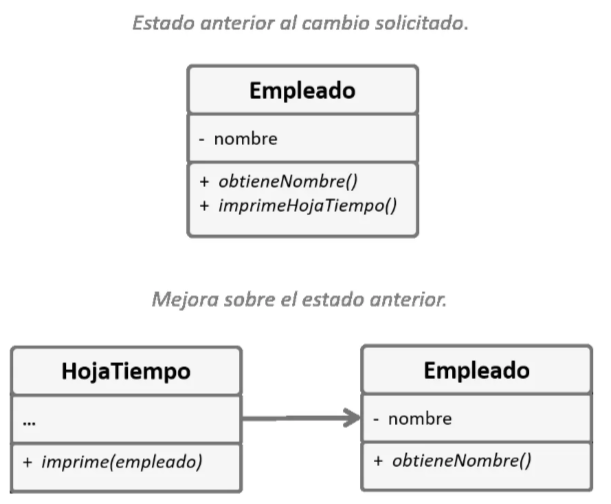
  <figcaption><b>Figura 2:</b> Diagrama de Clases del Principio de Responsabilidad Simple.</figcaption>
</figure>

Por tanto, como podemos apreciar, el problema se resuelve muy fácilmente. Simplemente creando una nueva clase llamada HojaTiempo y creando un método que cumple el rol de imprimir la hoja de tiempo del empleado y además, esta clase se la vincula con la clase Empleado. Este proceso de separación simplifica el código y por otro lado, desacopla las responsabilidades de forma más clara y concisa.

<figure style="text-align:center;">
  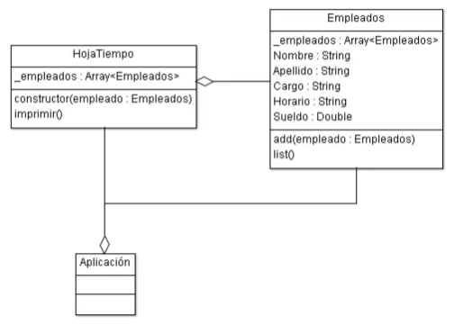
  <figcaption><b>Figura 3:</b> Diagrama de Clases del Principio de Responsabilidad Simple.</figcaption>
</figure>

```typescript
namespace SOLID_SRP {
    export class HojaTiempo {
        public _empleados: Array<Empleados> = new Array<Empleados>();

        constructor(empleado: Empleados) {
            this._empleados = empleado._empleados;
        }

        public imprimir() {
            let data: string = `Hoja de Tiempo por Empleado:\n`;
            let i = 1;
            this._empleados.forEach(e => {
                data += 
                  `${i++} - ${e.Horario} - ${e.Nombre} ${e.Apellido}\n`;
            });
            console.log(data);
        }
    }

    export class Empleados {
        public _empleados: Array<Empleados> = new Array<Empleados>();
      
        public Nombre: string;
        public Apellido: string;
        public Cargo: string;
        public Horario: string;
        public Sueldo: number;

        public add(empleado: Empleados) { 
          this._empleados.push(empleado);
        }

        public list() { 
            let data: string = `Listado de Empleados:\n`;
            let i = 1;
            this._empleados.forEach(e => {
                data += 
                 `${i++} - ${e.Nombre} ${e.Apellido} ${e.Cargo} 
                  ${e.Horario} $${e.Sueldo}\n`;
            });
            console.log(data);
        }
    }
}

class UnitTest {
  static test() {
    // Crear instancias para Empleados
    let emp = new SOLID_SRP.Empleados(); 
    let e1 = new SOLID_SRP.Empleados();
    // Añadiendo un empleado.
    e1.Nombre = "Juan";
    e1.Apellido = "Suarez";
    e1.Cargo = "Ingeniero";
    e1.Horario = "9:00hs a 17:00hs";
    e1.Sueldo = 250000;
    emp.add(e1);
    // Añadiendo un empleado.
    e1 = new SOLID_SRP.Empleados();
    e1.Nombre = "Ana Luisa";
    e1.Apellido = "Delmonte";
    e1.Cargo = "Analista de Sistemas";
    e1.Horario = "9:00hs a 17:00hs";
    e1.Sueldo = 180000;
    emp.add(e1);
    // Añadiendo un empleado.
    e1 = new SOLID_SRP.Empleados();
    e1.Nombre = "Pablo Luis";
    e1.Apellido = "Alcaraz";
    e1.Cargo = "Analista Funcional";
    e1.Horario = "9:00hs a 17:00hs";
    e1.Sueldo = 200000;
    emp.add(e1);
    // Listar empleados.
    emp.list();
    // Crear instancia para HojaTimepo
    let hojaRuta = new SOLID_SRP.HojaTiempo(emp); 
    // Imprimir la Hoja de Tiempo.
    hojaRuta.imprimir();
  }
} 

// Resultados:
// 
// Listado de Empleados:
//
// 1 - Juan Suarez Ingeniero 9:00hs a 17:00hs $250000
// 2 - Ana Luisa Delmonte Analista de Sistemas 9:00hs a 17:00hs $180000
// 3 -Pablo Luis Alcaraz Analista Funcional 9:00hs a 17:00hs $200000
// Hoja de Tiempo por Empleado:
// 
// 1 - 9:00hs a 17:00hs - Juan Suarez
// 2 - 9:00hs a 17:00hs - Ana Luisa Delmonte
// 3 - 9:00hs a 17:00hs - Pablo Luis Alcaraz

// Código 1
```

## OCP (Open Closed Principle) — Principio Abierto Cerrado
El principio básicamente establece la regla sencilla de estar abierta a la extensión pero cerrada a la modificación.

### Fundamento
La idea de fondo de este principio es la de mantener el código existente ante la eventual rotura del mismo cuando se proceda a implementar nuevas características.

En algunas ocaciones el principio declarado como abierto y cerrado pueden crear confusión puesto que ambos términos resultan ser en apariencia mutuamente excluyentes. Sin embargo, el concepto general resulta ser bastante sencillo de comprender.

Una clase es abierta si puede extenderse. Ello quiere decir que permite el mecanismo de herencia. La extensión es un mecanismo que permite moverse de lo generalizado hacia lo especializado. En efecto, la extensión se mueve desde una superclase o clase base hacia las subclases o clases hijas.

Algunos lenguajes de programación permiten un mecanismo de restricción sobre las clases base, a los efectos de evitar que sean modificadas luego. El objetivo es evitar que la misma pueda ser modificada o alterada de forma accidental o intencionalmente. Este tipo de clases se las suele llamar como Sealed “selladas”. Cada tipo de lenguaje de programación tiene su propia semántica para su uso. Por ejemplo, en el lenguaje de Visual C# se utiliza la palabra clave sealed y, en el caso del lenguaje Java, la palabra clave es final aunque las últimas evoluciones de Java 17, se ha incorporado la palabra clave sealed para definir el sellado de sus propias clases.

Por desgracia, el lenguaje de TypeScript no cuenta con un mecanismo de sellado para proteger las clases de forma directo a nativa. Si bien, se puede crear cierto grado de protección mediante el uso de decoradores o de alguna técnica practicada por algún tipo de framework, no deja de ser una solución no nativa. No obtante, pese a esta carencia de protección por parte de TypeScript, el principo de cerrado se puede aplicar conceptualmente en las clases de TypeScript normalmente y es como lo estudiaremos en este apartado.

No obstante, quizá algo que se acerque un poco al principio cerrado podría ser el uso de la declaración de interfaces o también, de clases de tipo abstracta. En ambos casos, tanto las funciones como los métodos declarados, no poseen cuerpo puesto que consisten en la declaración de tan solo sus firmas. Esto en cierto modo evita la modificación por sobrescritura. Si bien, el principio de cerrado en este caso tiene sus limitaciones este resulta ser útil para el propósito.

Entonces, para comprender mejor el concepto general del principio OCP, cuando hablamos del principio cerrado para las clases base declaradas en TypeScript, conceptualmente estaremos indicando que el uso implica evitar cualquier tipo de alteración de las declarariones originales. Por otro lado, cuando hablamos de del principio abierto estamos indicando que la clase base permite su extensión y además, otorga la posibilidad de sobrescribir sus métodos o funciones implementados en las clases hijas.

### Analogía
Imaginemos que tienes una aplicación de e-commerce con una clase llamada Orden que calcula los costos de los fletes y todos sus métodos para el tipo de fletaje, han sido arduamente codificados dentro de la clase. Si necesitas añadir un nuevo método de fletaje, tendrás que cambiar el código dentro de la clase Orden y por tanto, podría correr el riesgo de romperse.

<figure style="text-align:center;">
  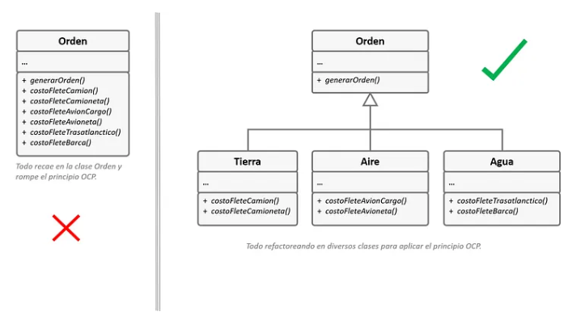
  <figcaption><b>Figura 4:</b> Diagrama de Clases del Principio Abierto-Cerrado — Prácticas Incorrectas y Correctas.</figcaption>
</figure>

Como podemos observar en la figura de arriba, en la sección izquierda, la clase Orden agrupa todos los métodos o funciones que se encargan de calcular los costos de los fletes en función al medio de transporte. Ahora bien, el problema surge cuando se requiere añadir un nuevo proceso para un nuevo tipo de flete. Añadir un nuevo proceso puede poner en riesgo a la clase y además, estaríamos rompiendo el principio OCP.

En la sección derecha podemos observar una solución apropiada para mantener el principio OCP y evitar modificar y poner en riesgo a la clase Orden. Para ello se han creado tres clases más llamadas Aire, Agua y Tierra que heredan desde la clase Orden.

Como puedes apreciar esta nueva predisposición nos permite muy fácilmente tomar los métodos o funciones apropiados, en función al tipo de flete que necesitemos. Es más, si necesitamos añadir un nuevo tipo de fleje, bastará con añadirlo en la clase adecuada. Supongamos que nos pidiesen como requisito añadir tipos de fletes para drones. Por tanto, implementar este nuevo requerimiento resultará muy sencillo de hacer. En la clase Aire añadiríamos el nuevo requerimiento, sin alterar en absoluto la clase base Orden. 

<figure style="text-align:center;">
  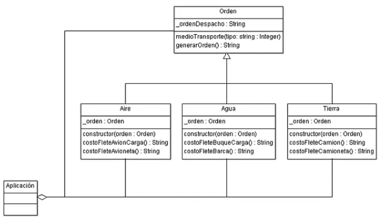
  <figcaption><b>Figura 5:</b> Diagrama de Clases dle Principio Abierto y Cerrado.</figcaption>
</figure>

```typescript
namespace SOLID_OCP {

    export class Orden {
        private _ordenDespacho: string; 
        
        public medioTransporte(tipo: string) {
          this._ordenDespacho = tipo;
        }

        public generarOrden(): string {
            return this._ordenDespacho;
        }
    }

    export class Aire extends Orden {
        private _orden: Orden = new Orden();
        
        constructor(orden: Orden) {
          super();
          this._orden = orden;
        }        
        
        public costoFleteAvionCargo(): string {
            return `Detalle General:\n${this._orden.generarOrden()}\nCosto de Viaje: $ 500.000,00`;
        }

        public costoFleteAvioneta(): string {
            return `Detalle General:\n${this._orden.generarOrden()}\nCosto de Viaje: $ 120.000,00`;
        }        
    }
    
    export class Agua extends Orden { 
        private _orden: Orden = new Orden();
        
        constructor(orden: Orden) {
          super();
          this._orden = orden;
        }
        
        public costoFleteBuqueCarga(): string {
            return `Detalle General:\n${this._orden.generarOrden()}\nCosto de Viaje: $ 350.000,00`;
        }

        public costoFleteBarca(): string {
            return `Detalle General:\n${this._orden.generarOrden()}\nCosto de Viaje: $ 82.000,00`;
        }         
    }
    
    export class Tierra extends Orden { 
        private _orden: Orden = new Orden();
        
        constructor(orden: Orden) {
          super();
          this._orden = orden;
        }
        
        public costoFleteCamion(): string {
            return `Detalle General:\n${this._orden.generarOrden()}\nCosto de Viaje: $ 75.000,00`;
        }

        public costoFleteCamioneta(): string {
            return `Detalle General:\n${this._orden.generarOrden()}\nCosto de Viaje: $ 36.000,00`;
        }        
    }     
}

class UnitTest {
  static test() {
    let tp1 = new SOLID_OCP.Orden();
    let tp2 = new SOLID_OCP.Orden();
    let tp3 = new SOLID_OCP.Orden();
    // Transporte por Aire
    tp1.medioTransporte("Avion: Airbus 320");
    let fleteAire = new SOLID_OCP.Aire(tp1);
    console.log(fleteAire.costoFleteAvionCargo());
    tp1.medioTransporte("Avion: Cessna 172 Skyhawk");
    console.log(fleteAire.costoFleteAvioneta()); 
    // Transporte por Agua 
    tp1.medioTransporte("Handymax");
    let fleteAgua = new SOLID_OCP.Agua(tp2); 
    console.log(fleteAgua.costoFleteBuqueCarga());
    tp2.medioTransporte("TurboSquid");
    console.log(fleteAgua.costoFleteBarca());    
    // Transporte por Tierra
    tp3.medioTransporte("Scannia"); 
    let fleteTierra = new SOLID_OCP.Tierra(tp3); 
    console.log(fleteTierra.costoFleteCamion());
    tp3.medioTransporte("Pickup Ford Amarok"); 
    console.log(fleteTierra.costoFleteCamioneta());
  }
} 

UnitTest.test(); 

// Resultados:
// 
// Detalle General:
// Avion: Airbus 320
// Costo de Viaje: $ 500.000,00
// Detalle General:
// Avion: Cessna 172 Skyhawk
// Costo de Viaje: $ 120.000,00
//
// Detalle General:
// Handymax
// Costo de Viaje: $ 350.000,00
// 
// Detalle General:
// TurboSquid
// Costo de Viaje: $ 82.000,00
// 
// Detalle General:
// Scannia
// Costo de Viaje: $ 75.000,00
// 
// Detalle General:
// Pickup Ford Amarok
// Costo de Viaje: $ 36.000,00 

// Código 2
```

## LSP (Liskov Substitute Principle) — Pincipio de Substitución de Liskov
El principio de substitución fue propuesto y desarrollado por la Dra. Barbara Liskov. Cuando se extiende una clase, hay que recordar que se debe disponer del paso de los objetos de la subclase en lugar de los objetos de la clase principal sin romper el código del cliente.

### Fundamento
La subclase debe permanecer compatible con el comportamiento de la superclase. Al anular un método o una función, es necesario extender el comportamiento de la clase base en lugar de reemplazarlo con algo completamente distinto.

El principio de substitución es un conjunto de verificaciones que ayudan a predecir si una subclase permanece compatible con el código que fue dispuesto para trabajar con los objetos de la superclase. Este concepto es crítico cuando se desarrollan librerías y framework porque las clases irán a ser utilizadas por otras personas cuyo código no puede directamente accederse ni modificarse.

A diferencia del principio de diseño que es ampliamente abierto para su interpretación, el principio de substición tiene un conjunto de requerimientos formales para las subclases y especialmente para cada uno de sus métodos y funciones. La siguiente lista expone algunos puntos a favor y encontra muy interesantes para analizar.

Los tipos de parámetros en un método de subclases deben coincidir o ser más abstractas que los tipos de parámetros en el método de la superclase.
Digamos que hay una clase con un método que se encarga de alimentar a un gato, algo así como alimentar(g: **Gato**). El código de la aplicación pasa siempre objetos tipo gato a este método.

> ***Bueno**: Creaste una subclase que sobrescribió el método alimentar() donde este se encarga de alimentar a cualquier animal (desde una superclase de gatos), algo así como alimentar(a: Animal). Ahora si pasas un objeto de esta subclase enlugar de un objeto de la superclase hacia el código de la aplicación, todo esto funcionaría bien. El método puede alimentar a todos los animales, por tanto, este podrá alimentar a cualquier tipo de gato pasado desde la aplicación.*
> 
> ***Malo**: Has creado otra subclase y le has restringido el método para que alimentar() solo acepte tipos de gatos Siamese (una subclase de gatos), algo así como alimentar(gs: GatoSiamese). ¿Qué pasará en el código de la aplicación si este está enlazado a este objeto en lugar del objeto de la clase original? En breve, el problema es que el proceso de alimentar gato se restringe solamente a los gatos Siameses y no al resto de los gatos. En consecuencia, esto romperá todas las funcionalidades relacionadas.*

* *El tipo de retorno en un método de una subclase deberá coincidir o ser un subtipo del tipo de retorno en el método de la superclase.* 

> ***Bueno**: Una subclase sobrescribe la función algo así como comprarGato(): GatoSiamese. La aplicación retornará un tipo de gato Siamese, es decir, una raza felina válida para los tipos de gatos y, en consecuencia, hasta aquí todo iría bien.*
> 
> ***Malo**: En una subclase, tu sobrescribes a la función algo así como comprarGato(): Animal. Ahora la aplicación retornará un animal genérico, digamos desconocido. Es decir, la resultante podría tratarse de un cocodrilo, un oso, un perro, etc. En consecuencia, la estructura se ha roto. Ello se debe a que el retorno del tipo puede ser cualquier tipo de animal incluyendo incluso a un gato mismo. Sin embargo, no se tratará específicamente de un gato.*

Ahora citemos los problemas que podrían surgir con algunas características del propio lenguaje que manejemos en base a las funcionalidades preconstruidas de los mismos. 

* *Un método en una subclase no debería lanzar tipos de excepciones que el método base no espera lanzar.*

En otras palabras, los tipos de excepciones deberán coincidir o ser subtipos del que tenga disponible el método base para lanzar. Esta regla proviene del hecho de que los bloques try-catch en el código de la aplicación apuntan a tipos específicos de excepciones que es probable que genere el método base. Por lo tanto, un tipo de excepción inesperada podría deslizarse a través de las líneas defensivas del código de la aplicación, produciendo un colapso total en esta. 

> ***Importante**: Muchas de estas reglas de control y manejo de las excepciones son gestionadas por el propio core interno del lenguaje de turno. Tal es el caso de los lenguajes como Visual C# y Java, entre otros. Por tanto, no podrás compilar un programa que viole estas reglas.*

* *Una subclase no debería fortalecer las precondiciones.* 

Supongamos que el método base tiene un parámetro con el tipo int. Si en una subclase se sobrescribe este método y se requiere que el valor del argumento pasado hacia el método deba ser un valor positivo, lanzando una excepción si el valor pasado es negativo, esto estará forzando las precondiciones. El código de la aplicación, que es utilizado para que trabaje de modo fino cuando se pasen números negativos dentro del método, terminará rompiendose cuando comience a trabajar con un objeto desde esta subclase. 

* *Una subclase no deberá debilitar las poscondiciones.* 

Tienes una clase con un método que trabaja con una base de datos. Un método de esta clase manejará el mecanismo de conexión hacia la base de datos abriéndola y cerrándola en el momento de estar retornando desde ella ciertos valores esperados.

Luego, le creas una subclase y cambias esta para que las conexiones hacia la base de datos permanezcan abiertas para que puedas reutilizarlas luego. La aplicación no podrá saber cualquiera de estas intenciones. Dado que espera que los métodos cierren todas las conexiones, podrían simplemente terminar el programa justo después de invocar al método, contaminando un sistema con conexiones hacia la bases de datos fantasma. 

* *Los Invariantes de una superclases deberán ser preservados.* 

Esta es al menos la regla formal de todas. Los Invariantes son condiciones en el que un objeto tiene sentido. Los invariantes de un gato son, por ejemplo, que tienen patas, cola, maúllan, etc. La parte más confusa de los invariantes es que mientras ellos pueden ser definidos como explícitos en el formulario de una interface de contratos o un conjunto de asersiones dentro de los métodos, ellos podrían también ser implícitos para ciertas pruebas unitarias y diversas espectativas en el código de la aplicación.

La regla de los invariantes es más fácil de violar dado que podrías malinterpretar o no darte cuenta de todos los invariantes de una clase compleja. Por lo tanto, la manera segura para extender clases es introducir nuevos campos y métodos y no mezclarlos con cualquier miembro existente de la superclase. Por supuesto, esto no siempre es posible en la vida real. 

* *Una subclase no deberá cambiar los valores de los campos privados de la superclase.*

Algunos lenguajes de programación permiten el acceso a los miembros privados de una clase a través de mecanismos de reflexión. Los lenguajes como Python y JavaScript, no tienen ningún tipo de protección contra todos los miembros privados. Por tanto, en la mayoría de los casos, este punto resulta muy crítico sino complejo de resolver.

### Analogía
A continuación, vamos analizar un caso donde se produce una violación del principio de substitución de Liskov. 

<figure style="text-align:center;">
  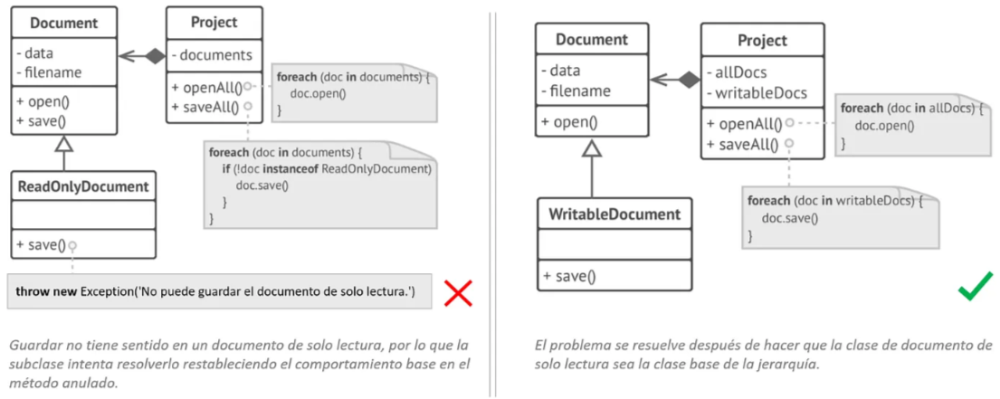
  <figcaption><b>Figura 6:</b> Diagrama de Clases del Principio de Liskov — Prácticas Incorrectas y Correctas.</figcaption>
</figure>

En la sección izquierda de la imagen vemos el problema. El método save() en la subclase ReadOnlyDocuments lanza una excepción si alguien intenta invocarlo. El método base no tiene esta restricción. Eso significa que el código de la aplicación se romperá y no verificará el tipo de documento antes de proceder a guardarlo.

Por tanto, la resultante de este proceso es la violación del principio abierto/cerrado OCP que depende de las clases concretas de los documentos. Si se introduce una nueva subclase de documento, se necesitará cambiar el código de la aplicación para que sea soportado.

Por tanto, para poder resolver este problema habrá que enfocarse sobre la jerarquía de las clases. Observando el sector derecho de la imagen, una subclase deberá extender el comportamiento de una superclase. Por lo tanto, el documento de solo lectura se convierte en la clase base de la jerarquía. El documento que permite la escritura es ahora una subclase que se extiende desde la clase base y añade el comportamiento guardar.

<figure style="text-align:center;">
  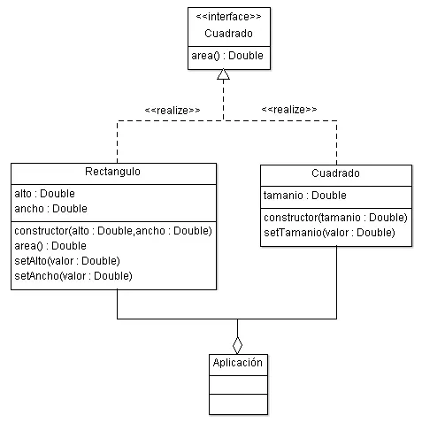
  <figcaption><b>Figura 7:</b> Diagrama de Clases del Principio de Liskov.</figcaption>
</figure>

```typescript
namespace SOLID_LSP {
    export interface IGeometria {
        area(): number;
    }

    export class Rectangulo implements IGeometria {
        constructor(public alto: number, public ancho: number) { }

        setAlto(valor: number) {
            this.alto = valor;
        }

        setAncho(valor: number) {
            this.ancho = valor;
        }

        area(): number {
            return this.ancho * this.alto;
        }
    }

    export class Cuadrado implements IGeometria {
        constructor(public tamanio: number) {}

        setTamanio(valor: number) {
            this.tamanio = valor;
        }
    
        area(): number {
            return this.tamanio ** 2;
        }        
    }
}

class UnitTest {
  static test() {
    let rect = new SOLID_LSP.Rectangulo(12, 45);
    console.log('Rectangulo:')
    console.log(`Alto ${rect.alto} x Ancho: ${rect.ancho} = Area: ${rect.area()}`);
    let cua = new SOLID_LSP.Cuadrado(23);
    console.log('Cuadrado:');
    console.log(`Lado: x ${cua.tamanio} Lado: ${cua.tamanio} = Area: ${cua.area()}`);
  }
}

UnitTest.test(); 

// Resultados:
// 
// Rectangulo:
// Alto 12 x Ancho: 45 = Area: 540
// 
// Cuadrado:
// Lado: x 23 Lado: 23 = Area: 529 

// Código 3
```

## ISP (Interface Segregation Principle) — Principio de Segregación de Interface
Los clientes no deben ser forzados a depender de métodos que no usan. En breve, intenta que las interfaces sean los suficientemente pequeñas para que las clases de los clientes no tengan que implementar tipos de comportamiento que no necesitan.

### Fundamento
Acorde al principio de segregación de interfaces, es necesario particionar las interfaces “infladas de recursos”, a través de un mecanismo estratégico mucho más granular y específico para cada una de esas partes. Los clientes en sus programas tan solo deben implementar los métodos que ellos necesitan y no todos juntos. No hacer eso es desperdiciar recursos.

Imagina un caso donde el cliente que implementa una interface de estas, cargada de métodos y funciones, las cuales, el cliente tan solo utiliza tres funciones de esta para construir su lógica y el resto de los métodos y funciones implementados no los usa. Esto a simple vista es un desperdicio de recursos innecesario. Además, todas estas implementaciones de facto también podrían confundir al cliente que consume estas interfaces.

La herencia simple le permite a las clases tener una sola superclase, pero esto presenta un número limitado de interfaces que la clase puede implementar al mismo tiempo. Por este motivo, no resulta necesario atestar con toneladas de métodos y funciones no relacionados para una simple interface. Particionar estos métodos y funciones en algunas interfaces de modo más granular permite luego ser implementadas todas ellas si es necesario en una simple clase. Sin embargo, algunas clases será más que suficiente implementar una de ellas.

Otro punto que tenemos que considerar es el criterio del particionado de sus métodos y funciones de una interface inflada. En algunas ocasiones podríamos tener problemas de referencias circulares en el uso de varias interfaces particionadas cuando se implementan en una clase destino. Un método o una función de una interface podría chocar con otro que se encuentra en otra interface. Por tanto, debes ser cuidadoso con la creación del particionado de interfaces.

Por último, cabe añadir que no todos los lenguajes de programación admiten el uso de interfaces. Por ejemplo, el lenguaje nativo JavaScript no lo soporta. Tenemos que recordar que JavaScript es un lenguaje que se basa en la herencia de objetos y no de clases., De hecho, su paradigma deriva de la Orientación de Objetos pero se basa en Prototipos de Objetos. Por tanto, para estos casos particulares, este principio no puede ser aplicado apropiadamente.

### Analogía
Imagina que creas una librería que hace más fácil la integración de las aplicaciones con varios proveedores de Cloud Computers “computadoras en la nube”. Al comienzo en la versión original solamente soportaba la nube de Amazon. Esta cubría por completo los servicios y características de la nube de este proveedor.

Al mismo tiempo asumes que todos los proveedores de nubes tienen el mismo amplio espectro de características como Amazon. Sin embargo, cuando estas son implementadas para otro tipo de proveedor, quedan fuera la mayoría de las interfaces de la librería que son también amplias. Algunos métodos describen características que otros proveedores de nube no poseen.

<figure style="text-align:center;">
  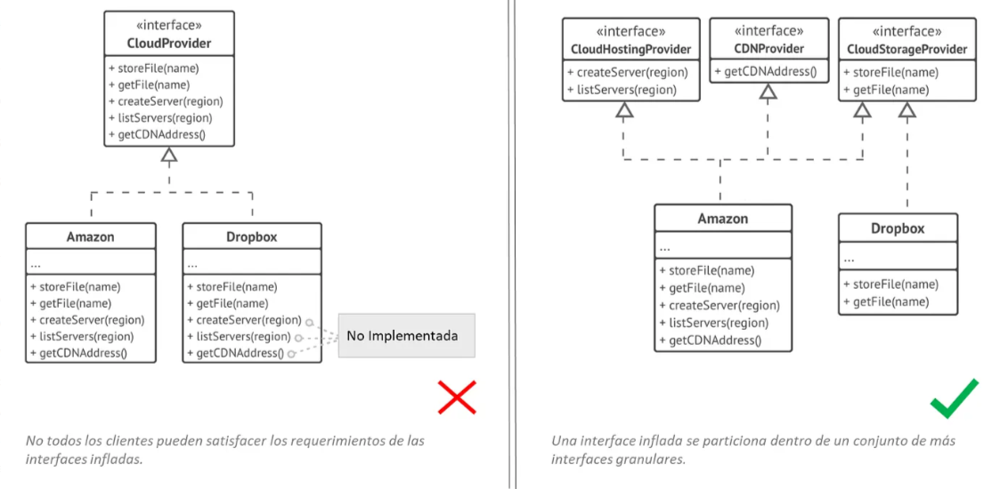
  <figcaption><b>Figura 8:</b> Diagramas de Clases del Principio de Segregación de Interfaces — Prácticas Incorrectas y Correctas.</figcaption>
</figure>

Como con otros principios, puedes moverte también más allá de estos. No particiones más una interface que ya resulta ser bastante específica. Recuerda que más interfaces creadas, más complejo se volverá tu código. Ante todo, se siempre criterioso con todos estos puntos. 

<figure style="text-align:center;">
  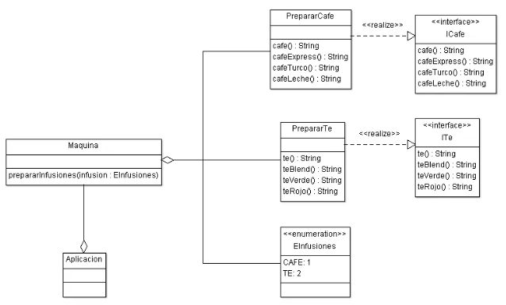
  <figcaption><b>Figura 9:</b> Diagrama de Clases del Principio de Segregación de Interfaces.</figcaption>
</figure>

```typescript
namespace SOLID_ISP {
    
    export interface ICafe {
        cafe(): string;
        cafeExpress(): string;
        cafeTurco(): string;
        cafeLeche(): string;
    }

    export interface ITe {
        te(): string;
        teBlend(): string;
        teCeilan(): string;
        teVerde(): string;
        teRojo(): string;
    }

    export enum EInfusiones {
        CAFE = 1, 
        TE = 2
    }

    export class PrepararCafe implements ICafe {
        cafe(): string {
            return "Café";
        }
        cafeExpress(): string {
            return "Café Express Italiano";
        }
        cafeTurco(): string {
            return "Café Fuerte Turco";
        }
        cafeLeche(): string {
            return "Café con Leche";
        }
    }

    export class PrepararTe implements ITe {
        te(): string {
            return "Té";
        }
        teBlend(): string {
            return "Té Suave";
        }
        teCeilan(): string {
            return "Té Ceilán";
        }
        teVerde(): string {
            return "Té Verde Chino";
        }
        teRojo(): string {
            return "Té Rojo Chino";
        }
    }

    export class Maquina {
        prepararInfusiones(infusion: EInfusiones): void {
            switch(infusion) {
                case EInfusiones.CAFE: 
                    let cafe: ICafe = new PrepararCafe();
                    // Preparar Café Express...
                    console.log(cafe.cafeExpress());
                break;
                case EInfusiones.TE: 
                    let te: ITe = new PrepararTe(); 
                    // Preparar Té Ceilán...
                    console.log(te.teCeilan());
                break;
                default: 
                    console.log("Infusión no admititda.");
            }
        }
    }
}

class UnitTest {
    static test() {
        let maq = new SOLID_ISP.Maquina(); 
        maq.prepararInfusiones(1); // Preparar Café.
        maq.prepararInfusiones(2); // Preparar Té.
    }
}

UnitTest.test(); 

// Resultados:
// 
// Café Express Italiano
// Té Ceilán

// Código 4
```

## DIP (Dependency Inversion Principle) — Principio de Inversión de Dependencias
Las clases de alto nivel no deberían depender de las clases de bajo nivel. Ambas deben depender de las abstracciones. Las abstracciones no deben depender de los detalles. Los detalles deben depender de las abstracciones.

### Fundamento
Usualmente cuando se diseña el software podrás distinguir dos niveles de clases. Estos niveles son las llamadas clases de bajo nivel y clases de alto nivel.

* **Clases de Bajo Nivel** — Implementa las operaciones básicas tales como las que trabajan con un disco, transfieren datos sobre al red, conexiones a bases de datos, et.

* **Clases de Alto Nivel** — Contiene una lógica de negocio compleja que dirige a las clases de bajo nivel para que hagan algo.

Algunas veces la mayoría de los desarrolladores primero diseñan clases de bajo nivel y luego empiezan trabajando sobre una de alto nivel. Es muy común cuando arrancas desarrollando un prototipo sobre un nuevo sistema que no estés seguro incluso de qué posiblilidades tendrán las declaradas como alto y bajo nivel, dado que aún no tienes bien en claro la implementación. Tal enfoque de la lógica del negocio de las clases tienden a ser dependiente de primitivas clases de bajo nivel.

El ISP principio de inversión de dependencia sugiere entonces el cambio de dirección de esta dependencia para los siguientes puntos importantes.

1. Al principio necesitas describir las interfaces para las operaciones de las clases de bajo nivel, preferiblemente en términos del negocio. Por ejemplo, la lógica del negocio deberá llamar a un método como openReport(file) más que una serie de métodos como openFile(x), readByts(n), closeFiles(x). Esta interfaces cuenta con algunas de alto nivel.
2. Ahora podrás hacer que las clases de alto nivel dependan de estas interfaces en lugar de clases de bajo nivel concreta. Esta dependencia sería mucho más flexible que la original.
3. Una clase de bajo nivel implementa estas interfaces, estas dependen del nivel de la lógica de negocio, invirtiendo la dirección de la dependencia original.

El ISP principio de inversión de dependencia ofrece que va en conjunto con el OCP principio abierto cerrado. Puedes extender las clases de bajo nivel para usarlas con clases de diferentes lógica de negocio sin romper las clases existentes. 

### Analogía
Supongamos que para el siguiente ejemplo tienes una clase de reportes de presupuestos de alto nivel que usa una clase de bajo nivel de base de datos para leer y persistir los datos. Cualquier cambio en la clase de bajo nivel, tal es el caso para cuando se lanza una nueva versión del servidor de base de datos, podría afectar la clase de alto nivel y que se supone que no debe preocuparse por los detalles del almacenamiento de los datos.

<figure style="text-align:center;">
  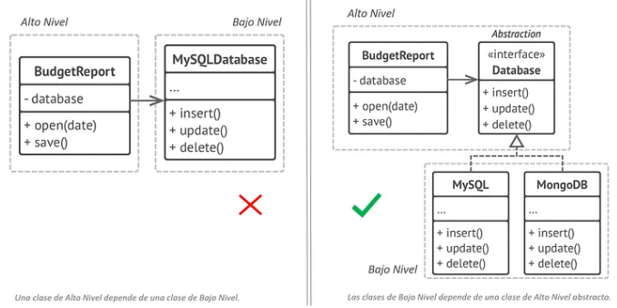
  <figcaption><b>Figura 10:</b> Diagrama de Clases del Principio de Inversión de Dependencias — Prácticas Incorrectas y Correctas.</figcaption>
</figure>

Podrás corregir este problema creando una interface que describe las operaciones lectura-escritura y haciendo que la clase de reportes utilice la interrface en lugar de una clase de bajo nivel. Luego podrás cambiar o extender la clase de bajo nivel original para implementar la nueva interfdace de lectura-escritura declarada por la lógica del negocio.

Como resultado, la dirección de la dependencia original ha sido inverrtida: Las clases de bajo nivel dependen de la de alto nivel de abstracciones.

<figure style="text-align:center;">
  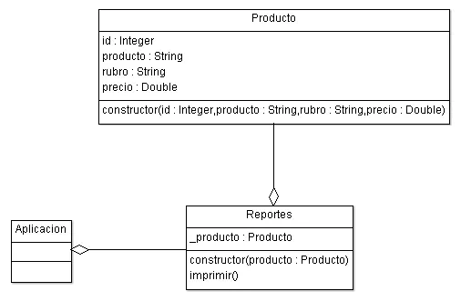
  <figcaption><b>Figura 11:</b> Diagrama de Clases del Principio de inversión de Dependencias.</figcaption>
</figure>

```typescript
namespace SOLID_DIP {

    export class Producto {
        constructor(
            public id: number, 
            public producto: string, 
            public rubro: string, 
            public precio: number
        ) {}
    }

    export class Reportes {
        private _producto: Producto;

        constructor(producto: Producto) {
            this._producto = producto;
        }

        imprimir(): Producto {
            return this._producto;
        }
    }
}

class UnitTest {
    static test() {        
        let imp = new SOLID_DIP.Reportes(
            new SOLID_DIP.Producto(
                1, "Jamón Serrano", "Fiambre", 2345.16
            )
        );
        console.log(imp.imprimir());
    }
}

UnitTest.test();  

// Resultados:
// 
// Producto: {
//   "id": 1,
//   "producto": "Jamón Serrano",
//   "rubro": "Fiambre",
//   "precio": 2345.16 
// }

// Código 5
```

# Conclusión 
Los principios SOLID no deben entenderse como reglas rígidas, sino como guías que permiten construir software más mantenible, escalable y comprensible. Su verdadero valor radica en ayudar al desarrollador a tomar mejores decisiones de diseño, reduciendo el acoplamiento y aumentando la cohesión del sistema, lo que facilita su evolución en el tiempo

Aplicar SOLID no implica escribir más código, sino escribirlo mejor. Cada principio aborda un problema común en el desarrollo orientado a objetos, proponiendo soluciones que permiten extender funcionalidades sin romper lo existente, mejorar la reutilización y facilitar el testing. En conjunto, forman una base sólida para cualquier arquitectura moderna

Sin embargo, su correcta aplicación requiere criterio. Un uso excesivo o mal interpretado puede llevar a sobreingeniería, generando complejidad innecesaria. Por ello, es fundamental encontrar el equilibrio entre teoría y práctica, adaptando estos principios al contexto real del proyecto.

En definitiva, dominar SOLID no solo mejora la calidad del código, sino que también eleva el nivel profesional del desarrollador, permitiéndole diseñar sistemas más robustos, flexibles y preparados para el cambio.

## Fuente

### Autor: 
- (Arq. e Ing.) Ariel Alejandro Wagner

### Medios Relacionados: 

Publicación: https://medium.com/@arielwagnermovil/principios-solid-4356674cb25b


